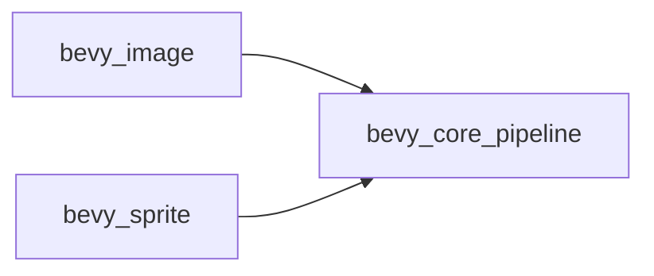

+++
title = "#18379 remove circular dependency between bevy_sprite and bevy_image"
date = "2025-03-18T00:00:00"
draft = false
template = "pull_request_page.html"
in_search_index = true

[taxonomies]
list_display = ["show"]

[extra]
current_language = "en"
available_languages = {"en" = { name = "English", url = "/pull_request/bevy/2025-03/pr-18379-en-20250318" }, "zh-cn" = { name = "中文", url = "/pull_request/bevy/2025-03/pr-18379-zh-cn-20250318" }}
+++

# #18379 remove circular dependency between bevy_sprite and bevy_image

## Basic Information
- **Title**: remove circular dependency between bevy_sprite and bevy_image
- **PR Link**: https://github.com/bevyengine/bevy/pull/18379
- **Author**: mockersf
- **Status**: MERGED
- **Created**: 2025-03-18T00:57:44Z
- **Merged**: Not merged
- **Merged By**: N/A

## Description Translation
# Objective

- #17219 introduced a circular dependency between bevy_image and bevy_sprite for documentation

## Solution

- Remove the circular dependency
- Simplify the doc example

## The Story of This Pull Request

This PR addresses a dependency chain issue that emerged from previous documentation improvements. The problem originated in PR #17219, which inadvertently created a circular dependency between two core Bevy crates: `bevy_image` and `bevy_sprite`. While circular dependencies in Rust don't prevent compilation, they can cause issues with documentation generation and create maintenance challenges.

The root cause was traced to documentation examples where `bevy_image` depended on `bevy_sprite` for type references, while `bevy_sprite` simultaneously depended on `bevy_image`. This mutual dependency created an undesirable coupling between the crates that needed resolution.

The solution took a two-pronged approach:
1. **Dependency Removal**: The `bevy_sprite` dependency was removed from `bevy_image`'s Cargo.toml
2. **Example Simplification**: Documentation examples were refactored to use more appropriate types from `bevy_core_pipeline`

Key implementation changes included:
- Removing `bevy_sprite` from `bevy_image`'s dependencies
- Updating imports in `texture_atlas_builder.rs` to use `bevy_core_pipeline::core_2d` instead of sprite-related modules
- Simplifying documentation examples to demonstrate equivalent functionality without cross-crate dependencies

These changes improved the crate isolation while maintaining documentation clarity. By using `Core2d` bundle from `bevy_core_pipeline` instead of `Sprite`-related components, the examples became more focused on the core image handling functionality without relying on higher-level sprite concepts.

## Visual Representation



## Key Files Changed

1. `crates/bevy_image/Cargo.toml`
```toml
# Before:
[dependencies]
bevy_sprite = { path = "../bevy_sprite", version = "0.14.0-dev", optional = true }

# After:
# (bevy_sprite dependency removed)
```

2. `crates/bevy_image/src/texture_atlas_builder.rs`
```rust
// Before:
use bevy_sprite::texture_atlas::TextureAtlasLayout;

// After:
use bevy_core_pipeline::core_2d::Camera2dBundle;
```

## Further Reading
- [Rust Cargo Dependency Management](https://doc.rust-lang.org/cargo/reference/specifying-dependencies.html)
- [Bevy ECS System Ordering](https://bevy-cheatbook.github.io/programming/system-order.html)
- [Circular Dependency Resolution Patterns](https://en.wikipedia.org/wiki/Circular_dependency#Resolving_circular_dependencies)