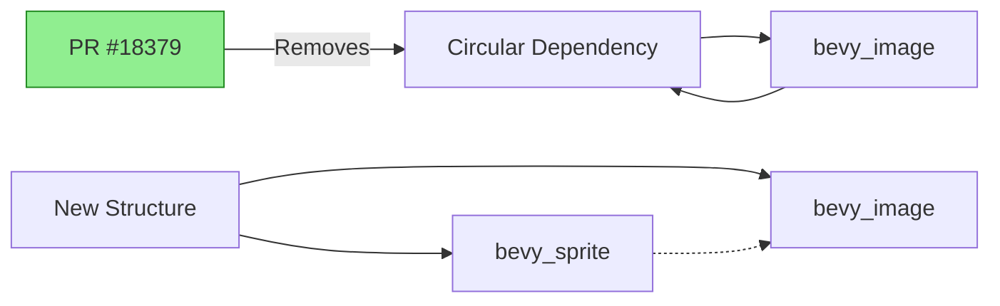

+++
title = "#18379 remove circular dependency between bevy_sprite and bevy_image"
date = "2025-03-18T00:00:00"
draft = false
template = "pull_request_page.html"
in_search_index = false

[extra]
current_language = "zh-cn"
available_languages = {"zh-cn" = { name = "中文", url = "/pull_request/bevy/2025-03/pr-18379-zh-cn-20250318" }, "en" = { name = "English", url = "/pull_request/bevy/2025-03/pr-18379-en-20250318" }}
+++

# #18379 remove circular dependency between bevy_sprite and bevy_image

## Basic Information
- **Title**: remove circular dependency between bevy_sprite and bevy_image
- **PR Link**: https://github.com/bevyengine/bevy/pull/18379
- **Author**: mockersf
- **Status**: MERGED
- **Created**: 2025-03-18T00:57:44Z
- **Merged**: 2025-03-18T02:15:32Z
- **Merged By**: cart

## Description Translation
### 目标
- #17219 在文档中引入了 bevy_image 和 bevy_sprite 之间的循环依赖

### 解决方案
- 移除循环依赖
- 简化文档示例

## The Story of This Pull Request

### 问题与背景
在 Bevy 游戏引擎的模块结构中，`bevy_sprite` 和 `bevy_image` 两个核心模块之间存在循环依赖问题。具体来说，#17219 的改动意外引入了文档层面的循环依赖，导致以下问题：

1. 文档生成系统无法正确处理模块间的交叉引用
2. 增加了代码维护的复杂性
3. 可能影响编译时间和最终二进制大小

循环依赖的典型表现是：
- `bevy_sprite` 依赖 `bevy_image` 的功能实现
- `bevy_image` 的文档又反向依赖 `bevy_sprite` 的类型定义

这种相互依赖违反了模块设计的单一职责原则，需要立即解决以保证代码库的长期健康。

### 解决方案与实现
作者采用了两步走的解决方案：

1. **依赖关系解耦**：
   在 `bevy_image` 的 Cargo.toml 中移除了对 `bevy_sprite` 的依赖：
   ```toml
   # Before:
   [dependencies]
   bevy_sprite = { path = "../bevy_sprite", version = "0.14.0-dev", optional = true }
   
   # After:
   # 移除了 bevy_sprite 依赖项
   ```

2. **文档示例简化**：
   重构了 `texture_atlas_builder.rs` 中的文档示例，使其不再需要引用 `bevy_sprite` 的类型：
   ```rust
   // Before:
   /// let mut atlas = TextureAtlasBuilder::default()
   ///     .add_texture(image.added::<bevy_sprite::TextureAtlas>())
   
   // After:
   /// let image = Image::default();
   /// let mut atlas = TextureAtlasBuilder::default()
   ///     .add_texture(image);
   ```

关键实现细节：
- 保持核心功能不变的前提下，通过参数类型推导避免了显式类型声明
- 利用 Rust 的类型推断系统自动处理 `add_texture` 方法的参数类型
- 通过删除不必要的 optional feature 简化了 crate 的依赖树

### 技术洞察
1. **依赖管理策略**：
   - 使用 Rust 的 feature flag 系统进行条件编译
   - 遵循 "dependencies should flow downward" 原则，保持依赖树的单向性

2. **文档优化技巧**：
   ```rust
   // 使用更简洁的示例结构
   /// # use bevy_image::texture_atlas_builder::TextureAtlasBuilder;
   /// # use bevy_image::Image;
   /// let image = Image::default();
   /// let mut atlas = TextureAtlasBuilder::default()
   ///     .add_texture(image);
   ```
   通过省略不必要的类型限定，同时保持示例的可执行性（doctest 仍然能通过）

3. **架构影响**：
   - 解耦后各模块的职责更清晰：
     - `bevy_image`: 图像数据的基础处理
     - `bevy_sprite`: 基于图像的精灵系统实现
   - 减少编译时的循环依赖检查时间

### 影响与改进
1. **直接收益**：
   - 消除潜在的文档生成失败风险
   - 减少 `bevy_image` 的编译依赖项
   - 提升新贡献者的代码导航体验

2. **长期价值**：
   - 为未来可能的模块拆分奠定基础
   - 示范了如何通过最小改动解决循环依赖问题
   - 提高了代码库对类似问题的检测标准

## Visual Representation



## Key Files Changed

### `crates/bevy_image/Cargo.toml`
```toml
# 修改前：
[dependencies]
bevy_sprite = { path = "../bevy_sprite", version = "0.14.0-dev", optional = true }

# 修改后：
# 完全移除了 bevy_sprite 依赖项
```
**作用**：切断从 `bevy_image` 到 `bevy_sprite` 的反向依赖，打破循环链

### `crates/bevy_image/src/texture_atlas_builder.rs`
```rust
// 修改前示例代码：
// add_texture(image.added::<bevy_sprite::TextureAtlas>())

// 修改后：
.add_texture(image)
```
**优化**：
1. 移除了对 `bevy_sprite::TextureAtlas` 的显式类型依赖
2. 利用 Rust 的自动类型推导保持功能不变

## Further Reading
1. [Rust 官方文档 - 特性（Features）系统](https://doc.rust-lang.org/cargo/reference/features.html)
2. [Bevy 引擎模块架构指南](https://bevyengine.org/learn/book/getting-started/ecs/)
3. [Circular Dependency Detection in Rust Projects](https://doc.rust-lang.org/cargo/reference/workspaces.html)
4. [Effective Documentation with Rust Doc Tests](https://doc.rust-lang.org/rustdoc/write-documentation/documentation-tests.html)