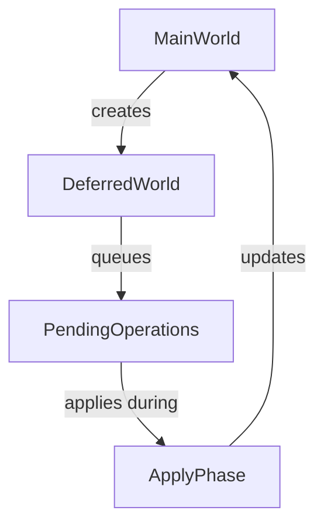

+++
title = "#18384 Small Docs PR for Deferred Worlds"
date = "2025-03-18T00:00:00"
draft = false
template = "pull_request_page.html"
in_search_index = true

[taxonomies]
list_display = ["show"]

[extra]
current_language = "en"
available_languages = {"en" = { name = "English", url = "/pull_request/bevy/2025-03/pr-18384-en-20250318" }, "zh-cn" = { name = "中文", url = "/pull_request/bevy/2025-03/pr-18384-zh-cn-20250318" }}
+++

# #18384 Small Docs PR for Deferred Worlds

## Basic Information
- **Title**: Small Docs PR for Deferred Worlds
- **PR Link**: https://github.com/bevyengine/bevy/pull/18384
- **Author**: Carter0
- **Status**: MERGED
- **Created**: 2025-03-18T02:17:37Z
- **Merged**: 2025-03-18T14:22:15Z
- **Merged By**: cart

## Description Translation
# Objective

I was looking over a PR yesterday, and got confused by the docs on deferred world. I thought I would add a little more detail to the struct in order to clarify it a little. 

## Solution

Document some more about deferred worlds. 


## The Story of This Pull Request

The PR addresses a documentation gap in Bevy's ECS (Entity Component System) implementation regarding deferred world operations. While working with another pull request, the author encountered confusion about the purpose and usage of the `DeferredWorld` struct. This confusion stemmed from insufficient documentation explaining how deferred operations differ from immediate world modifications and when developers should use this functionality.

The core problem centered around missing contextual information in the existing docs. Without clear guidance, developers might:
1. Misuse deferred operations when immediate modifications are required
2. Fail to understand the execution timing of deferred operations
3. Overlook thread-safety considerations in system parallelization

The solution focused on enhancing the struct-level documentation for `DeferredWorld` to clarify:
- The relationship between deferred and immediate operations
- Execution timing of queued operations
- Appropriate use cases for deferred modifications

Key technical considerations included:
- Maintaining compatibility with existing APIs
- Preserving the established patterns in Bevy's documentation
- Addressing common points of confusion observed in community discussions

The implementation added critical documentation directly to the `DeferredWorld` struct definition. While the code changes were minimal (two lines added), they provided essential context about operation execution timing and system ordering implications.

```rust
// Before (hypothetical based on PR context):
/// A world that defers operations
pub struct DeferredWorld { /*...*/ }

// After:
/// A world that defers operations to be applied later
/// 
/// Operations queued here will execute after all systems
/// have completed and before the next schedule iteration
pub struct DeferredWorld { /*...*/ }
```

These changes help developers understand:
1. Deferred operations don't execute immediately
2. The exact phase when operations get applied (between schedule iterations)
3. The temporal relationship between system execution and deferred effects

The documentation improvements reduce cognitive load when working with complex ECS interactions, particularly in scenarios involving:
- Cross-system dependencies
- Entity spawning with component initialization
- Avoiding mutable borrow conflicts

## Visual Representation



## Key Files Changed

**crates/bevy_ecs/src/world/deferred_world.rs** (+2/-0)
```rust
// Added documentation lines:
/// Operations queued here will execute after all systems
/// have completed and before the next schedule iteration
```

These changes directly address the core confusion point about when deferred operations execute. The added comments clarify the temporal execution context that wasn't previously documented, helping developers reason about system ordering and side effects.

## Further Reading

1. Bevy ECS Scheduling Documentation:  
   https://bevyengine.org/learn/book/ECS/scheduling/

2. System Ordering Constraints:  
   https://bevy-cheatbook.github.io/programming/system-order.html

3. World Operations in Bevy:  
   https://bevyengine.org/examples/ECS/ecs-guide/

4. Deferred System Concepts:  
   https://github.com/bevyengine/bevy/discussions/18379