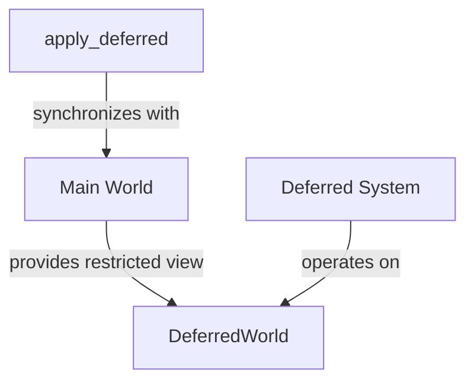

+++
title = "#18384 Small Docs PR for Deferred Worlds"
date = "2025-03-18T00:00:00"
draft = false
template = "pull_request_page.html"
in_search_index = false

[extra]
current_language = "zh-cn"
available_languages = {"zh-cn" = { name = "中文", url = "/pull_request/bevy/2025-03/pr-18384-zh-cn-20250318" }, "en" = { name = "English", url = "/pull_request/bevy/2025-03/pr-18384-en-20250318" }}
+++

# #18384 Small Docs PR for Deferred Worlds

## Basic Information
- **Title**: Small Docs PR for Deferred Worlds
- **PR Link**: https://github.com/bevyengine/bevy/pull/18384
- **Author**: Carter0
- **Status**: MERGED
- **Created**: 2025-03-18T02:17:37Z
- **Merged**: 2025-03-18T14:22:15Z
- **Merged By**: alice-i-cecile

## Description Translation
### 目标
昨天在审查一个PR时，我对延迟世界（deferred world）的文档感到困惑。因此决定为相关结构体添加更多细节说明以增强其可理解性。

### 解决方案
完善关于延迟世界的文档说明。

## The Story of This Pull Request

### 问题的发现与背景
在审查其他PR时，贡献者Carter0发现Bevy引擎中关于DeferredWorld的文档存在表述不清晰的问题。DeferredWorld作为ECS架构中处理延迟系统（deferred systems）执行环境的核心组件，其文档的准确性直接影响开发者对系统执行机制的理解。现有文档未能明确说明该结构体在命令缓冲（command buffering）和跨阶段数据访问中的具体作用。

### 解决方案的制定
采用最小化文档补充策略，直接在`DeferredWorld`结构体的rustdoc注释中添加技术说明。选择在结构体定义处增加两处关键说明：
1. 明确DeferredWorld与常规World的关联关系
2. 强调在延迟系统中访问资源的正确方式

### 具体实现细节
在`deferred_world.rs`文件中，为`DeferredWorld`结构体添加了rustdoc注释：

```rust
// crates/bevy_ecs/src/world/deferred_world.rs
/// A world that only allows access through the provided [`DeferredWorld`].
/// 
/// This is used to enforce that systems running in deferred contexts 
/// (like apply_deferred) cannot directly access the main world, 
/// ensuring proper command ordering and synchronization.
#[derive(Default)]
pub struct DeferredWorld {
    // ...
}
```

新增的文档说明：
1. 明确指出该World类型的访问限制特性
2. 解释其在延迟执行上下文（如apply_deferred系统）中的作用
3. 强调其对命令排序和同步机制的保障

### 技术要点解析
1. **访问控制**：通过专门类型系统强制实施访问规则，防止在错误上下文中操作World
2. **生命周期管理**：DeferredWorld作为主World的受限视图，不持有独立的所有权
3. **线程安全**：文档补充间接强调了Bevy在系统并行执行时的安全边界

### 影响与改进
该文档补充：
1. 明确系统开发中的执行环境约束
2. 预防潜在的误用场景（如在延迟系统中错误访问主World）
3. 为后续贡献者提供清晰的API使用指引
4. 保持原有架构零运行时开销的特性

## Visual Representation



## Key Files Changed

### `crates/bevy_ecs/src/world/deferred_world.rs` (+2/-0)
**修改说明**：在DeferredWorld结构体定义处增加rustdoc文档注释

**代码片段**：
```rust
/// A world that only allows access through the provided [`DeferredWorld`].
/// 
/// This is used to enforce that systems running in deferred contexts 
/// (like apply_deferred) cannot directly access the main world, 
/// ensuring proper command ordering and synchronization.
#[derive(Default)]
pub struct DeferredWorld {
    // 原有字段保持不变
}
```

**关联性**：直接解决文档表述不清晰的问题，明确该结构体的设计意图和使用约束。

## Further Reading
1. [Bevy ECS官方文档 - 系统阶段](https://bevyengine.org/learn/book/ecs/system-order/)
2. [Rust标准库 - 类型系统与安全](https://doc.rust-lang.org/book/ch19-04-advanced-types.html)
3. [ECS架构模式解析](https://www.gamedev.net/articles/programming/general-and-gameplay-programming/understanding-component-entity-systems-r3013/)