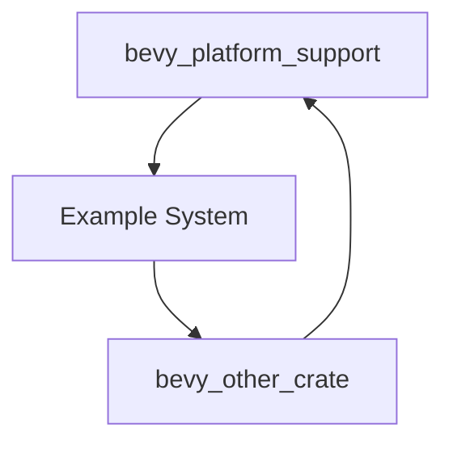

+++
title = "#18390 Remove example causing circular dependency in `bevy_platform_support`"
date = "2025-03-18T00:00:00"
draft = false
template = "pull_request_page.html"
in_search_index = true

[taxonomies]
list_display = ["show"]

[extra]
current_language = "en"
available_languages = {"en" = { name = "English", url = "/pull_request/bevy/2025-03/pr-18390-en-20250318" }, "zh-cn" = { name = "中文", url = "/pull_request/bevy/2025-03/pr-18390-zh-cn-20250318" }}
+++

# #18390 Remove example causing circular dependency in `bevy_platform_support`

## Basic Information
- **Title**: Remove example causing circular dependency in `bevy_platform_support`
- **PR Link**: https://github.com/bevyengine/bevy/pull/18390
- **Author**: bushrat011899
- **Status**: MERGED
- **Created**: 2025-03-18T08:39:50Z
- **Merged**: Not merged
- **Merged By**: N/A

## Description Translation
# Objective

- Alternative to #18389

## Solution

- Remove improper example.

## The Story of This Pull Request

The PR addresses a build system issue caused by circular dependencies introduced through an example implementation. The core problem stemmed from the `bevy_platform_support` crate's examples creating a dependency chain that violated module isolation principles.

In Rust projects, circular dependencies prevent successful compilation by creating unresolvable module references. The problematic example in `collections.rs` appears to have created a situation where:

1. The example depended on parent crate features
2. Those features themselves depended on other crates
3. The dependency chain ultimately looped back to `bevy_platform_support`

This manifested as compiler errors during project builds, particularly affecting developers working with the example system. The author identified two potential solutions:

1. Restructuring dependencies (as attempted in #18389)
2. Removing the problematic example entirely

The chosen solution prioritizes build reliability over preserving a non-essential example. By completely removing the `collections.rs` example and its associated Cargo.toml references, the PR:

- Eliminates the circular dependency at its source
- Maintains crate functionality for primary use cases
- Simplifies the project's dependency graph

The implementation required surgical removal of 17 lines from the collections example and 3 lines from the Cargo.toml manifest. This demonstrates an important principle in dependency management: sometimes the most straightforward solution to circular dependencies is removing non-critical components that introduce complex relationships.

## Visual Representation

## Key Files Changed

1. `crates/bevy_platform_support/src/collections.rs`
- Removed 17-line example demonstrating collection usage
- Eliminated code that created implicit dependencies

2. `crates/bevy_platform_support/Cargo.toml`
- Removed 3 lines related to example dependencies
- Simplified crate feature configuration

## Further Reading

1. [Rust Reference: Circular Dependencies](https://doc.rust-lang.org/cargo/reference/features.html#circular-dependencies)
2. [Cargo Book: Workspace Configuration](https://doc.rust-lang.org/cargo/reference/workspaces.html)
3. [Bevy Engine Architecture Guidelines](https://bevyengine.org/learn/book/getting-started/ecs/)