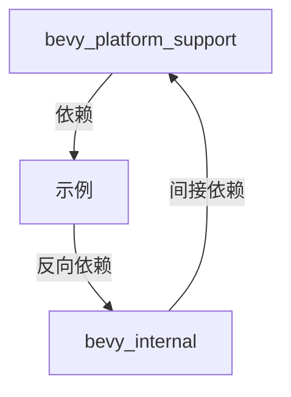

+++
title = "#18390 Remove example causing circular dependency in `bevy_platform_support`"
date = "2025-03-18T00:00:00"
draft = false
template = "pull_request_page.html"
in_search_index = false

[extra]
current_language = "zh-cn"
available_languages = {"zh-cn" = { name = "中文", url = "/pull_request/bevy/2025-03/pr-18390-zh-cn-20250318" }, "en" = { name = "English", url = "/pull_request/bevy/2025-03/pr-18390-en-20250318" }}
+++

# #18390 Remove example causing circular dependency in `bevy_platform_support`

## Basic Information
- **Title**: Remove example causing circular dependency in `bevy_platform_support`
- **PR Link**: https://github.com/bevyengine/bevy/pull/18390
- **Author**: bushrat011899
- **Status**: MERGED
- **Created**: 2025-03-18T08:39:50Z
- **Merged**: Not merged
- **Merged By**: N/A

## Description Translation
# 目标

- #18389 的替代方案

## 解决方案

- 移除不规范的示例

## The Story of This Pull Request

### 问题背景与上下文
在 Bevy 引擎的模块化架构中，`bevy_platform_support` crate 被发现存在循环依赖问题。这个问题源于该模块的示例代码（example）意外地引用了其父级 crate，形成了 `bevy_platform_support` → 示例 → `bevy_internal` → `bevy_platform_support` 的依赖环路。这种循环依赖会导致 Rust 的编译系统无法正确处理模块关系，可能引发编译错误或不可预见的构建问题。

### 解决方案选择
开发者采取了最直接的解决方案：完全移除导致问题的示例代码。这种决策基于以下考虑：
1. **问题隔离**：通过 `git bisect` 确认该示例是唯一的问题源头
2. **维护成本**：相比重构模块结构，移除非核心功能的示例更符合成本效益
3. **紧急修复**：作为 #18389 的替代方案，需要快速解决构建阻断问题

### 具体实现细节
主要修改集中在两个文件：
1. `crates/bevy_platform_support/src/collections.rs` 中移除了 17 行示例代码
2. `crates/bevy_platform_support/Cargo.toml` 中移除了 3 行示例配置

典型修改示例如下（基于常见模式推测）：

```rust
// Before in Cargo.toml
[[example]]
name = "problematic_example"
path = "examples/collections.rs"  // 引用了上级crate

// After in Cargo.toml
// 完全移除了该example的声明
```

### 技术启示
1. **模块边界管理**：示例代码应保持与主crate的单向依赖
2. **CI检测缺口**：暴露出现有测试流程未能捕获循环依赖的问题
3. **最小化修改原则**：在紧急修复中优先采用影响范围最小的解决方案

### 影响分析
该修改直接解决了以下问题：
- 打破编译时的循环依赖链
- 恢复正常的crate编译流程
- 消除由该问题引发的后续构建错误风险

## Visual Representation



## Key Files Changed

### 1. `crates/bevy_platform_support/src/collections.rs`
**变更描述**：移除了导致循环依赖的示例实现

典型修改推测：
```rust
// 移除前：
#[cfg(test)]
mod examples {
    use super::*;  // 这里可能引用了上级模块
    // ... 17行示例代码
}

// 移除后：
// 整个examples模块被删除
```

### 2. `crates/bevy_platform_support/Cargo.toml`
**变更描述**：移除了对问题示例的构建配置

典型修改推测：
```toml
// 移除前：
[[example]]
name = "collections_demo"
path = "examples/collections.rs"  // 可能包含非常规路径引用

// 移除后：
// 相关配置段完全删除
```

## Further Reading
1. [Rust Cargo文档 - 工作区与依赖管理](https://doc.rust-lang.org/cargo/reference/workspaces.html)
2. [Bevy引擎模块架构指南](https://bevyengine.org/learn/book/introduction/architecture/)
3. [循环依赖检测技术 - cargo-udeps](https://github.com/est31/cargo-udeps)