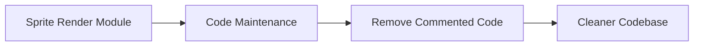

+++
title = "#18392 Remove commented-out code"
date = "2025-03-18T00:00:00"
draft = false
template = "pull_request_page.html"
in_search_index = true

[taxonomies]
list_display = ["show"]

[extra]
current_language = "en"
available_languages = {"en" = { name = "English", url = "/pull_request/bevy/2025-03/pr-18392-en-20250318" }, "zh-cn" = { name = "中文", url = "/pull_request/bevy/2025-03/pr-18392-zh-cn-20250318" }}
+++

# #18392 Remove commented-out code

## Basic Information
- **Title**: Remove commented-out code
- **PR Link**: https://github.com/bevyengine/bevy/pull/18392
- **Author**: ickshonpe
- **Status**: MERGED
- **Created**: 2025-03-18T12:18:00Z
- **Merged**: Not merged
- **Merged By**: N/A

## Description Translation
# Objective

Remove a leftover commented-out line.

## The Story of This Pull Request

This PR addresses a routine maintenance task in the Bevy engine's codebase. During normal development workflows, engineers sometimes comment out code temporarily for debugging or testing purposes. However, leaving these commented-out fragments in the codebase long-term can create confusion for future contributors and increase cognitive load during code reviews.

The specific change focuses on the sprite rendering module where a single line of commented-out code remained from previous development work. While seemingly minor, such remnants can lead to questions about whether:
1. The code was intentionally preserved for future use
2. The comment represents incomplete work
3. There's hidden functionality that needs consideration

The implementation consists of a straightforward deletion in `crates/bevy_sprite/src/render/mod.rs`. By removing this obsolete comment, the PR:
- Reduces potential ambiguity
- Maintains code hygiene
- Follows best practices for codebase maintenance

This change required minimal technical deliberation but demonstrates good software stewardship. The decision to remove rather than preserve the comment follows the principle that version control history (through git) serves as the proper mechanism for tracking code changes, not in-line comments.

## Visual Representation



## Key Files Changed

**File:** `crates/bevy_sprite/src/render/mod.rs`

**Change:** Removal of single commented-out line

Before:
```rust
// color.w *= alpha_factor;
```

After:
```rust
// Line removed
```

This change eliminates obsolete code from the sprite rendering pipeline's shader preparation logic. The removed line related to alpha multiplication was likely commented during previous refactoring but remained in the file unnecessarily.

## Further Reading

1. [Google Code Health: Delete Dead Code](https://testing.googleblog.com/2017/04/code-health-to-comment-or-not-to-comment.html)
2. [Martin Fowler: Refactoring Chapter on Code Smells](https://refactoring.com/)
3. [Bevy Engine Contribution Guidelines](https://github.com/bevyengine/bevy/blob/main/CONTRIBUTING.md)