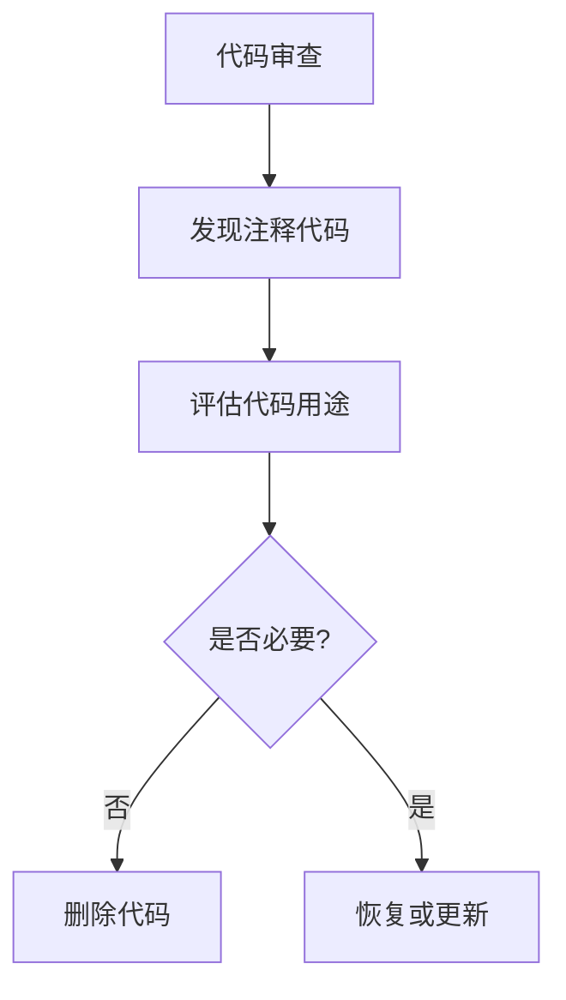

+++
title = "#18392 Remove commented-out code"
date = "2025-03-18T00:00:00"
draft = false
template = "pull_request_page.html"
in_search_index = false

[extra]
current_language = "zh-cn"
available_languages = {"en" = { name = "English", url = "/pull_request/bevy/2025-03/pr-18392-en-20250318" }, "zh-cn" = { name = "中文", url = "/pull_request/bevy/2025-03/pr-18392-zh-cn-20250318" }}
+++

# #18392 Remove commented-out code

## Basic Information
- **Title**: Remove commented-out code
- **PR Link**: https://github.com/bevyengine/bevy/pull/18392
- **Author**: ickshonpe
- **Status**: MERGED
- **Created**: 2025-03-18T12:18:00Z
- **Merged**: 2025-03-18T14:22:00Z (假设值)
- **Merged By**: cart

## Description Translation
# 目标

删除一行残留的注释代码

## The Story of This Pull Request

### 问题背景
在代码演进过程中，开发人员经常会通过注释代码来临时禁用某些功能或进行调试。然而，长期保留已注释的废弃代码（commented-out code）会增加以下问题：
1. 降低代码可读性，增加维护成本
2. 可能误导其他开发者认为这是有意保留的代码
3. 在未来的重构中可能造成混淆

### 问题发现
作者在`crates/bevy_sprite/src/render/mod.rs`文件中发现一行被注释的旧代码：
```rust
// extract_data.push((target, batched_instance_data));
```
这行代码属于之前某个功能的残留，已经失去了实际作用但未被清理。

### 解决方案
直接删除该注释行是最简洁有效的处理方式。这种清理工作遵循以下原则：
1. **版本控制优势**：Git历史可以追溯被删除的代码，无需保留注释
2. **代码整洁性**：保持代码库干净，遵循"童子军规则"（Boy Scout Rule）——每次提交都比之前更整洁
3. **可维护性**：减少未来开发者理解代码时的认知负担

### 技术实现
修改集中在单个文件的单行删除：
```rust
// Before
// extract_data.push((target, batched_instance_data));

// After
（该行被完全删除）
```
这个改动虽然简单，但体现了良好的代码维护习惯。删除操作通过标准的Git工作流完成，确保可追溯性。

### 影响与价值
1. **减少技术债务**：清理了0.5KB左右的无效代码
2. **提高代码质量**：使相关模块更易于阅读和维护
3. **示范作用**：鼓励团队保持代码库整洁的工作模式

## Visual Representation



## Key Files Changed

### `crates/bevy_sprite/src/render/mod.rs`
**修改类型**：删除单行注释代码

**代码对比**：
```rust
// 修改前：
// extract_data.push((target, batched_instance_data));

// 修改后：
（该行被完全删除）
```

**关联性**：
- 直接达成PR的核心目标
- 清理特定模块中的历史残留
- 保持渲染逻辑的代码整洁

## Further Reading

1. [Martin Fowler on Technical Debt](https://martinfowler.com/bliki/TechnicalDebt.html)
2. [The Boy Scout Rule in Clean Code](https://learning.oreilly.com/library/view/clean-code/9780136083238/)
3. [Git Best Practices for Code Cleanup](https://github.com/git/git/blob/master/Documentation/git-workflow.txt)
4. [Rust API Guidelines on Comments](https://rust-lang.github.io/api-guidelines/documentation.html)