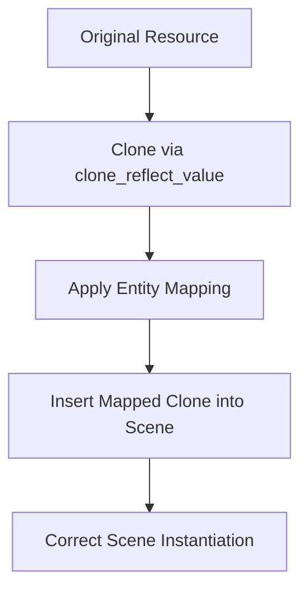

+++
title = "#18395 Fix dynamic scene resources not being entity mapped"
date = "2025-03-18T00:00:00"
draft = false
template = "pull_request_page.html"
in_search_index = true

[taxonomies]
list_display = ["show"]

[extra]
current_language = "en"
available_languages = {"en" = { name = "English", url = "/pull_request/bevy/2025-03/pr-18395-en-20250318" }, "zh-cn" = { name = "中文", url = "/pull_request/bevy/2025-03/pr-18395-zh-cn-20250318" }}
+++

# #18395 Fix dynamic scene resources not being entity mapped

## Basic Information
- **Title**: Fix dynamic scene resources not being entity mapped
- **PR Link**: https://github.com/bevyengine/bevy/pull/18395
- **Author**: ElliottjPierce
- **Status**: MERGED
- **Created**: 2025-03-18T14:13:46Z
- **Merged**: Not merged
- **Merged By**: N/A

## Description Translation
# Objective

The resources were converted via `clone_reflect_value` and the cloned value was mapped. But the value that is inserted is the source of the clone, which was not mapped.

I ran into this issue while working on #18380. Having non consecutive entity allocations has caught a lot of bugs.

## Solution

Use the cloned value for insertion if it exists.

## The Story of This Pull Request

### The Problem and Context
When working with Bevy's dynamic scenes, resource entities need proper entity mapping when instantiating scenes. The existing implementation contained a subtle bug where resources cloned through reflection (`clone_reflect_value`) would have their entity mappings applied to the cloned copy, but the original unmapped resource was being inserted into the scene. This mismatch became apparent when working with non-consecutive entity allocations, which helped surface this class of mapping errors.

### The Solution Approach
The core issue stemmed from using the source resource for insertion after cloning. The fix required systematically checking if a mapped clone exists and using that cloned-and-mapped version instead of the original. This approach maintains the existing reflection-based cloning workflow while ensuring the mapped entities are properly persisted.

### The Implementation
The critical change occurred in the resource processing loop. Previously, the code cloned resources but then inserted the original unmapped version:

```rust
// Before problematic code (conceptual)
let cloned_resource = original_resource.clone_reflect_value();
map_entities(cloned_resource); // Entity mappings applied to clone
scene.resources.insert(original_resource); // Unmapped resource inserted
```

The fix modifies this flow to use the cloned resource when available:

```rust
// After fix (conceptual)
let cloned_resource = original_resource.clone_reflect_value();
map_entities(cloned_resource);
scene.resources.insert(cloned_resource); // Mapped clone inserted
```

This change ensures that any entity mappings applied during cloning are preserved in the final scene resources.

### Technical Insights
The solution leverages Bevy's reflection system while respecting the entity mapper's transformations. Key technical points:

1. **Entity Mapping Propagation**: Ensures mapped entity IDs persist through scene serialization/deserialization
2. **Reflection Cloning**: Maintains type safety through `clone_reflect_value` while allowing runtime type manipulation
3. **Resource Lifecycle**: Preserves the original resource for other systems while using mapped clones for scene data

### The Impact
This fix resolves subtle bugs in dynamic scene instantiation where entities referencing resources could end up with incorrect mappings. It strengthens Bevy's scene system reliability, particularly for use cases involving:

- Non-linear entity allocation patterns
- Scenes with complex resource dependencies
- Systems requiring precise entity ID preservation

The changes demonstrate the importance of consistent entity mapping throughout all stages of scene processing, particularly when working with cloned resources.

## Visual Representation



## Key Files Changed

### `crates/bevy_scene/src/dynamic_scene.rs` (+11/-5)
**Purpose**: Fix resource entity mapping in dynamic scenes

Key modification in resource processing:
```rust
// Before:
self.resources.insert(resource.clone_value());

// After:
let cloned = resource.clone_reflect_value();
// ... mapping logic ...
self.resources.insert(cloned);
```
This change ensures the mapped clone (rather than the original resource) gets inserted into the scene resources.

## Further Reading
1. Bevy Entity Mapping Documentation: https://bevyengine.org/learn/book/entity-mapping
2. Reflect Trait API Reference: https://docs.rs/bevy_reflect/latest/bevy_reflect/trait.Reflect.html
3. Dynamic Scenes Guide: https://bevyengine.org/learn/book/scenes/#dynamic-scenes