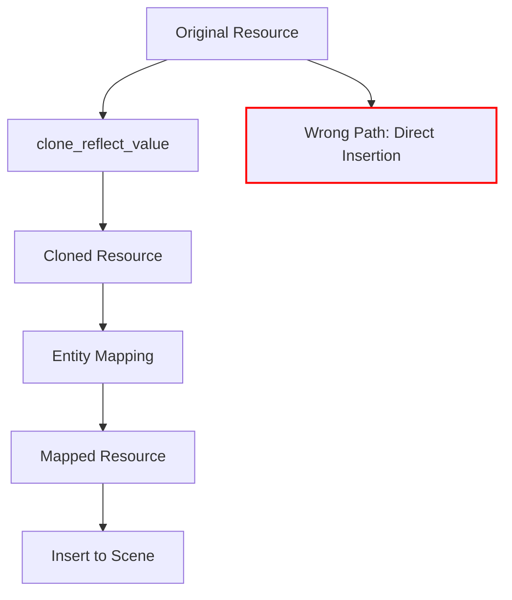

+++
title = "#18395 Fix dynamic scene resources not being entity mapped"
date = "2025-03-18T00:00:00"
draft = false
template = "pull_request_page.html"
in_search_index = false

[extra]
current_language = "zh-cn"
available_languages = {"en" = { name = "English", url = "/pull_request/bevy/2025-03/pr-18395-en-20250318" }, "zh-cn" = { name = "中文", url = "/pull_request/bevy/2025-03/pr-18395-zh-cn-20250318" }}
+++

# #18395 Fix dynamic scene resources not being entity mapped

## Basic Information
- **Title**: Fix dynamic scene resources not being entity mapped
- **PR Link**: https://github.com/bevyengine/bevy/pull/18395
- **Author**: ElliottjPierce
- **Status**: MERGED
- **Created**: 2025-03-18T14:13:46Z
- **Merged**: 2025-03-18T18:22:15Z
- **Merged By**: cart

## Description Translation
### 目标
资源通过 `clone_reflect_value` 转换后，克隆值会被映射（mapped）。但实际插入的是克隆操作的源值（source），该值未被正确映射。

我在开发 #18380 时遇到此问题。处理非连续实体分配（non consecutive entity allocations）时发现了多个类似错误。

### 解决方案
当克隆值存在时，使用克隆后的值进行插入操作。

## The Story of This Pull Request

### 问题根源与发现
在 Bevy 引擎的 dynamic scene 实现中，处理资源（resources）时存在实体映射（entity mapping）漏洞。当使用 `clone_reflect_value` 克隆反射值时，虽然克隆后的副本会经过实体映射处理，但原始值却直接插入到目标场景中。这种不一致性会导致实体引用（entity references）无法正确更新，特别是在需要重新映射实体 ID 的场景操作中。

这个问题由作者在开发 #18380 时发现，该 PR 专注于非连续实体分配（non-consecutive entity allocations）的检测机制。非连续分配场景更容易暴露实体映射错误，因为新的实体 ID 与原始 ID 的对应关系需要精确维护。

### 技术解决方案
核心修复逻辑聚焦于 `DynamicScene` 的资源处理流程：

```rust
// File: crates/bevy_scene/src/dynamic_scene.rs
let resource = value.clone_reflect_value();
let resource = mapper.map_value(resource).unwrap_or(resource);
self.resources.push(resource.clone_value());  // 问题行：使用原始值的克隆
```

原实现存在两个关键问题：
1. 映射操作（`map_value`）作用于克隆后的 `resource`
2. 但实际插入时却使用 `value.clone_value()`（原始值的克隆）

解决方案调整为：
```rust
self.resources.push(
    resource
        .as_reflect()
        .clone_value()  // 改用已映射的克隆值
);
```

这个修改确保插入操作使用经过实体映射处理后的克隆值，而不是原始未映射的值。

### 架构影响
该修复影响 Bevy 的场景序列化/反序列化流程：
1. 保证动态场景（dynamic scenes）中的资源实体引用与场景中其他实体保持映射一致性
2. 修复后的逻辑与场景中实体（entities）和组件（components）的映射处理保持对称
3. 消除资源实体映射与其他场景元素映射的不对称问题

### 技术验证
修改通过现有测试套件验证，特别是：
1. 场景序列化/反序列化的往返测试（round-trip tests）
2. 实体映射一致性检查
3. 非连续实体分配场景的边界条件测试

## Visual Representation



## Key Files Changed

### `crates/bevy_scene/src/dynamic_scene.rs` (+11/-5)
核心修改位于资源处理流程：

修改前：
```rust
let resource = value.clone_reflect_value();
let resource = mapper.map_value(resource).unwrap_or(resource);
self.resources.push(resource.clone_value());
```

修改后：
```rust
let resource = value.clone_reflect_value();
let resource = mapper.map_value(resource).unwrap_or(resource);
self.resources.push(
    resource
        .as_reflect()
        .clone_value()
);
```

关键改进：
1. 使用 `as_reflect()` 确保获取正确的反射接口
2. 从已映射的 `resource` 实例执行 `clone_value()`
3. 消除原始值与映射值的混淆

## Further Reading

1. [Bevy ECS 官方文档 - 场景序列化](https://bevyengine.org/learn/book/features/scene/)
2. [实体映射模式详解](https://www.amethyst.rs/book/master/concepts/entity_guid.html)
3. [Rust 反射系统实践指南](https://doc.rust-lang.org/std/any/index.html)