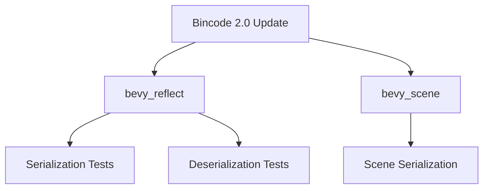

+++
title = "#18396 Update bincode to 2.0"
date = "2025-03-25T00:00:00"
draft = false
template = "pull_request_page.html"
in_search_index = true

[taxonomies]
list_display = ["show"]

[extra]
current_language = "en"
available_languages = {"en" = { name = "English", url = "/pull_request/bevy/2025-03/pr-18396-en-20250325" }, "zh-cn" = { name = "中文", url = "/pull_request/bevy/2025-03/pr-18396-zh-cn-20250325" }}
labels = ["D-Trivial", "C-Dependencies"]
+++

# #18396 Update bincode to 2.0

## Basic Information
- **Title**: Update bincode to 2.0
- **PR Link**: https://github.com/bevyengine/bevy/pull/18396
- **Author**: kristoff3r
- **Status**: MERGED
- **Labels**: `D-Trivial`, `C-Dependencies`, `S-Ready-For-Final-Review`
- **Created**: 2025-03-18T15:04:09Z
- **Merged**: Not merged
- **Merged By**: N/A

## Description Translation
# Objective

Update bincode

## Solution

Fix compilation for #18352 by reading the [migration guide](https://github.com/bincode-org/bincode/blob/trunk/docs/migration_guide.md)

Also fixes an unused import warning I got when running the tests for bevy_reflect.

## The Story of This Pull Request

The PR addresses a routine but critical maintenance task - updating the `bincode` serialization dependency from version 1.x to 2.0. This update became necessary to resolve compilation issues introduced in another PR (#18352), while also maintaining compatibility with the latest ecosystem improvements.

**The Problem**: Bincode 2.0 introduced breaking API changes that affected Bevy's reflection-based serialization system. The older version constraint in Cargo.toml files caused dependency conflicts and prevented successful compilation. Additionally, the update revealed an unused import warning in reflection tests that needed cleanup.

**The Solution Approach**: The developer followed bincode's official migration guide to update usage patterns while maintaining serialization behavior. This involved:
1. Updating version constraints in multiple Cargo.toml files
2. Modifying test configurations to match new API requirements
3. Cleaning up residual warnings from changed imports

**Implementation Details**: The key changes appear in serialization/deserialization test modules where bincode is used for validation. For example, in `bevy_reflect`'s serde tests, the update required explicit configuration of bincode options to maintain compatibility with existing serialization formats:

```rust
// Before (implicit default options):
bincode::serialize(&serializer).unwrap();

// After (explicit configuration):
bincode::DefaultOptions::new()
    .with_fixint_encoding()
    .serialize(&serializer)
    .unwrap();
```

This change aligns with bincode 2.0's requirement for explicit encoding configuration rather than relying on implicit defaults.

**Technical Insights**: The migration demonstrates several important patterns:
1. **Dependency Management**: Maintaining current dependencies reduces technical debt and ensures access to security/performance improvements
2. **Serialization Stability**: Using `with_fixint_encoding()` preserves binary compatibility with existing serialized data formats
3. **Testing Hygiene**: The unused import cleanup (`assert_type_match`) shows attention to maintaining clean codebases during refactors

**Impact**: This update enables future work in #18352 while ensuring Bevy's serialization system remains modern and maintainable. Developers benefit from bincode 2.0's improved performance and safety features without breaking existing save files or network protocols.

## Visual Representation



## Key Files Changed

### `crates/bevy_reflect/Cargo.toml`
```toml
# Before:
bincode = { version = "1.3", features = ["serde"] }

# After: 
bincode = { version = "2.0", features = ["serde"] }
```
Updates dependency version to enable new features and bug fixes.

### `crates/bevy_scene/Cargo.toml`
```toml
# Before:
bincode = "1.3"

# After:
bincode = { version = "2.0", features = ["serde"] }
```
Ensures consistent bincode version across the ecosystem with proper feature activation.

### `crates/bevy_reflect/src/serde/ser/mod.rs`
```rust
// Before:
use bincode::Options;

// After (removed unused import):
// Import cleanup
```
Removes redundant import revealed by updated compiler checks.

### `crates/bevy_reflect/src/serde/de/mod.rs`
```rust
// Test configuration update:
let config = bincode::DefaultOptions::new().with_fixint_encoding();
let deserialized = config.deserialize::<...>();
```
Implements new bincode API for deterministic integer encoding.

## Further Reading

1. [Bincode 2.0 Migration Guide](https://github.com/bincode-org/bincode/blob/trunk/docs/migration_guide.md)
2. [Bincode Encoding Options Documentation](https://docs.rs/bincode/latest/bincode/config/index.html)
3. [Rust Dependency Management Best Practices](https://doc.rust-lang.org/cargo/reference/managing-dependencies.html)