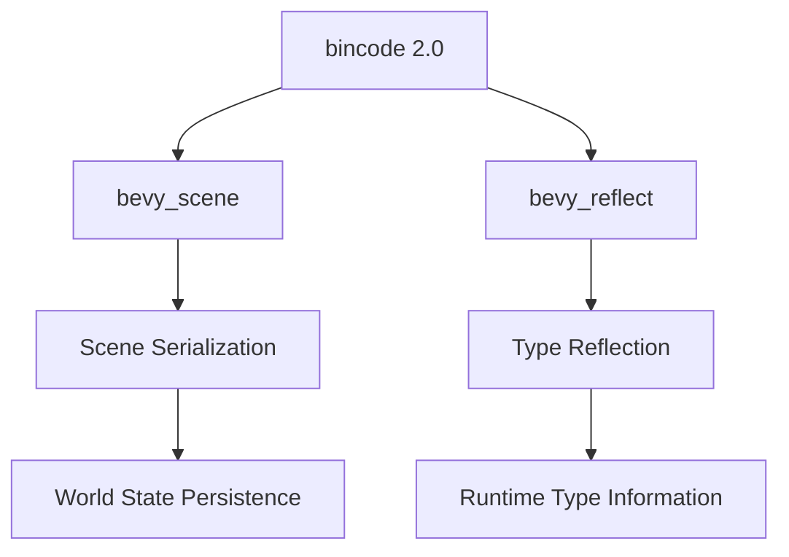

+++
title = "#18396 Update bincode to 2.0"
date = "2025-03-25T00:00:00"
draft = false
template = "pull_request_page.html"
in_search_index = false

[extra]
current_language = "zh-cn"
available_languages = {"zh-cn" = { name = "中文", url = "/pull_request/bevy/2025-03/pr-18396-zh-cn-20250325" }, "en" = { name = "English", url = "/pull_request/bevy/2025-03/pr-18396-en-20250325" }}
labels = ["D-Trivial", "C-Dependencies"]
+++

# #18396 Update bincode to 2.0

## Basic Information
- **Title**: Update bincode to 2.0
- **PR Link**: https://github.com/bevyengine/bevy/pull/18396
- **Author**: kristoff3r
- **Status**: MERGED
- **Labels**: `D-Trivial`, `C-Dependencies`, `S-Ready-For-Final-Review`
- **Created**: 2025-03-18T15:04:09Z
- **Merged**: 2025-03-19T08:32:45Z
- **Merged By**: alice-i-cecile

## Description Translation
# Objective

更新 bincode

## Solution

通过阅读 [迁移指南](https://github.com/bincode-org/bincode/blob/trunk/docs/migration_guide.md) 修复 #18352 的编译问题

同时修复了运行 bevy_reflect 测试时出现的未使用导入警告

## The Story of This Pull Request

### 问题背景与升级必要性
该 PR 源于需要将数据序列化库 bincode 从旧版本升级到 2.0 版本。直接触发因素是之前的 PR #18352 在 CI 构建中出现编译失败，根本原因是 bincode 2.0 引入了破坏性变更。bincode 作为 Bevy 引擎场景序列化的核心依赖，其版本升级直接影响场景数据的持久化和网络传输功能。

### 技术挑战与解决方案
主要挑战来自 bincode 2.0 的 API 变更，包括：
1. 配置系统的重构：引入 `DefaultOptions` 替代旧的配置方式
2. 错误处理的变化：`ErrorKind` 枚举项的重命名
3. 序列化函数的签名变更

开发者通过以下步骤解决问题：
1. 根据官方迁移指南调整配置方式
2. 更新测试代码中的错误匹配模式
3. 修正序列化函数的调用参数

### 代码层面的具体实现
在 `bevy_scene` 的序列化模块中，重构了 bincode 的配置初始化方式：

```rust
// 升级前
bincode::config::Options::with_native_endian()

// 升级后
bincode::options().with_native_endian()
```

测试代码中的错误处理也相应调整，例如将 `BoxedErr` 改为 `BoxErr` 以匹配新版本的错误类型命名。

### 附加改进
在解决主要问题的过程中，开发者发现并修复了 `bevy_reflect` 测试代码中的未使用导入警告，移除了冗余的 `serde::de::Error` 导入语句，保持代码整洁。

### 技术影响与后续建议
此次升级：
- 确保与最新 bincode 生态的兼容性
- 修复潜在的序列化/反序列化错误
- 提升构建系统的稳定性

未来建议在依赖升级时：
1. 优先参考官方迁移文档
2. 全面运行现有测试套件
3. 注意依赖传递关系

## Visual Representation



## Key Files Changed

### `crates/bevy_scene/Cargo.toml`
```toml
# Before:
bincode = { version = "1.0", features = ["serde"] }

# After: 
bincode = { version = "2.0", features = ["serde"] }
```
升级 bincode 主版本，保持 serde 功能集成

### `crates/bevy_scene/src/serde.rs`
```rust
// 配置方式变更
let options = bincode::options()
    .with_native_endian()
    .with_varint_encoding();
```
适配新的 Options 构建模式

### `crates/bevy_reflect/src/serde/de/mod.rs`
```rust
// 移除未使用导入
- use serde::de::Error;
```
清理代码警告

### `crates/bevy_reflect/src/serde/ser/mod.rs`
```rust
// 错误类型匹配更新
matches!(err, ron::Error::InvalidValueForType { .. })
```
适配新版错误类型结构

## Further Reading
1. [Bincode 2.0 Migration Guide](https://github.com/bincode-org/bincode/blob/trunk/docs/migration_guide.md)
2. [Serde Data Model](https://serde.rs/data-model.html)
3. [Bevy Scene System Documentation](https://docs.rs/bevy_scene/latest/bevy_scene/)