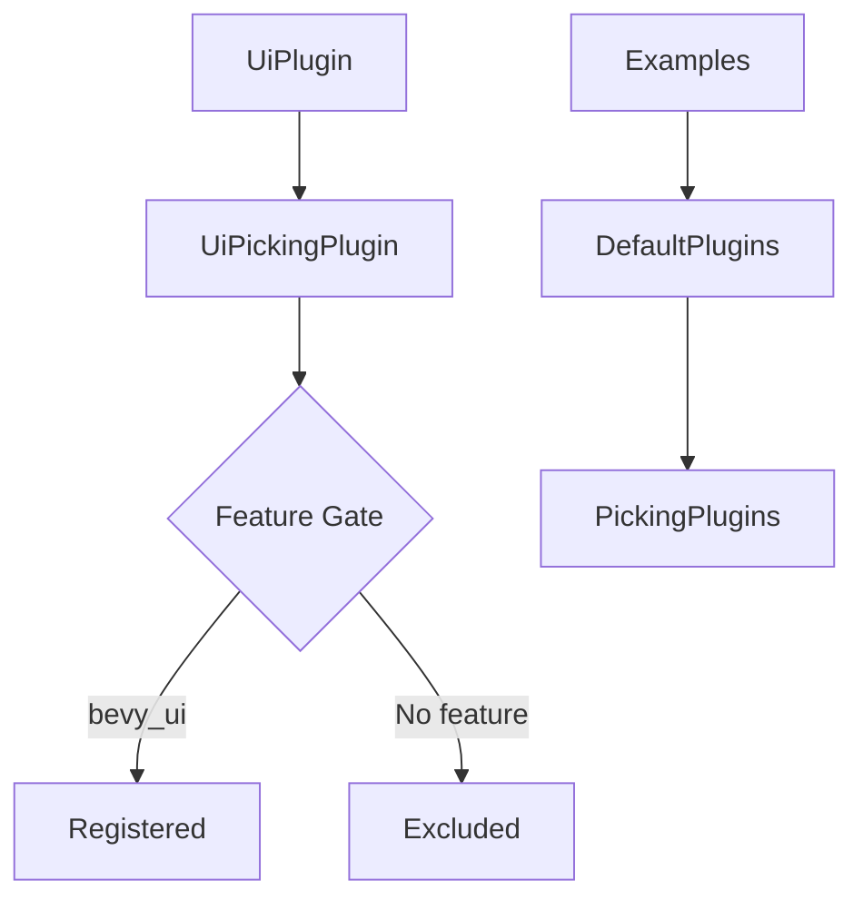

+++
title = "#18401 Unified picking cleanup"
date = "2025-03-18T00:00:00"
draft = false
template = "pull_request_page.html"
in_search_index = true

[taxonomies]
list_display = ["show"]

[extra]
current_language = "en"
available_languages = {"en" = { name = "English", url = "/pull_request/bevy/2025-03/pr-18401-en-20250318" }, "zh-cn" = { name = "中文", url = "/pull_request/bevy/2025-03/pr-18401-zh-cn-20250318" }}
+++

# #18401 Unified picking cleanup

## Basic Information
- **Title**: Unified picking cleanup
- **PR Link**: https://github.com/bevyengine/bevy/pull/18401
- **Author**: alice-i-cecile
- **Status**: MERGED
- **Created**: 2025-03-18T19:58:13Z
- **Merged**: 2025-03-19T08:22:45Z
- **Merged By**: cart

## Description Translation
# Objective

@cart noticed some issues with my work in https://github.com/bevyengine/bevy/pull/17348#discussion_r2001815637, which I somehow missed before merging the PR.

## Solution

- feature gate the UiPickingPlugin correctly
- don't manually add the picking plugins

## Testing

Ran the debug_picking and sprite_picking examples (for UI and sprites respectively): both seem to work fine.

## The Story of This Pull Request

This PR addresses two related issues in Bevy's picking system that were discovered post-merge of a previous implementation (#17348). The core problem stemmed from inconsistent plugin management and feature gating in the UI picking implementation.

**The Problem**  
The original implementation introduced a potential dependency issue where `UiPickingPlugin` wasn't properly feature-gated. This could lead to compilation errors when building without certain features. Additionally, several examples contained redundant plugin registration - they manually added picking plugins that were already included through default plugin groups.

**The Solution Approach**  
The author focused on two key fixes:
1. Correctly wrapping `UiPickingPlugin` registration with `#[cfg(feature = "bevy_ui")]` to prevent inclusion when UI features are disabled
2. Removing manual plugin additions from examples that already inherited them through `DefaultPlugins`

**Implementation Details**  
In `crates/bevy_ui/src/lib.rs`, the plugin registration was modified to:

```rust
#[cfg(feature = "bevy_ui")]
impl Plugin for UiPlugin {
    fn build(&self, app: &mut App) {
        app.add_plugins(UiPickingPlugin);
    }
}
```

This ensures the picking plugin only loads when both the UI system and picking features are enabled. The examples were simplified by removing explicit plugin additions like:

```rust
// Before:
app.add_plugins(DefaultPickingPlugins)
    .add_plugins(UiPickingPlugin);

// After:
app.add_plugins(DefaultPlugins);
```

**Technical Impact**  
These changes:
- Prevent potential compilation errors in non-UI configurations
- Reduce example complexity by relying on plugin inheritance
- Make feature dependencies more explicit
- Maintain backward compatibility while cleaning up initialization patterns

The fixes demonstrate proper use of Bevy's plugin system and feature gating, serving as a reference for future plugin development. By leveraging existing plugin groups, the changes make client code more maintainable and less error-prone.

## Visual Representation



## Key Files Changed

1. `crates/bevy_ui/src/lib.rs` (+3/-2)
```rust
// Before:
impl Plugin for UiPlugin {
    fn build(&self, app: &mut App) {
        app.add_plugins(UiPickingPlugin);
    }
}

// After:
#[cfg(feature = "bevy_ui")]
impl Plugin for UiPlugin {
    fn build(&self, app: &mut App) {
        app.add_plugins(UiPickingPlugin);
    }
}
```
Ensures UI picking only loads with UI features

2. `examples/picking/sprite_picking.rs` (+1/-4)
```rust
// Before:
.add_plugins(DefaultPickingPlugins)

// After:
.add_plugins(DefaultPlugins)
```
Removes redundant plugin registration

3. `examples/ui/tab_navigation.rs` (+1/-6)
```rust
// Removed:
.add_plugins(UiPickingPlugin)
```
Relies on plugins from DefaultPlugins instead

## Further Reading

- Bevy Plugin System: https://bevyengine.org/learn/book/getting-started/plugins/
- Feature Gating in Rust: https://doc.rust-lang.org/cargo/reference/features.html
- Bevy Picking Implementation History: https://github.com/bevyengine/bevy/pull/17348