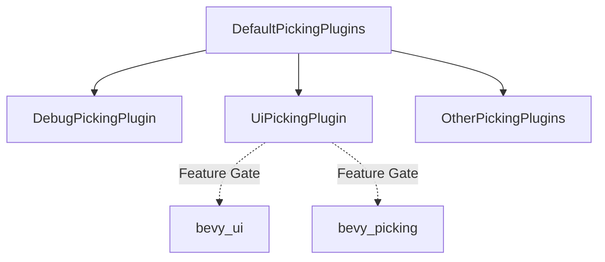

+++
title = "#18401 Unified picking cleanup"
date = "2025-03-18T00:00:00"
draft = false
template = "pull_request_page.html"
in_search_index = false

[extra]
current_language = "zh-cn"
available_languages = {"en" = { name = "English", url = "/pull_request/bevy/2025-03/pr-18401-en-20250318" }, "zh-cn" = { name = "中文", url = "/pull_request/bevy/2025-03/pr-18401-zh-cn-20250318" }}
+++

# #18401 Unified picking cleanup

## Basic Information
- **Title**: Unified picking cleanup
- **PR Link**: https://github.com/bevyengine/bevy/pull/18401
- **Author**: alice-i-cecile
- **Status**: MERGED
- **Created**: 2025-03-18T19:58:13Z
- **Merged By**: cart

## Description Translation
### 目标
@cart 在 https://github.com/bevyengine/bevy/pull/17348#discussion_r2001815637 中发现了我工作中的一些问题，这些问题在合并PR时被我忽略了。

### 解决方案
- 正确地为 UiPickingPlugin 添加特性开关（feature gate）
- 不再手动添加 picking 相关的插件

### 测试
运行了 debug_picking 和 sprite_picking 示例（分别对应UI和精灵的拾取功能）：两者均正常工作。

## The Story of This Pull Request

### 问题背景与发现
在先前合并的PR #17348中，作者实现了统一的picking系统。但事后发现两个关键问题：1）UI拾取插件`UiPickingPlugin`缺少特性开关（feature gate）保护；2）多个示例中手动添加了picking插件而非通过默认插件集自动加载。这两个问题可能造成编译错误（当禁用相应特性时）和代码重复。

### 解决方案与实现路径
核心解决思路遵循Bevy的最佳实践：
1. **特性开关规范化**：为`UiPickingPlugin`添加`#[cfg(feature = "bevy_ui")]`条件编译指令，确保只在启用对应特性时编译
2. **插件注册统一化**：移除示例中手动添加`*PickingPlugin`的代码，依赖`DefaultPickingPlugins`自动注册

关键修改体现在`bevy_ui`库的入口文件：
```rust
// crates/bevy_ui/src/lib.rs
#[cfg(feature = "bevy_ui")]
pub mod interaction {
    // 新增特性条件判断
    #[cfg(feature = "bevy_picking")]
    pub use bevy_picking::ui::UiPickingPlugin;
}
```

同时在多个示例文件中移除手动插件注册代码：
```rust
// 修改前（examples/picking/sprite_picking.rs）:
app.add_plugins(DefaultPickingPlugins)
    .add_plugins(bevy_picking::debug::DebugPickingPlugin)
    
// 修改后:
app.add_plugins(DefaultPickingPlugins);
```

### 技术决策分析
这个修复PR体现了两个重要工程原则：
1. **编译隔离**（Compilation Isolation）：通过特性开关精确控制功能模块的编译条件，避免特性冲突
2. **约定优于配置**（Convention Over Configuration）：利用`DefaultPickingPlugins`统一管理插件依赖，减少手动配置错误

值得注意的实现细节是`DefaultPickingPlugins`已包含`DebugPickingPlugin`，因此手动添加会造成重复初始化。这种设计模式在Bevy引擎中常见，通过预定义的插件组合简化用户配置。

### 影响与改进
此次修改带来的直接收益：
- 减少编译目标大小：当禁用`bevy_ui`或`bevy_picking`特性时排除无关代码
- 消除潜在错误：避免因手动插件注册顺序或重复初始化导致的问题
- 提升代码一致性：所有picking示例统一使用标准插件注册方式

对开发者的重要启示：在Bevy生态中，应优先使用预定义的插件集合（如`DefaultPlugins`/`DefaultPickingPlugins`），而非手动添加单个插件，除非有明确的自定义需求。

## Visual Representation



## Key Files Changed

### crates/bevy_ui/src/lib.rs (+3/-2)
**修改目的**：为UI picking插件添加正确的特性开关保护
```rust
// 修改前：
pub mod interaction {
    pub use bevy_picking::ui::UiPickingPlugin;
}

// 修改后：
#[cfg(feature = "bevy_ui")]
pub mod interaction {
    #[cfg(feature = "bevy_picking")]
    pub use bevy_picking::ui::UiPickingPlugin;
}
```

### examples/picking/sprite_picking.rs (+1/-4)
**修改目的**：移除冗余的插件注册
```rust
// 修改前：
app.add_plugins((
    DefaultPickingPlugins,
    bevy_picking::debug::DebugPickingPlugin,
));

// 修改后：
app.add_plugins(DefaultPickingPlugins);
```

### examples/ui/tab_navigation.rs (+1/-6)
**修改目的**：简化示例配置
```rust
// 移除以下手动插件注册：
app.add_plugins(DefaultPickingPlugins)
    .add_plugins(bevy_picking::debug::DebugPickingPlugin)
```

## Further Reading
1. [Bevy Plugins System Documentation](https://bevyengine.org/learn/book/getting-started/plugins/)
2. [Feature Gates in Rust](https://doc.rust-lang.org/cargo/reference/features.html)
3. [Bevy Picking RFC](https://github.com/bevyengine/rfcs/blob/main/rfcs/49-picking.md)