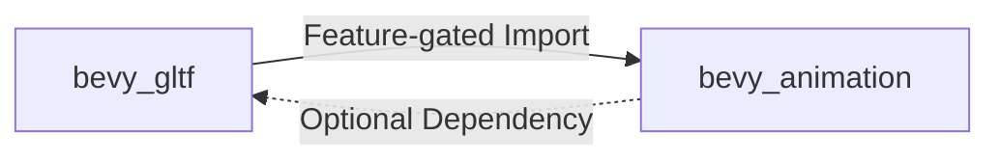

+++
title = "#18403 gate import on bevy_animation in bevy_gltf"
date = "2025-03-19T00:00:00"
draft = false
template = "pull_request_page.html"
in_search_index = true

[taxonomies]
list_display = ["show"]

[extra]
current_language = "en"
available_languages = {"en" = { name = "English", url = "/pull_request/bevy/2025-03/pr-18403-en-20250319" }, "zh-cn" = { name = "中文", url = "/pull_request/bevy/2025-03/pr-18403-zh-cn-20250319" }}
+++

# #18403 gate import on bevy_animation in bevy_gltf

## Basic Information
- **Title**: gate import on bevy_animation in bevy_gltf
- **PR Link**: https://github.com/bevyengine/bevy/pull/18403
- **Author**: mockersf
- **Status**: MERGED
- **Created**: 2025-03-18T23:07:33Z
- **Merged**: Not merged
- **Merged By**: N/A

## Description Translation
# Objective

- `collect_path` is only declared when feature `bevy_animation` is enabled
- it is imported without checking for the feature, not compiling when not enabled

## Solution

- Gate the import


## The Story of This Pull Request

The PR addresses a conditional compilation issue in Bevy's GLTF loader implementation. The root problem stemmed from an unconditional import of animation functionality that wasn't properly feature-gated, causing build failures when the `bevy_animation` feature wasn't enabled.

In the `bevy_gltf` crate's loader module, there was a direct import of `bevy_animation::collect_path` without proper feature flag protection. This created a hard dependency on the animation system even for users who didn't require it, violating Bevy's modular architecture principles. The error manifested as a compilation failure when building without `bevy_animation` enabled, as the imported function wouldn't exist in that configuration.

The solution employed standard Rust conditional compilation attributes to gate the problematic import. By wrapping the import in a `#[cfg(feature = "bevy_animation")]` attribute, the code ensures the animation dependency only loads when the corresponding feature is explicitly enabled. This maintains the GLTF loader's functionality for animation users while preserving compatibility for those who don't need animation support.

The key modification appears in `crates/bevy_gltf/src/loader/mod.rs`:

```rust
#[cfg(feature = "bevy_animation")]
use bevy_animation::collect_path;
```

This three-line change (including the conditional attribute and import statement) fixes the compilation error while maintaining existing behavior for feature-enabled builds. The approach follows Bevy's established patterns for optional subsystem integration, using Rust's native feature flag system to manage cross-crate dependencies.

The change demonstrates proper handling of conditional features in Rust crate ecosystems. It reinforces the importance of:
1. Strict feature gating for cross-crate imports
2. Maintaining compiler compatibility across feature flag combinations
3. Preserving modular architecture by avoiding implicit dependencies

## Visual Representation



## Key Files Changed

**File**: `crates/bevy_gltf/src/loader/mod.rs` (+3/-1)

**Changes**:
```rust
// Before:
use bevy_animation::collect_path;

// After:
#[cfg(feature = "bevy_animation")]
use bevy_animation::collect_path;
```

This change gates the animation path collection import behind the `bevy_animation` feature flag. The conditional compilation attribute ensures the import only occurs when the feature is enabled, resolving the compilation error while maintaining functionality for users who need animation support.

## Further Reading

1. [Rust Conditional Compilation Documentation](https://doc.rust-lang.org/reference/conditional-compilation.html)
2. [Bevy Feature Flags Guide](https://bevyengine.org/learn/book/getting-started/features/)
3. [Cargo Features Documentation](https://doc.rust-lang.org/cargo/reference/features.html)