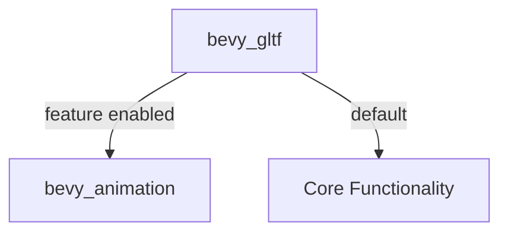

+++
title = "#18403 gate import on bevy_animation in bevy_gltf"
date = "2025-03-19T00:00:00"
draft = false
template = "pull_request_page.html"
in_search_index = false

[extra]
current_language = "zh-cn"
available_languages = {"en" = { name = "English", url = "/pull_request/bevy/2025-03/pr-18403-en-20250319" }, "zh-cn" = { name = "中文", url = "/pull_request/bevy/2025-03/pr-18403-zh-cn-20250319" }}
+++

# #18403 gate import on bevy_animation in bevy_gltf

## Basic Information
- **Title**: gate import on bevy_animation in bevy_gltf
- **PR Link**: https://github.com/bevyengine/bevy/pull/18403
- **Author**: mockersf
- **Status**: MERGED
- **Created**: 2025-03-18T23:07:33Z
- **Merged**: Not merged
- **Merged By**: N/A

## Description Translation
### 目标
- `collect_path` 函数仅在启用 `bevy_animation` 功能时声明
- 当前未检查该功能直接导入，导致未启用时编译失败

### 解决方案
- 添加功能门控条件导入

## The Story of This Pull Request

### 问题与上下文
在 Bevy 引擎的 glTF 加载模块（bevy_gltf）中，开发者发现当用户未启用 `bevy_animation` 功能时，编译会失败。根本原因是代码中直接导入了属于动画模块的 `collect_path` 函数，而该函数仅在启用 `bevy_animation` 功能时存在。这违反了 Rust 的条件编译规则，导致编译时出现未解析符号错误。

### 解决方案与实现
核心解决策略是使用 Rust 的 `#[cfg(feature = "bevy_animation")]` 属性来门控相关导入。具体实施分为两步：

1. **条件导入**：将 `collect_path` 的导入语句包裹在功能检查中
2. **作用域管理**：确保相关代码块只在功能启用时编译

关键修改体现在 `loader/mod.rs` 文件：

```rust
#[cfg(feature = "bevy_animation")]
use bevy_animation::collect_path;
```

这个改动将原本无条件的导入语句转换为仅在启用 `bevy_animation` 功能时生效。原始代码直接导入的方式：

```rust
use bevy_animation::collect_path; // 未加条件判断
```

会导致当用户不启用动画功能时出现编译错误，因为 `bevy_animation` 模块此时不会被包含在编译范围内。

### 技术洞察
这个修改体现了 Rust 条件编译的两个重要实践：
1. **精准的功能门控**：通过 `#[cfg]` 属性精确控制特定功能的编译包含
2. **模块化依赖管理**：确保可选功能的相关依赖不会污染基础编译路径

对于游戏引擎这种需要灵活功能组合的场景，这种处理方式可以：
- 减少不必要的编译依赖
- 降低最终二进制文件体积
- 提高功能组合的灵活性

### 影响与启示
该修复虽然代码量小（仅3行改动），但解决了以下关键问题：
1. 恢复了 `bevy_gltf` 在不启用动画功能时的正常编译能力
2. 明确了模块间的功能依赖关系
3. 为后续类似功能的门控处理提供了参考模式

开发者可以从中学习到：
- 在跨模块引用时需严格管理功能依赖
- 即使单个导入语句也需要考虑编译条件
- 持续集成测试中应覆盖不同功能组合的编译场景

## Visual Representation



## Key Files Changed

### `crates/bevy_gltf/src/loader/mod.rs` (+3/-1)
**修改说明**：添加条件编译属性门控动画功能相关导入

修改前：
```rust
use bevy_animation::collect_path;
```

修改后：
```rust
#[cfg(feature = "bevy_animation")]
use bevy_animation::collect_path;
```

**关联性**：这是本PR的核心修改，直接解决未启用功能时的编译失败问题。通过条件编译语句，确保只有在启用 `bevy_animation` 功能时才导入相关函数。

## Further Reading
1. [Rust Conditional Compilation 官方文档](https://doc.rust-lang.org/reference/conditional-compilation.html)
2. [Bevy 功能门控最佳实践](https://bevy-cheatbook.github.io/programming/features.html)
3. [Cargo Features 深度解析](https://doc.rust-lang.org/cargo/reference/features.html)