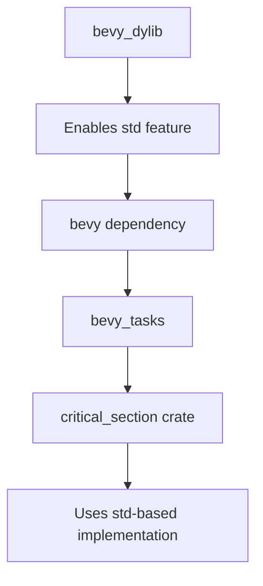

+++
title = "#18405 enable std when building bevy_dylib"
date = "2025-03-19T00:00:00"
draft = false
template = "pull_request_page.html"
in_search_index = true

[taxonomies]
list_display = ["show"]

[extra]
current_language = "en"
available_languages = {"en" = { name = "English", url = "/pull_request/bevy/2025-03/pr-18405-en-20250319" }, "zh-cn" = { name = "中文", url = "/pull_request/bevy/2025-03/pr-18405-zh-cn-20250319" }}
+++

# #18405 enable std when building bevy_dylib

## Basic Information
- **Title**: enable std when building bevy_dylib
- **PR Link**: https://github.com/bevyengine/bevy/pull/18405
- **Author**: mockersf
- **Status**: MERGED
- **Created**: 2025-03-19T00:22:40Z
- **Merged**: Not merged
- **Merged By**: N/A

## Description Translation
# Objective

- bevy_dylib fails to build:
```
   Compiling bevy_dylib v0.16.0-rc.1 (/bevy/crates/bevy_dylib)
error: linking with `cc` failed: exit status: 1
  |
  = note: some arguments are omitted. use `--verbose` to show all linker arguments
  = note: Undefined symbols for architecture arm64:
            "__critical_section_1_0_acquire", referenced from:
                critical_section::with::h00cfbe529dea9dc9 in libbevy_tasks-53c9db6a3865f250.rlib[58](bevy_tasks-53c9db6a3865f250.evom2xwveqp508omiiqb25xig.rcgu.o)
            "__critical_section_1_0_release", referenced from:
                core::ptr::drop_in_place$LT$critical_section..with..Guard$GT$::hfa034e0208e1a49d in libbevy_tasks-53c9db6a3865f250.rlib[48](bevy_tasks-53c9db6a3865f250.d9dwgpd0156zfn2h5z5ff94zn.rcgu.o)
          ld: symbol(s) not found for architecture arm64
          clang: error: linker command failed with exit code 1 (use -v to see invocation)
```

## Solution

- enable `std` when building bevy_dylib

## The Story of This Pull Request

The problem surfaced when building bevy_dylib for ARM64 architectures resulted in linker errors related to missing critical section symbols. These symbols (`__critical_section_1_0_acquire` and `__critical_section_1_0_release`) are required by the `critical_section` crate used in Bevy's task system. The errors indicated the build system wasn't linking the required implementations for thread synchronization primitives.

The root cause stemmed from `bevy_dylib` being built without Rust's standard library (no_std). While Bevy supports no_std environments, certain components like the task system require OS-level threading support when building as a dynamic library. The `critical_section` crate's implementation differs based on std availability - without std, it expects external implementations of these symbols that weren't being provided in this configuration.

The solution modifies the build configuration to explicitly enable the standard library for bevy_dylib. This ensures:

1. The `critical_section` crate uses its std-based implementation
2. Required threading primitives are properly linked
3. Platform-specific synchronization functions are available

The key code change occurs in `crates/bevy_dylib/Cargo.toml` where the Bevy dependency specification was updated to include the "std" feature:

```toml
# Before
bevy = { path = "../bevy", default-features = false }

# After
bevy = { path = "../bevy", default-features = false, features = ["std"] }
```

This change propagates the std feature through Bevy's dependency graph, ensuring all downstream crates (including `bevy_tasks` and its `critical_section` dependency) use their std-enabled implementations. The fix addresses the immediate linking issue while maintaining compatibility with Bevy's overall feature flag architecture.

The impact is immediate and specific - ARM64 builds of bevy_dylib now complete successfully without requiring changes to Bevy's core architecture. This demonstrates the importance of consistent feature flag propagation in Rust workspaces, particularly when mixing no_std and std components.

## Visual Representation



## Key Files Changed

- `crates/bevy_dylib/Cargo.toml` (+5/-1)

**Change Description**:
Modified Bevy dependency features to include "std" when building the dynamic library target. This ensures proper linkage of threading primitives required by the task system.

Code diff:
```toml
# Before
[dependencies]
bevy = { path = "../bevy", default-features = false }

# After
[dependencies]
bevy = { path = "../bevy", default-features = false, features = ["std"] }
```

## Further Reading

1. Rust Feature Flags Documentation: https://doc.rust-lang.org/cargo/reference/features.html
2. Critical Section Crate Overview: https://crates.io/crates/critical-section
3. Bevy's Feature Flag Guide: https://bevyengine.org/learn/book/getting-started/features/