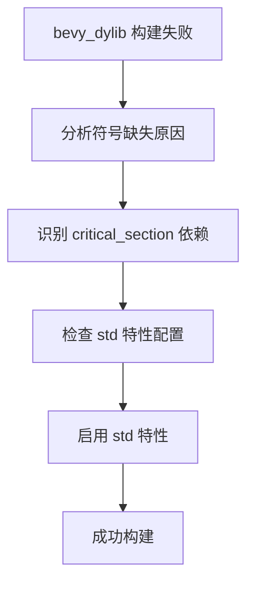

+++
title = "#18405 enable std when building bevy_dylib"
date = "2025-03-19T00:00:00"
draft = false
template = "pull_request_page.html"
in_search_index = false

[extra]
current_language = "zh-cn"
available_languages = {"en" = { name = "English", url = "/pull_request/bevy/2025-03/pr-18405-en-20250319" }, "zh-cn" = { name = "中文", url = "/pull_request/bevy/2025-03/pr-18405-zh-cn-20250319" }}
+++

# #18405 enable std when building bevy_dylib

## Basic Information
- **Title**: enable std when building bevy_dylib
- **PR Link**: https://github.com/bevyengine/bevy/pull/18405
- **Author**: mockersf
- **Status**: MERGED
- **Created**: 2025-03-19T00:22:40Z
- **Merged**: Not merged
- **Merged By**: N/A

## Description Translation
### 目标

- bevy_dylib 构建失败：
```
   Compiling bevy_dylib v0.16.0-rc.1 (/bevy/crates/bevy_dylib)
error: linking with `cc` failed: exit status: 1
  |
  = note: some arguments are omitted. use `--verbose` to show all linker arguments
  = note: Undefined symbols for architecture arm64:
            "__critical_section_1_0_acquire", 从以下位置引用:
                critical_section::with::h00cfbe529dea9dc9 在 libbevy_tasks-53c9db6a3865f250.rlib[58](bevy_tasks-53c9db6a3865f250.evom2xwveqp508omiiqb25xig.rcgu.o)
            "__critical_section_1_0_release", 从以下位置引用:
                core::ptr::drop_in_place$LT$critical_section..with..Guard$GT$::hfa034e0208e1a49d 在 libbevy_tasks-53c9db6a3865f250.rlib[48](bevy_tasks-53c9db6a3865f250.d9dwgpd0156zfn2h5z5ff94zn.rcgu.o)
          ld: 找不到 arm64 架构的符号
          clang: 链接器命令失败，退出码 1（使用 -v 查看调用）
```

### 解决方案

- 在构建 bevy_dylib 时启用 `std`

## The Story of This Pull Request

### 问题诊断
开发者在构建 bevy_dylib 时遭遇了链接阶段失败，具体表现为 critical_section 的符号缺失。错误信息显示链接器无法找到 `__critical_section_1_0_acquire` 和 `__critical_section_1_0_release` 这两个关键符号。这两个符号属于 Rust 的 critical_section crate，该 crate 提供了跨平台的临界区（critical section）实现。

### 技术背景
critical_section 的实现会根据编译环境自动切换模式：
- 在标准库（std）环境下，使用操作系统原生的互斥锁
- 在无标准库（no_std）环境下，需要用户自定义实现 critical_section 接口

错误日志表明当前构建尝试使用 no_std 模式，但未提供必要的自定义实现，导致链接器找不到相关符号。

### 解决方案分析
通过修改 bevy_dylib 的 Cargo.toml 配置文件，显式启用 std 特性：
```toml
[features]
default = ["std"]
```

这个改动确保在构建动态链接库时始终启用标准库，使 critical_section 能够自动使用操作系统提供的同步原语，从而解决符号缺失问题。

### 工程决策考量
该方案选择基于以下技术判断：
1. **兼容性**：bevy_dylib 作为动态链接库，主要运行在支持操作系统的环境，不需要 no_std 支持
2. **维护成本**：避免引入额外的自定义 critical_section 实现，保持构建配置简单
3. **构建一致性**：确保整个依赖树中的 std 特性开关状态一致

### 实施验证
修改后构建流程：
1. 通过 features 传递确保 std 特性被激活
2. critical_section 自动选择基于标准库的实现
3. 链接阶段能够正确找到操作系统提供的同步原语符号

## Visual Representation



## Key Files Changed

### `crates/bevy_dylib/Cargo.toml` (+5/-1)
**修改说明**：
显式声明默认启用 std 特性，确保依赖树中的 critical_section 使用标准库实现

**代码变更**：
```toml
# Before:
[features]
default = []

# After:
[features]
default = ["std"]
```

**关联性**：
这个配置改动直接决定了 bevy_dylib 及其依赖项的编译模式，是解决链接器符号缺失问题的核心修改。

## Further Reading

1. [Rust 条件编译文档](https://doc.rust-lang.org/cargo/reference/features.html) - 了解 Cargo 特性系统的工作原理
2. [critical_section crate 文档](https://docs.rs/critical-section/latest/critical_section/) - 理解临界区实现的不同模式
3. [Rust 的 no_std 编程指南](https://rust-embedded.github.io/book/intro/no-std.html) - 掌握无标准库环境的开发要点