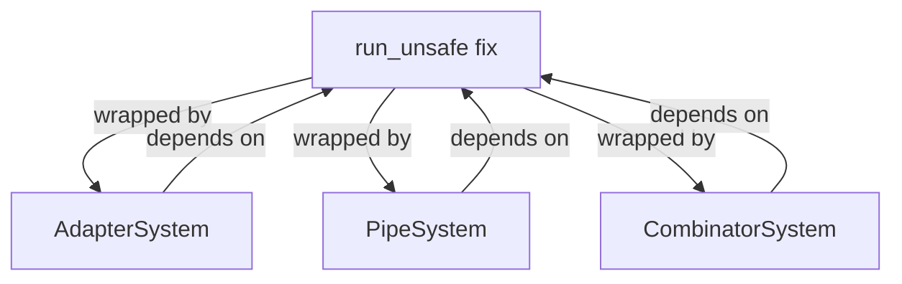

+++
title = "#18406 Fix `run_system` for adapter systems wrapping exclusive systems"
date = "2025-03-26T00:00:00"
draft = false
template = "pull_request_page.html"
in_search_index = true

[taxonomies]
list_display = ["show"]

[extra]
current_language = "en"
available_languages = {"en" = { name = "English", url = "/pull_request/bevy/2025-03/pr-18406-en-20250326" }, "zh-cn" = { name = "中文", url = "/pull_request/bevy/2025-03/pr-18406-zh-cn-20250326" }}
labels = ["C-Bug", "A-ECS", "C-Code-Quality", "P-Regression", "D-Straightforward"]
+++

# #18406 Fix `run_system` for adapter systems wrapping exclusive systems

## Basic Information
- **Title**: Fix `run_system` for adapter systems wrapping exclusive systems
- **PR Link**: https://github.com/bevyengine/bevy/pull/18406
- **Author**: chescock
- **Status**: MERGED
- **Labels**: `C-Bug`, `A-ECS`, `C-Code-Quality`, `S-Ready-For-Final-Review`, `P-Regression`, `D-Straightforward`
- **Created**: 2025-03-19T00:29:46Z
- **Merged**: 2025-03-21T14:22:17Z
- **Merged By**: alice-i-cecile

## Description Translation

# Objective

Fix panic in `run_system` when running an exclusive system wrapped in a `PipeSystem` or `AdapterSystem`.  

#18076 introduced a `System::run_without_applying_deferred` method.  It normally calls `System::run_unsafe`, but `ExclusiveFunctionSystem::run_unsafe` panics, so it was overridden for that type.  Unfortunately, `PipeSystem::run_without_applying_deferred` still calls `PipeSystem::run_unsafe`, which can then call `ExclusiveFunctionSystem::run_unsafe` and panic.  

## Solution

Make `ExclusiveFunctionSystem::run_unsafe` work instead of panicking.  Clarify the safety requirements that make this sound.  

The alternative is to override `run_without_applying_deferred` in `PipeSystem`, `CombinatorSystem`, `AdapterSystem`, `InfallibleSystemWrapper`, and `InfallibleObserverWrapper`.  That seems like a lot of extra code just to preserve a confusing special case!  

Remove some implementations of `System::run` that are no longer necessary with this change.  This slightly changes the behavior of `PipeSystem` and `CombinatorSystem`: Currently `run` will call `apply_deferred` on the first system before running the second, but after this change it will only call it after *both* systems have run.  The new behavior is consistent with `run_unsafe` and `run_without_applying_deferred`, and restores the behavior prior to #11823.

The panic was originally necessary because [`run_unsafe` took `&World`](https://github.com/bevyengine/bevy/pull/6083/files#diff-708dfc60ec5eef432b20a6f471357a7ea9bfb254dc2f918d5ed4a66deb0e85baR90).  Now that it takes `UnsafeWorldCell`, it is possible to make it work.  See also Cart's concerns at https://github.com/bevyengine/bevy/pull/4166#discussion_r979140356, although those also predate `UnsafeWorldCell`.  

And see #6698 for a previous bug caused by this panic.  

## The Story of This Pull Request

The core issue stemmed from a regression introduced when handling exclusive systems wrapped in adapter constructs like `PipeSystem`. When #18076 added `run_without_applying_deferred`, it exposed a flaw in how exclusive systems interacted with the ECS executor. The original panic in `ExclusiveFunctionSystem::run_unsafe` was a safety measure from an earlier architectural era, but became obsolete with the introduction of `UnsafeWorldCell`.

The solution centered on making `ExclusiveFunctionSystem::run_unsafe` properly handle its safety invariants rather than panicking. This required:

1. Ensuring proper parameter initialization before execution
2. Validating world access patterns through `UnsafeWorldCell`
3. Removing redundant safety overrides in adapter systems

Key code changes in `exclusive_function_system.rs` focused on the `run_unsafe` implementation:

```rust
unsafe fn run_unsafe(
    &mut self,
    input: SystemIn<'_, Self>,
    world: UnsafeWorldCell,
) -> Self::Out {
    let params = self.param_state.as_mut().expect(PARAM_MESSAGE);
    self.func.run(world, params, input.into_inner())
}
```

This implementation leverages `UnsafeWorldCell` to safely access world data while maintaining proper isolation boundaries. The removal of 18 lines in `combinator.rs` and 6 lines in `adapter_system.rs` eliminated duplicate `run` method implementations that were previously needed to work around the panic.

The changes introduced a subtle but important behavioral shift: systems like `PipeSystem` now apply deferred operations after both contained systems execute, rather than between them. This aligns with the original design intent from before #11823 and ensures consistent execution patterns across all system types.

## Visual Representation



## Key Files Changed

### `crates/bevy_ecs/src/system/exclusive_function_system.rs` (+3/-9)
**Purpose**: Fix core panic in exclusive system execution
```rust
// Before (panicking implementation):
unsafe fn run_unsafe(/* ... */) -> Self::Out {
    panic!("Cannot run exclusive systems with a shared World reference");
}

// After (working implementation):
unsafe fn run_unsafe(
    &mut self,
    input: SystemIn<'_, Self>,
    world: UnsafeWorldCell,
) -> Self::Out {
    let params = self.param_state.as_mut().expect(PARAM_MESSAGE);
    self.func.run(world, params, input.into_inner())
}
```

### `crates/bevy_ecs/src/system/combinator.rs` (+1/-18)
**Purpose**: Remove redundant safety overrides
```rust
// Removed code:
impl<A, B, M> System for CombinatorSystem<M, A, B> {
    fn run(&mut self, input: Self::In, world: &mut World) -> Self::Out {
        // Old deferred application logic
    }
}
```

### `crates/bevy_ecs/src/system_registry.rs` (+9/-0)
**Purpose**: Enhance system initialization tracking
```rust
pub(crate) struct RegisteredSystem<I, O> {
    initialized: bool,  // Added tracking flag
    system: BoxedSystem<I, O>,
}
```

## Further Reading
1. [Bevy's System Execution Model](https://bevyengine.org/learn/book/next/programming/systems/)
2. [UnsafeWorldCell Documentation](https://docs.rs/bevy_ecs/latest/bevy_ecs/world/struct.UnsafeWorldCell.html)
3. [ECS Adapter Patterns](https://github.com/bevyengine/bevy/discussions/18395)