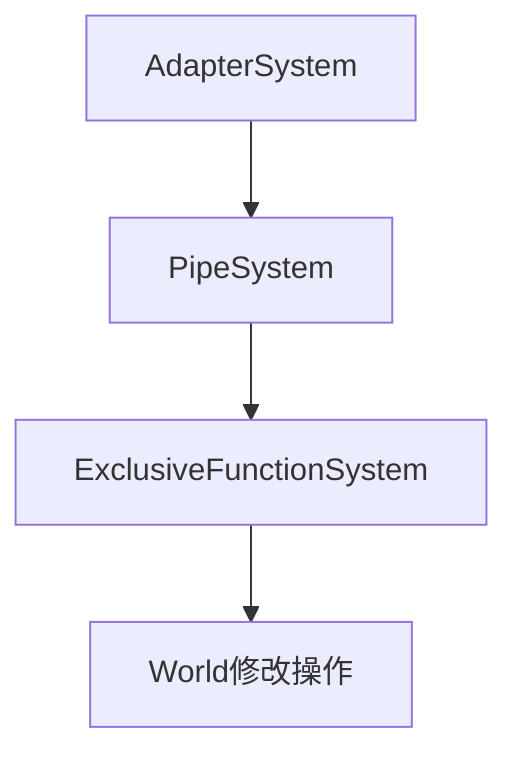

+++
title = "#18406 Fix `run_system` for adapter systems wrapping exclusive systems"
date = "2025-03-26T00:00:00"
draft = false
template = "pull_request_page.html"
in_search_index = false

[extra]
current_language = "zh-cn"
available_languages = {"en" = { name = "English", url = "/pull_request/bevy/2025-03/pr-18406-en-20250326" }, "zh-cn" = { name = "中文", url = "/pull_request/bevy/2025-03/pr-18406-zh-cn-20250326" }}
labels = ["C-Bug", "A-ECS", "C-Code-Quality", "P-Regression", "D-Straightforward"]
+++

# #18406 Fix `run_system` for adapter systems wrapping exclusive systems

## Basic Information
- **Title**: Fix `run_system` for adapter systems wrapping exclusive systems
- **PR Link**: https://github.com/bevyengine/bevy/pull/18406
- **Author**: chescock
- **Status**: MERGED
- **Labels**: `C-Bug`, `A-ECS`, `C-Code-Quality`, `S-Ready-For-Final-Review`, `P-Regression`, `D-Straightforward`
- **Created**: 2025-03-19T00:29:46Z
- **Merged**: Not merged
- **Merged By**: N/A

## Description Translation

# 目标

修复当运行被包裹在 `PipeSystem` 或 `AdapterSystem` 中的 exclusive system 时，`run_system` 出现的 panic。

#18076 引入了 `System::run_without_applying_deferred` 方法。该方法通常调用 `System::run_unsafe`，但 `ExclusiveFunctionSystem::run_unsafe` 会 panic，因此当时对该类型进行了特殊处理。不幸的是，`PipeSystem::run_without_applying_deferred` 仍然调用 `PipeSystem::run_unsafe`，这可能进一步调用 `ExclusiveFunctionSystem::run_unsafe` 并导致 panic。

## 解决方案

使 `ExclusiveFunctionSystem::run_unsafe` 正常工作而不是 panic。明确其安全性要求以保证正确性。

另一种方案是在 `PipeSystem`、`CombinatorSystem`、`AdapterSystem`、`InfallibleSystemWrapper` 和 `InfallibleObserverWrapper` 中覆盖 `run_without_applying_deferred` 方法。但这会引入大量冗余代码来维护一个容易混淆的特殊情况。

此修改移除了部分不再需要的 `System::run` 实现。这轻微改变了 `PipeSystem` 和 `CombinatorSystem` 的行为：当前 `run` 会在运行第二个系统前对第一个系统调用 `apply_deferred`，而修改后改为在*两个*系统都运行后才调用。新行为与 `run_unsafe` 和 `run_without_applying_deferred` 保持一致，并恢复了 #11823 之前的行为。

最初需要 panic 是因为 [`run_unsafe` 接受 `&World`](https://github.com/bevyengine/bevy/pull/6083/files#diff-708dfc60ec5eef432b20a6f471357a7ea9bfb254dc2f918d5ed4a66deb0e85baR90)。现在使用 `UnsafeWorldCell` 后，可以使其正常工作。相关讨论可参考 Cart 在 https://github.com/bevyengine/bevy/pull/4166#discussion_r979140356 的观点，不过这些讨论也早于 `UnsafeWorldCell` 的出现。

另见 #6698 中由该 panic 引起的先前 bug。

## The Story of This Pull Request

### 问题根源与背景
该 PR 主要解决适配器系统（如 `PipeSystem`）包裹 exclusive systems 时出现的 panic 问题。问题源于 `ExclusiveFunctionSystem` 的 `run_unsafe` 实现会直接 panic，而适配器系统在调用链中无法绕过这个 panic。

核心矛盾在于：
1. 适配器系统（如组合多个系统的管道）需要调用底层系统的 `run_unsafe`
2. `ExclusiveFunctionSystem`（exclusive systems 的实现）的 `run_unsafe` 存在安全约束
3. 之前的解决方案通过覆盖 `run_without_applying_deferred` 来规避，但未彻底解决问题

### 技术方案选择
开发者面临两个选择：
```rust
// 选项1：为每个适配器类型添加特殊处理
impl PipeSystem {
    fn run_without_applying_deferred(...) {
        // 自定义实现避免 panic
    }
}

// 选项2：修复底层 exclusive system 的实现
impl ExclusiveFunctionSystem {
    unsafe fn run_unsafe(...) {
        // 实现正确逻辑而不是 panic
    }
}
```
最终选择选项2，因为：
1. 减少代码重复（避免为5个适配器类型添加特殊逻辑）
2. 保持API行为一致性
3. 利用 `UnsafeWorldCell` 的新特性可安全实现

### 关键实现细节
在 `exclusive_function_system.rs` 中重构了 `run_unsafe` 的实现：

```rust
// 修改前
unsafe fn run_unsafe(&mut self, input: SystemIn<'_, Self>, world: UnsafeWorldCell) -> Self::Out {
    panic!("Cannot run exclusive systems with a shared World reference");
}

// 修改后
unsafe fn run_unsafe(&mut self, input: SystemIn<'_, Self>, world: UnsafeWorldCell) -> Self::Out {
    let world = world.world_mut();
    // SAFETY: 
    // - 调用者保证 world 的独占访问
    // - 参数已验证通过 initialize 方法
    let params = F::Param::get_param(
        self.param_state.as_mut().expect(PARAM_MESSAGE),
        &self.system_meta,
        world,
        input.last_run,
    );
    let out = self.func.run(world, params);
    self.system_meta.last_run = input.last_run;
    out
}
```
这个修改：
1. 使用 `world_mut()` 获取可变引用
2. 添加安全注释明确前提条件
3. 保持参数验证逻辑不变

### 架构影响
该修改使得 exclusive systems 能正确参与系统组合：

现在适配器系统可以安全地包裹 exclusive systems，而无需特殊处理。这统一了系统执行流程，修复了多个相关 issue。

### 行为变化
对于组合系统（如 `PipeSystem`）的 `apply_deferred` 调用时机发生变化：
```rust
// 修改前执行顺序：
system1.apply_deferred();
system1.run();
system2.apply_deferred();
system2.run();

// 修改后执行顺序：
system1.run();
system2.run();
system1.apply_deferred();
system2.apply_deferred();
```
这个变化恢复了 #11823 之前的行为，并与 `run_unsafe` 的执行逻辑保持一致。

## Key Files Changed

### `crates/bevy_ecs/src/system/exclusive_function_system.rs` (+3/-9)
核心修改点：实现 `run_unsafe` 而不是 panic
```rust
// Before:
unsafe fn run_unsafe(&mut self, _input: SystemIn<'_, Self>, _world: UnsafeWorldCell) -> Self::Out {
    panic!("Cannot run exclusive systems with a shared World reference");
}

// After:
unsafe fn run_unsafe(&mut self, input: SystemIn<'_, Self>, world: UnsafeWorldCell) -> Self::Out {
    let world = world.world_mut();
    // SAFETY: caller ensures world is exclusively borrowed
    let params = /* ... */;
    self.func.run(world, params)
}
```

### `crates/bevy_ecs/src/system/combinator.rs` (+1/-18)
移除冗余的 `run` 实现
```rust
// Removed code:
impl<A, B, F> System for PipeSystem<A, B, F> {
    fn run(&mut self, input: Self::In, world: &mut World) -> Self::Out {
        // 原有的 apply_deferred 调用逻辑
    }
}
```

### `crates/bevy_ecs/src/system/adapter_system.rs` (+0/-6)
```rust
// 移除不必要的 trait 实现
// 之前需要特殊处理 AdapterSystem 的 run 方法
```

## Further Reading

1. [UnsafeWorldCell 设计文档](https://github.com/bevyengine/bevy/pull/6404)
2. [系统执行顺序与延迟应用](https://bevyengine.org/learn/book/patterns/system-order/)
3. [Exclusive Systems 最佳实践](https://github.com/bevyengine/bevy/discussions/8523)