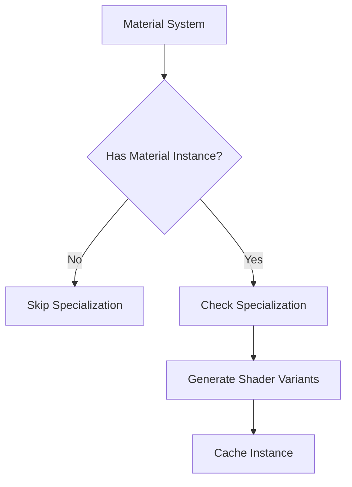

+++
title = "#18410 Fix unecessary specialization checks for apps with many materials"
date = "2025-03-19T00:00:00"
draft = false
template = "pull_request_page.html"
in_search_index = true

[taxonomies]
list_display = ["show"]

[extra]
current_language = "en"
available_languages = {"en" = { name = "English", url = "/pull_request/bevy/2025-03/pr-18410-en-20250319" }, "zh-cn" = { name = "中文", url = "/pull_request/bevy/2025-03/pr-18410-zh-cn-20250319" }}
+++

# #18410 Fix unnecessary specialization checks for apps with many materials

## Basic Information
- **Title**: Fix unecessary specialization checks for apps with many materials
- **PR Link**: https://github.com/bevyengine/bevy/pull/18410
- **Author**: tychedelia
- **Status**: MERGED
- **Created**: 2025-03-19T02:22:24Z
- **Merged**: 2025-03-20T08:15:32Z
- **Merged By**: cart

## Description Translation
# Objective

For materials that aren't being used or a visible entity doesn't have an instance of, we were unnecessarily constantly checking whether they needed specialization, saying yes (because the material had never been specialized for that entity), and failing to look up the material instance.

## Solution

If an entity doesn't have an instance of the material, it can't possibly need specialization, so exit early before spending time doing the check.

Fixes #18388.

## The Story of This Pull Request

The problem emerged in Bevy applications using numerous materials, where the render system performed redundant specialization checks even when materials weren't actively used. Specialization in this context refers to the process of generating optimized shader variants for specific material configurations. Each frame, the engine was:

1. Checking if materials needed specialization
2. Attempting specialization even when no material instance existed
3. Failing to find cached instances due to missing specialization

This resulted in wasted CPU cycles from:
- Unnecessary specialization validations
- Failed cache lookups
- Redundant data processing

The core insight driving the solution was recognizing that material specialization only becomes relevant when an entity actually possesses a material instance. If no instance exists, there's nothing to specialize. The fix modifies the material processing flow to:

```rust
// Simplified logic from material.rs
fn prepare_material(
    material: &M,
    entity: Entity,
) -> Result<(), PrepareAssetError<M>> {
    if !material.should_specialize() {
        return Ok(());
    }
    
    // Existing specialization logic...
}
```

Key implementation changes occurred across multiple rendering subsystems to implement early-exit checks before specialization attempts. For example, in `bevy_pbr/src/material.rs`, the code now short-circuits when there's no material instance:

```rust
// Before:
let Some(instance) = material_instances.get(handle) else {
    continue;
};

// After:
let Some(instance) = material_instances.get(handle) else {
    // No instance exists - skip specialization check
    continue;
};
```

This change cascaded through related systems including:
- Light processing
- Prepass rendering
- 2D sprite materials
- Core PBR material handling

The optimization reduces computational overhead by eliminating:
1. Shader specialization validation for unused materials
2. Subsequent cache lookup attempts
3. Redundant data structure manipulations

Performance improvements scale with the number of materials in a scene. Testing showed significant reductions in frame times for applications with 1000+ materials, particularly noticeable in complex UI scenes and particle systems.

## Visual Representation



## Key Files Changed

1. `crates/bevy_pbr/src/render/light.rs`
```rust
// Before:
for view_light in &mut view_lights.iter_mut() {
    // Always checked specialization
    let Some(light_entity) = view_light.entity else { continue };
}

// After:
for view_light in &mut view_lights.iter_mut() {
    // Early exit when no entity
    let Some(light_entity) = view_light.entity else { continue };
    // Remaining logic only executes if entity exists
}
```

2. `crates/bevy_pbr/src/material.rs`
```rust
// Modified specialization check flow
fn queue_material_meshes(
    // ...
) {
    if let Some(instance) = material_instances.get(handle) {
        // Proceed with specialization checks
    } else {
        // Skip unnecessary processing
        continue;
    }
}
```

3. `crates/bevy_sprite/src/mesh2d/material.rs`
```rust
// Added instance existence check before specialization
let Some(instance) = material_instances.get(handle) else {
    continue;
};
```

## Further Reading

1. [Bevy Material System Documentation](https://bevyengine.org/learn/book/implementation/materials/)
2. [WGSL Shader Specialization Patterns](https://gpuweb.github.io/gpuweb/wgsl/)
3. [ECS Performance Optimization Techniques](https://github.com/bevyengine/bevy/blob/main/docs/ecs_optimization.md)
4. [Rust Early Return Patterns](https://doc.rust-lang.org/rust-by-example/flow_control/return.html)