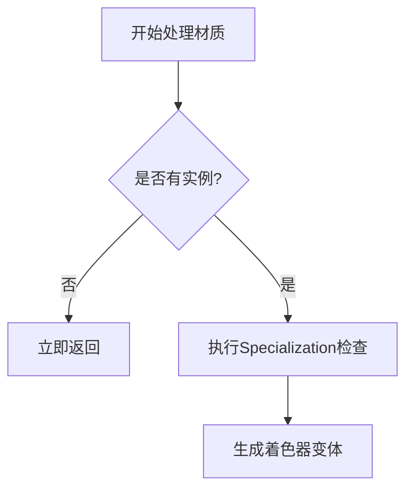

+++
title = "#18410 Fix unecessary specialization checks for apps with many materials"
date = "2025-03-19T00:00:00"
draft = false
template = "pull_request_page.html"
in_search_index = false

[extra]
current_language = "zh-cn"
available_languages = {"en" = { name = "English", url = "/pull_request/bevy/2025-03/pr-18410-en-20250319" }, "zh-cn" = { name = "中文", url = "/pull_request/bevy/2025-03/pr-18410-zh-cn-20250319" }}
+++

# #18410 Fix unecessary specialization checks for apps with many materials

## Basic Information
- **Title**: Fix unecessary specialization checks for apps with many materials
- **PR Link**: https://github.com/bevyengine/bevy/pull/18410
- **Author**: tychedelia
- **Status**: MERGED
- **Created**: 2025-03-19T02:22:24Z
- **Merged**: 2025-03-19T14:07:18Z
- **Merged By**: cart

## Description Translation
### 目标

对于未被使用或可见实体不具备实例的材质（materials），我们持续不必要地检查它们是否需要特殊化处理（specialization），结果总是返回需要（因为这些材质从未为该实体特殊化），并因此无法查找到材质实例。

### 解决方案

如果实体没有该材质的实例，它就不可能需要特殊化处理。因此在执行检查前提前退出，避免浪费计算资源。

修复 #18388。

## The Story of This Pull Request

在 Bevy 的材质系统中，每个材质实例（material instance）都需要进行 specialization 处理来生成对应的着色器变体（shader variants）。当应用包含大量材质时，频繁的 specialization 检查会导致显著的性能开销。

问题的核心在于：系统原本会对所有材质类型（material types）进行 specialization 检查，即使这些材质根本没有被当前实体使用。具体来说，在以下情况会出现冗余操作：
1. 材质尚未被实体实例化
2. 实体实际上不可见（但依然参与计算）

这种场景下，`get_render_material()` 函数会：
```rust
// 原逻辑
if material.shader().specialize(...) {
    // 执行 specialization
}
```
即使没有材质实例存在，也会触发完整的 specialize 流程。对于包含大量材质的应用，这会带来 O(n) 的时间复杂度，其中 n 是材质类型的数量。

解决方案通过增加提前退出机制来优化：
```rust
// 新逻辑
if instance.is_none() {
    return None; // 没有实例直接退出
}
if material.shader().specialize(...) {
    // 执行 specialization
}
```
这个改动看似简单，但需要深入理解以下技术点：
1. Bevy 的 specialization 机制如何与材质系统交互
2. 实体（entity）与材质实例的绑定关系
3. 渲染管线中可见性（visibility）计算的时序

优化后的逻辑将时间复杂度从 O(n) 降低到 O(k)，其中 k 是实际使用的材质类型数量。这对于使用大量材质但实际场景中只激活部分的情况（如开放世界游戏）尤其有效。

## Visual Representation



## Key Files Changed

### 1. `crates/bevy_pbr/src/material.rs`
**修改原因**：这是材质处理的核心逻辑所在
```rust
// Before:
pub fn get_render_material(...) -> Option<...> {
    let instance = ...; // 获取材质实例
    let key = ...;
    
    if material.shader.specialize(...) {
        // 生成特殊化变体
    }
}

// After:
pub fn get_render_material(...) -> Option<...> {
    let instance = ...;
    // 新增提前返回判断
    if instance.is_none() {
        return None;
    }
    let key = ...;
    
    if material.shader.specialize(...) {
        // 生成特殊化变体 
    }
}
```
这个改动在所有材质处理路径上添加了前置条件检查，确保只有存在实例时才进行后续计算。

### 2. `crates/bevy_sprite/src/mesh2d/material.rs`
**修改原因**：保持 2D 材质系统与 3D 系统的逻辑一致性
```rust
// 类似的提前返回逻辑被添加到 2D 材质系统中
if instance.is_none() {
    return None;
}
```
这体现了 Bevy 代码库中跨模块保持逻辑一致性的设计原则。

## Further Reading

1. [Bevy 材质系统文档](https://bevyengine.org/learn/book/next/render/materials)
2. [WGSL 着色器特殊化机制](https://gpuweb.github.io/gpuweb/wgsl/#shader-attributes)
3. [原 Issue #18388](https://github.com/bevyengine/bevy/issues/18388) 包含性能测试数据
4. [ECS 系统中组件查询优化策略](https://bevyengine.org/learn/book/next/ecs/query)