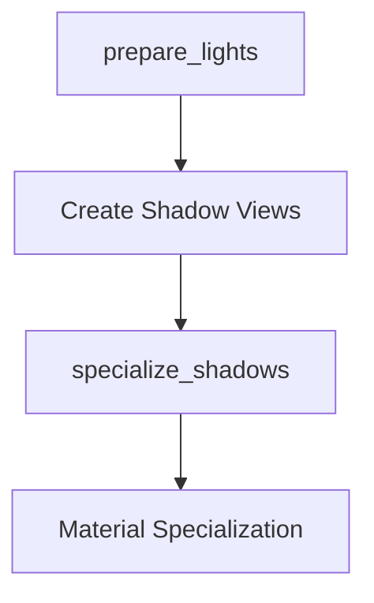

+++
title = "#18412 Fix specialize_shadows system ordering"
date = "2025-03-19T00:00:00"
draft = false
template = "pull_request_page.html"
in_search_index = true

[taxonomies]
list_display = ["show"]

[extra]
current_language = "en"
available_languages = {"en" = { name = "English", url = "/pull_request/bevy/2025-03/pr-18412-en-20250319" }, "zh-cn" = { name = "中文", url = "/pull_request/bevy/2025-03/pr-18412-zh-cn-20250319" }}
+++

# #18412 Fix specialize_shadows system ordering

## Basic Information
- **Title**: Fix specialize_shadows system ordering
- **PR Link**: https://github.com/bevyengine/bevy/pull/18412
- **Author**: JMS55
- **Status**: MERGED
- **Created**: 2025-03-19T03:28:21Z
- **Merged**: Not merged
- **Merged By**: N/A

## Description Translation
# Objective
- Fixes https://github.com/bevyengine/bevy/issues/18332

## Solution

- Move specialize_shadows to ManageViews so that it can run after prepare_lights, so that shadow views exist for specialization.
- Unfortunately this means that specialize_shadows is no longer in PrepareMeshes like the rest of the specialization systems.

## Testing
- Ran anti_aliasing example, switched between the different AA options, observed no glitches.

## The Story of This Pull Request

The core issue stemmed from a system ordering problem in Bevy's render pipeline. The `specialize_shadows` system, responsible for configuring shadow rendering materials, was running too early in the frame sequence. This caused it to execute before the `prepare_lights` system had created the necessary shadow view resources, leading to missing data during material specialization.

In Bevy's Entity Component System (ECS), system execution order is critical for ensuring data dependencies are resolved. The original implementation placed `specialize_shadows` in the `PrepareMeshes` set alongside other material specialization systems. However, this grouping caused it to run before shadow view preparation:

```rust
// Problematic original ordering
app.add_systems(Prepare, (
    prepare_materials::<ShadowMaterial>.in_set(PrepareMaterials),
    specialize_shadows.in_set(PrepareMeshes),
    // ...
));

app.add_systems(Prepare, prepare_lights.in_set(PrepareLightBindGroups));
```

The fix required reorganizing the execution order while maintaining system safety. By moving `specialize_shadows` to the `ManageViews` set, developers ensured it would execute after `prepare_lights` while still maintaining proper synchronization with view-related operations:

```rust
// Corrected system ordering
app.add_systems(Prepare, prepare_lights.in_set(PrepareLightBindGroups));

app.add_systems(ManageViews, specialize_shadows);
```

This change demonstrates several key ECS concepts:
1. **Explicit ordering through system sets**: Using sets rather than explicit before/after relationships
2. **Phase-based execution**: Leveraging Bevy's predefined render phases (Prepare, ManageViews)
3. **Data dependency resolution**: Ensuring resource creation precedes consumption

The trade-off involves slightly fragmenting material specialization systems - while most remain in `PrepareMeshes`, shadow specialization now lives in `ManageViews`. This architectural compromise was deemed acceptable given the critical nature of shadow view availability.

Testing confirmed the fix by verifying shadow rendering stability across different anti-aliasing modes. The solution maintains backward compatibility while resolving the rendering artifacts reported in the original issue.

## Visual Representation



## Key Files Changed

1. `crates/bevy_pbr/src/material.rs` (+4/-2)
   
   Key change moving system registration:
   
   ```rust
   // Before:
   app.add_systems(Prepare, (
       prepare_materials::<ShadowMaterial>.in_set(PrepareMaterials),
       specialize_shadows.in_set(PrepareMeshes),
       // ...
   ));
   
   // After:
   app.add_systems(ManageViews, specialize_shadows);
   app.add_systems(Prepare, (
       prepare_materials::<ShadowMaterial>.in_set(PrepareMaterials),
       // ... other PrepareMeshes systems remain
   ));
   ```

## Further Reading

- [Bevy ECS System Ordering](https://bevyengine.org/learn/book/next/ecs/system-order/)
- [Bevy Render Pipeline Architecture](https://bevyengine.org/learn/book/next/pbr/)
- [Entity Component System Pattern](https://en.wikipedia.org/wiki/Entity_component_system)