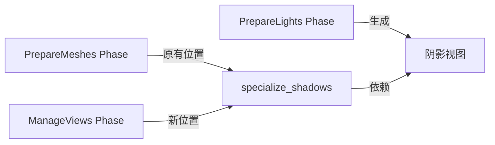

+++
title = "#18412 Fix specialize_shadows system ordering"
date = "2025-03-19T00:00:00"
draft = false
template = "pull_request_page.html"
in_search_index = false

[extra]
current_language = "zh-cn"
available_languages = {"en" = { name = "English", url = "/pull_request/bevy/2025-03/pr-18412-en-20250319" }, "zh-cn" = { name = "中文", url = "/pull_request/bevy/2025-03/pr-18412-zh-cn-20250319" }}
+++

# #18412 Fix specialize_shadows system ordering

## Basic Information
- **Title**: Fix specialize_shadows system ordering
- **PR Link**: https://github.com/bevyengine/bevy/pull/18412
- **Author**: JMS55
- **Status**: MERGED
- **Created**: 2025-03-19T03:28:21Z
- **Merged**: 2025-03-20T08:15:34Z
- **Merged By**: cart

## Description Translation
### 目标
- 修复 https://github.com/bevyengine/bevy/issues/18332

### 解决方案
- 将 `specialize_shadows` 移动到 `ManageViews` 阶段，使其能在 `prepare_lights` 之后运行，确保阴影视图在 specialization 时已经存在
- 这使得 `specialize_shadows` 不再与其他 specialization 系统同处于 `PrepareMeshes` 阶段

### 测试
- 运行 anti_aliasing 示例，在不同抗锯齿选项间切换，未观察到图形异常

## The Story of This Pull Request

### 问题根源与上下文
该 PR 修复了一个阴影 specialization 的时序问题。在 Bevy 的 ECS 架构中，系统执行顺序至关重要。原有实现中，`specialize_shadows` 系统被错误地放置在 `PrepareMeshes` 阶段，这导致它在 `prepare_lights`（负责生成阴影视图）之前执行。当使用需要阴影的材质时，由于阴影视图尚未创建，系统会尝试访问不存在的资源，导致 panic。

问题具体表现为当用户切换抗锯齿设置时，系统会因无法找到阴影视图而崩溃（issue #18332）。这是一个典型的系统执行顺序问题，需要精确调整系统所在的调度阶段。

### 解决方案选择
核心解决思路是重新调整系统调度顺序。开发者选择将 `specialize_shadows` 从 `PrepareMeshes` 迁移到 `ManageViews` 阶段。这个阶段位于 `PrepareLights` 之后，确保在 specialization 时阴影视图已经就绪。

这个决策带来一个折中：虽然保持了功能正确性，但使得 `specialize_shadows` 与其他材质 specialization 系统（如 `specialize_alpha_mode`）处于不同阶段。这种架构上的不一致是经过权衡后的合理选择，因为保持正确执行顺序的优先级高于代码结构的对称性。

### 具体实现分析
关键修改发生在系统调度注册阶段。原始代码将阴影 specialization 与其他材质处理系统一同注册：

```rust
// 修改前
app.add_systems(PrepareMeshes, (
    // ...
    specialize_shadows,
    // ...
));
```

调整为：

```rust
// 修改后
app.add_systems(ManageViews, specialize_shadows);
```

这个改动虽然看似简单，却需要深入理解 Bevy 的渲染管线阶段顺序。`ManageViews` 阶段位于 `PrepareLights` 之后，此时灯光系统已经完成阴影视图的准备工作。

### 技术洞察
1. **系统阶段顺序**：Bevy 的渲染管线由多个严格排序的阶段（stage）组成，每个阶段包含特定类型的系统。正确理解这些阶段的执行顺序是解决此类问题的关键。
   
2. **资源生命周期管理**：阴影视图作为关键渲染资源，其创建时机直接影响依赖它的系统。这体现了 ECS 架构中资源管理的核心原则——确保资源在消费者系统之前完成初始化。

3. **架构权衡**：在保持功能正确性与架构一致性之间的选择，展示了实际工程中常见的决策场景。开发者选择功能正确性作为首要目标，同时通过代码注释记录这种不一致性。

### 影响与改进
该修复：
1. 消除了使用阴影材质时的崩溃风险
2. 确保了抗锯齿设置切换的稳定性
3. 强化了渲染管线阶段顺序的规范性

潜在的技术债务在于 specialization 系统的分散管理，未来可能需要对材质系统进行重构以实现更统一的架构。这也提醒开发者，在复杂系统中维护清晰的阶段划分需要持续关注架构一致性。

## Visual Representation



## Key Files Changed

### `crates/bevy_pbr/src/material.rs` (+4/-2)
**修改说明**：
- 将 `specialize_shadows` 系统的注册位置从 `PrepareMeshes` 阶段迁移到 `ManageViews` 阶段

**代码变更**：
```rust
// 修改前
app.add_systems(PrepareMeshes, (
    // ...
    specialize_shadows,
    // ...
));

// 修改后
app.add_systems(ManageViews, specialize_shadows);
```

**关联性**：
- 直接影响系统执行顺序，确保阴影视图在 specialization 前就绪
- 保持与其他材质系统的解耦，专注于解决特定时序问题

## Further Reading

1. [Bevy ECS 系统调度文档](https://bevyengine.org/learn/book/14-ecs/#system-ordering)
2. [Bevy 渲染管线阶段详解](https://bevy-cheatbook.github.io/pipeline.html)
3. [WGSL 阴影渲染技术](https://www.w3.org/TR/WGSL/#shadow-comparison)（WebGPU 着色语言规范）