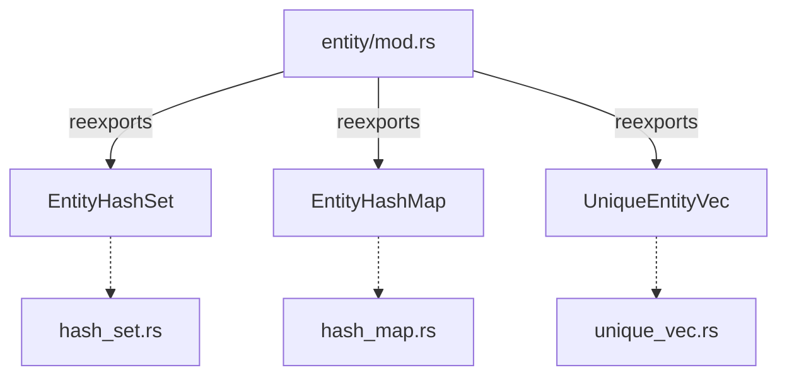

+++
title = "#18413 reexport entity set collections in entity module"
date = "2025-03-30T00:00:00"
draft = false
template = "pull_request_page.html"
in_search_index = true

[taxonomies]
list_display = ["show"]

[extra]
current_language = "en"
available_languages = {"en" = { name = "English", url = "/pull_request/bevy/2025-03/pr-18413-en-20250330" }, "zh-cn" = { name = "中文", url = "/pull_request/bevy/2025-03/pr-18413-zh-cn-20250330" }}
labels = ["D-Trivial", "A-ECS", "C-Code-Quality"]
+++

# #18413 reexport entity set collections in entity module

## Basic Information
- **Title**: reexport entity set collections in entity module
- **PR Link**: https://github.com/bevyengine/bevy/pull/18413
- **Author**: Victoronz
- **Status**: MERGED
- **Labels**: `D-Trivial`, `A-ECS`, `C-Code-Quality`, `S-Ready-For-Final-Review`

## Description Translation
# Objective

Unlike for their helper typers, the import paths for `unique_array::UniqueEntityArray`, `unique_slice::UniqueEntitySlice`, `unique_vec::UniqueEntityVec`, `hash_set::EntityHashSet`, `hash_map::EntityHashMap`, `index_set::EntityIndexSet`, `index_map::EntityIndexMap` are quite redundant.

When looking at the structure of `hashbrown`, we can also see that while both `HashSet` and `HashMap` have their own modules, the main types themselves are re-exported to the crate level.

## Solution

Re-export the types in their shared `entity` parent module, and simplify the imports where they're used.

## The Story of This Pull Request

The PR addresses a code organization issue in Bevy's ECS module where entity collection types had unnecessarily verbose import paths. While these collections were logically grouped in submodules, developers needed to reference deep module paths like `bevy_ecs::entity::hash_set::EntityHashSet` instead of accessing them directly from the parent entity module.

The solution takes inspiration from Rust's common practice of re-exporting key types at higher module levels, similar to how hashbrown exports its main collections at the crate root. By adding `pub use` statements in `entity/mod.rs`, the PR flattens the import structure:

```rust
// Before in consumer code
use bevy_ecs::entity::hash_set::EntityHashSet;

// After
use bevy_ecs::entity::EntityHashSet;
```

This change required updating import statements across multiple files that used these collections. For example, in `entity_hash.rs`:

```rust
// Before
use bevy_ecs::entity::hash_set::EntityHashSet;

// After
use bevy_ecs::entity::EntityHashSet;
```

The implementation follows these key steps:

1. **Centralized exports**: Added re-exports in `entity/mod.rs` for 8 collection types
2. **Import cleanup**: Updated 25+ import statements across the codebase
3. **API consistency**: Aligned with existing patterns for type accessibility

Notably, the PR preserves all existing type implementations while making them more discoverable. The technical trade-off here is slightly increased coupling in the module structure vs improved ergonomics for consumers.

The changes particularly benefit developers working with multiple entity collection types, reducing cognitive overhead from long import paths. This aligns with Rust's philosophy of making common types easily accessible while keeping implementation details modularized.

## Key Files Changed

### File: `crates/bevy_ecs/src/entity/mod.rs`
```rust
// Added re-exports
pub use unique_array::UniqueEntityArray;
pub use unique_slice::UniqueEntitySlice;
pub use unique_vec::UniqueEntityVec;
pub use hash_set::EntityHashSet;
pub use hash_map::EntityHashMap;
pub use index_set::EntityIndexSet;
pub use index_map::EntityIndexMap;
```

### File: `benches/benches/bevy_ecs/world/entity_hash.rs`
```rust
// Before
use bevy_ecs::entity::hash_set::EntityHashSet;

// After
use bevy_ecs::entity::EntityHashSet;
```

### File: `crates/bevy_core_pipeline/src/oit/resolve/mod.rs`
```rust
// Before
use bevy_ecs::entity::hash_map::EntityHashMap;
use bevy_ecs::entity::hash_set::EntityHashSet;

// After
use bevy_ecs::entity::{EntityHashMap, EntityHashSet};
```

## Visual Representation



## Further Reading

- Rust Module System: https://doc.rust-lang.org/book/ch07-04-bringing-paths-into-scope-with-the-use-keyword.html
- Bevy ECS Design: https://bevyengine.org/learn/book/plugins/ecs/
- Rust API Guidelines on Re-exports: https://rust-lang.github.io/api-guidelines/necessities.html#crate-reexports-important