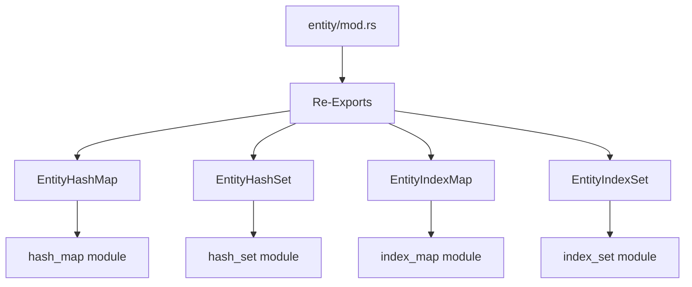

+++
title = "#18413 reexport entity set collections in entity module"
date = "2025-03-30T00:00:00"
draft = false
template = "pull_request_page.html"
in_search_index = false

[extra]
current_language = "zh-cn"
available_languages = {"en" = { name = "English", url = "/pull_request/bevy/2025-03/pr-18413-en-20250330" }, "zh-cn" = { name = "中文", url = "/pull_request/bevy/2025-03/pr-18413-zh-cn-20250330" }}
labels = ["D-Trivial", "A-ECS", "C-Code-Quality"]
+++

# #18413 reexport entity set collections in entity module

## Basic Information
- **Title**: reexport entity set collections in entity module
- **PR Link**: https://github.com/bevyengine/bevy/pull/18413
- **Author**: Victoronz
- **Status**: MERGED
- **Labels**: `D-Trivial`, `A-ECS`, `C-Code-Quality`, `S-Ready-For-Final-Review`

## Description Translation
该PR的目标是简化ECS模块中多个实体集合类型的导入路径。原先用户需要从深层子模块导入`EntityHashSet`、`EntityHashMap`等类型，现在通过在父模块中重新导出（re-export）这些类型，使得开发者可以直接从`bevy_ecs::entity`模块访问它们，减少了冗余路径。

---

## The Story of This Pull Request

### 问题背景与动机
在Bevy ECS模块中，多个实体集合类型（如`EntityHashSet`、`EntityHashMap`）分布在不同的子模块中。开发者在引用这些类型时需要写冗长的路径，例如：

```rust
use bevy_ecs::entity::hash_set::EntityHashSet;
use bevy_ecs::entity::hash_map::EntityHashMap;
```

这种结构违反了Rust生态中常见的模块组织惯例（如`std::collections`和`hashbrown`的做法），也增加了使用复杂度。主要问题表现为：
1. 类型定义与导出位置不一致
2. 导入路径冗余影响代码整洁性
3. 不符合开发者对集合类型导出位置的预期

### 解决方案与实现路径
参考`hashbrown`库的设计模式，虽然`HashSet`和`HashMap`定义在子模块，但主类型会被重新导出到crate根层级。该PR采用相同策略：

1. 在`entity/mod.rs`中集中重新导出所有实体集合类型
2. 修改现有代码中的导入路径
3. 保持原有模块结构不变以维持内部组织

关键修改示例：
```rust
// crates/bevy_ecs/src/entity/mod.rs
pub use hash_map::EntityHashMap;
pub use hash_set::EntityHashSet;
pub use index_map::EntityIndexMap;
pub use index_set::EntityIndexSet;
```

### 技术实现细节
该PR主要涉及模块层级的调整而非功能修改。核心变化点包括：

1. **模块重新导出**：在`entity`模块顶层暴露常用类型
2. **路径简化**：将类似`entity::hash_map::EntityHashMap`的引用简化为`entity::EntityHashMap`
3. **代码一致性**：统一使用新的导出路径替换旧有引用

典型代码修改对比：
```rust
// 修改前（crates/bevy_ecs/src/entity/clone_entities.rs）
use bevy_platform_support::collections::{HashMap, HashSet};

// 修改后
use crate::entity::{EntityHashMap, EntityHashSet};
```

### 技术影响与启示
1. **API友好性**：减少开发者需要记忆的模块层级
2. **维护性提升**：集中管理公共接口，降低后续重构成本
3. **符合惯例**：与Rust生态常见实践保持一致
4. **无破坏性变更**：原有导入路径仍可使用，保证向后兼容

该修改体现了良好的模块设计原则：
- **封装性**：隐藏内部模块结构
- **便利性**：提供简洁的公共接口
- **可扩展性**：方便未来添加新集合类型

---

## Visual Representation



---

## Key Files Changed

### File: `crates/bevy_ecs/src/entity/mod.rs`
**修改说明**：在模块顶层添加重新导出语句  
```rust
// 新增的重新导出
pub use hash_map::EntityHashMap;
pub use hash_set::EntityHashSet;
pub use index_map::EntityIndexMap;
pub use index_set::EntityIndexSet;
pub use unique_array::UniqueEntityArray;
pub use unique_slice::UniqueEntitySlice;
pub use unique_vec::UniqueEntityVec;
```

### File: `crates/bevy_ecs/src/entity/clone_entities.rs`
**修改说明**：替换旧有导入路径  
```rust
// 修改前
use bevy_platform_support::collections::{HashMap, HashSet};

// 修改后
use crate::entity::{EntityHashMap, EntityHashSet};
```

### File: `crates/bevy_ecs/src/entity/map_entities.rs`
**修改说明**：统一使用新的模块路径  
```rust
// 修改前
use bevy_platform_support::collections::HashSet;

// 修改后
use crate::entity::EntityHashSet;
```

---

## Further Reading

1. [Rust Module System Best Practices](https://doc.rust-lang.org/book/ch07-02-defining-modules-to-control-scope-and-privacy.html)
2. [hashbrown's Export Strategy](https://github.com/rust-lang/hashbrown/blob/master/src/lib.rs#L175-L176)
3. [Bevy ECS Architecture Guide](https://bevyengine.org/learn/book/plugins/ecs/)