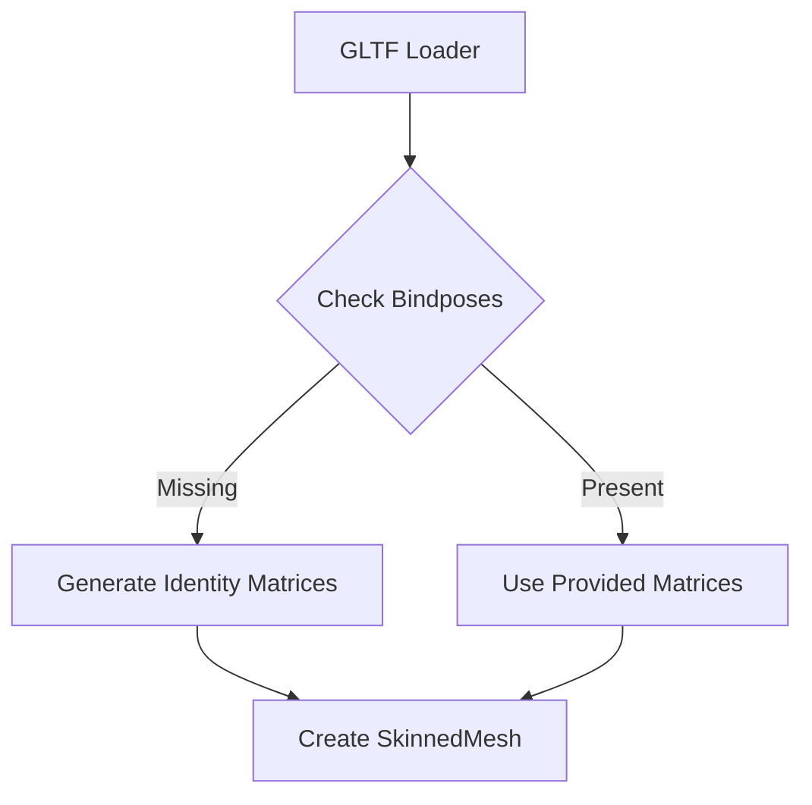

+++
title = "#18419 Gltf handle missing bindposes"
date = "2025-03-19T00:00:00"
draft = false
template = "pull_request_page.html"
in_search_index = true

[taxonomies]
list_display = ["show"]

[extra]
current_language = "en"
available_languages = {"en" = { name = "English", url = "/pull_request/bevy/2025-03/pr-18419-en-20250319" }, "zh-cn" = { name = "中文", url = "/pull_request/bevy/2025-03/pr-18419-zh-cn-20250319" }}
+++

# #18419 Gltf handle missing bindposes

## Basic Information
- **Title**: Gltf handle missing bindposes
- **PR Link**: https://github.com/bevyengine/bevy/pull/18419
- **Author**: robtfm
- **Status**: MERGED
- **Created**: 2025-03-19T11:59:16Z
- **Merged**: 2025-03-20T08:14:22Z
- **Merged By**: cart

## Description Translation
# Objective

correctly load gltfs without explicit bindposes

## Solution

use identity matrices if bindposes are not found.

note: currently does nothing, as gltfs without explicit explicit bindposes fail to load, see <https://github.com/gltf-rs/gltf/pull/449>

## The Story of This Pull Request

The PR addresses a critical gap in Bevy's GLTF loader implementation regarding skinning support. When loading 3D models using skeletal animation, inverse bind pose matrices (bindposes) are essential for proper skin deformation. However, some GLTF files omit these matrices, particularly when exported from certain tools.

The core issue stemmed from Bevy's strict expectation of explicit bindpose data. When absent, the loader would fail entirely, preventing valid models from loading. The solution implements a fallback mechanism using identity matrices when bindposes are missing, maintaining compatibility while waiting for upstream fixes in the gltf-rs parser.

Key implementation details in `crates/bevy_gltf/src/loader/mod.rs` show how the skin processing logic was modified:

```rust
// Before (simplified)
let inverse_bindposes = skin.inverse_bind_matrices().unwrap(); // Would panic if missing

// After
let inverse_bindposes = skin.inverse_bind_matrices().map(|acc| {
    load_buffer(acc, buffers, &blob, load_context)
}).unwrap_or_else(|| Ok(vec![Mat4::IDENTITY; skin.joints().count()]))?;
```

This change:
1. Uses `map` to handle existing bindpose data
2. Implements `unwrap_or_else` fallback to identity matrices
3. Maintains joint count compatibility through `skin.joints().count()`

The technical decision to use identity matrices (Mat4::IDENTITY) serves as a reasonable default since these matrices represent no transformation. This allows models to load with basic functionality while artists can address missing bindposes in their assets.

However, the solution's effectiveness was initially blocked by an upstream limitation in gltf-rs (tracked in [gltf-rs#449](https://github.com/gltf-rs/gltf/pull/449)). The Bevy implementation proactively handles the data availability while remaining compatible with future parser updates.

## Visual Representation



## Key Files Changed

### `crates/bevy_gltf/src/loader/mod.rs` (+4/-3)
**Purpose**: Implement fallback for missing inverse bind matrices

Key changes:
```rust
// Before
let inverse_bindposes = skin.inverse_bind_matrices().map(|acc| {
    load_buffer(acc, buffers, &blob, load_context)
}).transpose()?;

// After
let inverse_bindposes = skin.inverse_bind_matrices().map(|acc| {
    load_buffer(acc, buffers, &blob, load_context)
}).unwrap_or_else(|| Ok(vec![Mat4::IDENTITY; skin.joints().count()]))?;
```

This modification:
1. Replaces mandatory `.transpose()` with fallback handling
2. Uses `unwrap_or_else` to generate identity matrices matching joint count
3. Maintains error propagation through `?` operator

## Further Reading
- [glTF Skinning Specification](https://www.khronos.org/registry/glTF/specs/2.0/glTF-2.0.html#skins)
- [Bevy Skinning Documentation](https://bevyengine.org/learn/book/3d-rendering/advanced/3d-skinning/)
- [gltf-rs PR #449](https://github.com/gltf-rs/gltf/pull/449) - Upstream parser fix enabling this feature
- [Matrix Transformations in Computer Graphics](https://en.wikipedia.org/wiki/Transformation_matrix) - Background on identity matrices