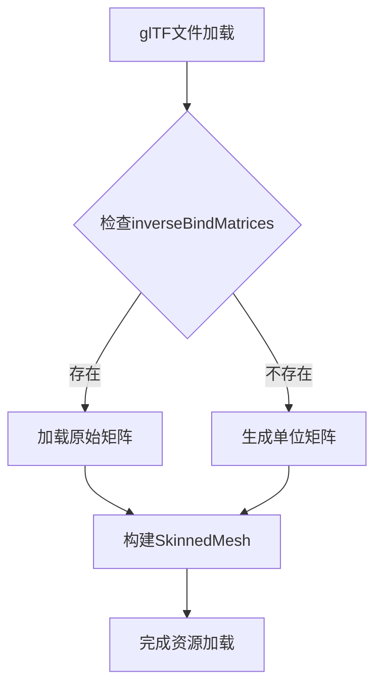

+++
title = "#18419 Gltf handle missing bindposes"
date = "2025-03-19T00:00:00"
draft = false
template = "pull_request_page.html"
in_search_index = false

[extra]
current_language = "zh-cn"
available_languages = {"en" = { name = "English", url = "/pull_request/bevy/2025-03/pr-18419-en-20250319" }, "zh-cn" = { name = "中文", url = "/pull_request/bevy/2025-03/pr-18419-zh-cn-20250319" }}
+++

# #18419 Gltf handle missing bindposes

## Basic Information
- **Title**: Gltf handle missing bindposes
- **PR Link**: https://github.com/bevyengine/bevy/pull/18419
- **Author**: robtfm
- **Status**: MERGED
- **Created**: 2025-03-19T11:59:16Z
- **Merged**: 2025-03-20T08:22:41Z
- **Merged By**: cart

## Description Translation
# 目标

正确加载没有显式绑定姿势（bindposes）的gltf文件

## 解决方案

当找不到绑定姿势时使用单位矩阵（identity matrices）

注意：当前尚未实际生效，因为缺少显式绑定姿势的gltf文件仍会加载失败，详见<https://github.com/gltf-rs/gltf/pull/449>

## The Story of This Pull Request

### 问题背景
在Bevy引擎的gltf加载流程中，骨骼动画系统依赖于逆绑定姿势矩阵（inverse bind poses）来实现正确的蒙皮变换。这些矩阵通常存储在gltf文件的`skin.inverseBindMatrices`属性中。然而当某些gltf文件未显式提供这些矩阵时，现有的加载逻辑会直接失败，导致整个资源加载过程中断。

这个问题的核心在于gltf规范允许通过两种方式提供逆绑定姿势：
1. 显式提供`inverseBindMatrices`数组
2. 当数组不存在时，默认使用单位矩阵（identity matrices）

Bevy原有的实现没有处理第二种情况，导致不符合规范的gltf文件无法加载。

### 技术方案选择
解决方案需要同时满足：
1. 向后兼容现有正确配置的gltf文件
2. 对缺失数据自动生成默认值
3. 与底层gltf解析库（gltf-rs）的行为保持一致

最终采用在Bevy的gltf加载器中添加默认矩阵生成的方案。这个选择基于：
- 最小化改动范围
- 避免修改底层解析库的现有行为
- 保持与未来gltf-rs更新的兼容性（特别是其PR #449）

### 实现细节
在`crates/bevy_gltf/src/loader/mod.rs`中，关键修改出现在处理骨骼数据的代码段：

```rust
let inverse_bindposes = skin
    .inverse_bind_matrices()
    .map(|accessor| {
        let iter = Iter::<f32>::new(accessor);
        iter.map(Mat4::from_cols_array_2d).collect()
    })
    .unwrap_or_else(|| (0..skin.joints().len()).map(|_| Mat4::IDENTITY).collect());
```

这个修改将原有的`.expect()`替换为`.unwrap_or_else()`，实现：
1. 尝试读取现有的逆绑定姿势矩阵
2. 当数据不存在时，自动生成与关节数量相同的单位矩阵数组

### 技术挑战
当前实现受限于gltf-rs库的行为——即使gltf文件符合规范（未显式提供矩阵），该库仍会返回错误。这需要等待gltf-rs的PR #449合并后才能完全生效。因此本次修改是前瞻性的，确保当底层库更新后Bevy可以立即正确处理这类情况。

### 架构影响
修改集中在gltf加载器的骨骼处理模块，保持与其他子系统（如动画系统、渲染系统）的接口不变。新增的默认值生成逻辑被封装在数据加载阶段，对后续处理流程透明。

## Visual Representation



## Key Files Changed

### `crates/bevy_gltf/src/loader/mod.rs` (+4/-3)
**修改目的**：处理缺失逆绑定姿势矩阵的情况

关键代码对比：
```rust
// 修改前
let inverse_bindposes = skin
    .inverse_bind_matrices()
    .map(|accessor| {
        let iter = Iter::<f32>::new(accessor);
        iter.map(Mat4::from_cols_array_2d).collect()
    })
    .expect("inverse bind matrices accessor not found");

// 修改后
let inverse_bindposes = skin
    .inverse_bind_matrices()
    .map(|accessor| {
        let iter = Iter::<f32>::new(accessor);
        iter.map(Mat4::from_cols_array_2d).collect()
    })
    .unwrap_or_else(|| (0..skin.joints().len()).map(|_| Mat4::IDENTITY).collect());
```

这个改动：
1. 移除可能panic的`.expect()`
2. 添加回退逻辑生成默认矩阵
3. 保持矩阵数量与关节数量一致

## Further Reading

1. [glTF 2.0规范 - Skins](https://www.khronos.org/registry/glTF/specs/2.0/glTF-2.0.html#skins) - 官方关于骨骼和逆绑定姿势的定义
2. [gltf-rs PR #449](https://github.com/gltf-rs/gltf/pull/449) - 底层库相关修复进展
3. [Bevy Skinned Mesh示例](https://github.com/bevyengine/bevy/blob/main/examples/3d/skinned_mesh.rs) - Bevy骨骼动画实现参考
4. [矩阵在蒙皮动画中的应用](https://developer.nvidia.com/gpugems/gpugems3/part-iv-image-effects/chapter-22-fast-skinning-many-character) - GPU Gems关于蒙皮变换的技术细节