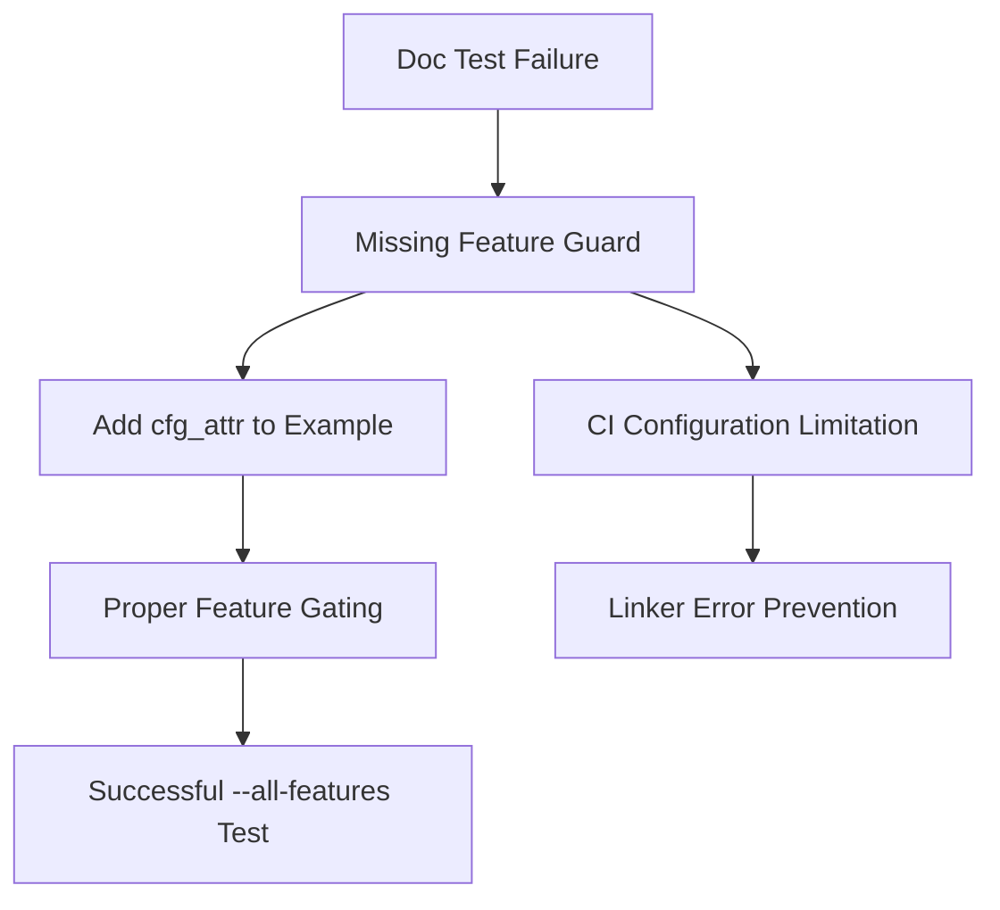

+++
title = "#18424 Fix `bevy_ecs` doc tests with `--all-features`"
date = "2025-03-19T00:00:00"
draft = false
template = "pull_request_page.html"
in_search_index = true

[taxonomies]
list_display = ["show"]

[extra]
current_language = "en"
available_languages = {"zh-cn" = { name = "中文", url = "/pull_request/bevy/2025-03/pr-18424-zh-cn-20250319" }, "en" = { name = "English", url = "/pull_request/bevy/2025-03/pr-18424-en-20250319" }}
+++

# #18424 Fix `bevy_ecs` doc tests with `--all-features`

## Basic Information
- **Title**: Fix `bevy_ecs` doc tests with `--all-features`
- **PR Link**: https://github.com/bevyengine/bevy/pull/18424
- **Author**: greeble-dev
- **Status**: MERGED
- **Created**: 2025-03-19T18:57:48Z
- **Merged**: 2025-03-20T09:14:32Z
- **Merged By**: alice-i-cecile

## Description Translation
### Objective

Fix `bevy_ecs` doc tests failing when used with `--all-features`.

```
---- crates\bevy_ecs\src\error\handler.rs - error::handler::GLOBAL_ERROR_HANDLER (line 87) stdout ----
error[E0425]: cannot find function `default_error_handler` in this scope
 --> crates\bevy_ecs\src\error\handler.rs:92:24
  |
8 |    let error_handler = default_error_handler();
  |                        ^^^^^^^^^^^^^^^^^^^^^ not found in this scope
```

I happened to come across this while testing #12207. I'm not sure it actually needs fixing but seemed worth a go

### Testing

```
cargo test --doc -p bevy_ecs --all-features
```

### Side Notes

The CI misses this error as it doesn't use `--all-features`. Perhaps it should?

I tried adding `--all-features` to `ci/src/commands/doc_tests.rs` but this triggered a linker error:

```
Compiling bevy_dylib v0.16.0-dev (C:\Projects\bevy\crates\bevy_dylib)
error: linking with `link.exe` failed: exit code: 1189
= note: LINK : fatal error LNK1189: library limit of 65535 objects exceeded␍
```

## The Story of This Pull Request

The PR addresses a documentation test failure that only manifests when building Bevy's ECS module with all features enabled. The core issue stemmed from conditional compilation attributes not properly guarding documentation examples when multiple features are active simultaneously.

The failure occurred in `bevy_ecs`'s error handling documentation tests, specifically around the `GLOBAL_ERROR_HANDLER` example. The `default_error_handler` function is conditionally available only when the `configurable_error_handler` feature is enabled. However, the documentation test lacked proper feature gating, leading to compilation failures when testing with `--all-features`.

The solution involved adding precise conditional compilation attributes to the documentation example. By using `#[cfg_attr(doc, cfg(feature = "configurable_error_handler"))]`, the example becomes properly guarded in two scenarios:
1. For regular compilation: Uses standard `#[cfg]` attributes
2. For documentation builds: Applies the feature flag conditionally

This approach ensures the documentation example only appears when the required feature is active, while maintaining visibility in generated docs. The implementation respects Bevy's existing patterns for feature-gated documentation while fixing the test execution path.

An important secondary consideration was CI configuration. The original CI setup didn't catch this issue because it didn't test documentation with all features enabled. While attempting to add `--all-features` to CI would be ideal, practical limitations (like linker errors from excessive object files) prevented this from being a viable immediate solution.

## Visual Representation



## Key Files Changed

### `crates/bevy_ecs/src/error/handler.rs` (+1/-1)

Added conditional compilation attributes to fix documentation test:

```rust
// Before:
/// # Example
///
/// ```

// After:
/// # Example
#[cfg_attr(doc, cfg(feature = "configurable_error_handler"))]
/// ```
```

This change ensures the documentation test example for `GLOBAL_ERROR_HANDLER` is only compiled when the required feature is active, resolving the missing `default_error_handler` function error.

## Further Reading

1. [Rust Documentation Tests](https://doc.rust-lang.org/rustdoc/write-documentation/documentation-tests.html)
2. [Conditional Compilation in Rust](https://doc.rust-lang.org/reference/conditional-compilation.html)
3. [Bevy's Feature Flags Documentation](https://github.com/bevyengine/bevy/blob/main/docs/features.md)