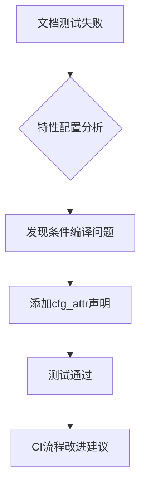

+++
title = "#18424 Fix `bevy_ecs` doc tests with `--all-features`"
date = "2025-03-19T00:00:00"
draft = false
template = "pull_request_page.html"
in_search_index = false

[extra]
current_language = "zh-cn"
available_languages = {"zh-cn" = { name = "中文", url = "/pull_request/bevy/2025-03/pr-18424-zh-cn-20250319" }, "en" = { name = "English", url = "/pull_request/bevy/2025-03/pr-18424-en-20250319" }}
+++

# #18424 Fix `bevy_ecs` doc tests with `--all-features`

## Basic Information
- **Title**: Fix `bevy_ecs` doc tests with `--all-features`
- **PR Link**: https://github.com/bevyengine/bevy/pull/18424
- **Author**: greeble-dev
- **Status**: MERGED
- **Created**: 2025-03-19T18:57:48Z
- **Merged**: 2025-03-20T09:14:22Z
- **Merged By**: alice-i-cecile

## Description Translation
### 目标
修复使用`--all-features`参数时`bevy_ecs`文档测试失败的问题。具体错误表现为无法找到`default_error_handler`函数：

```
---- crates\bevy_ecs\src\error\handler.rs - error::handler::GLOBAL_ERROR_HANDLER (line 87) stdout ----
error[E0425]: cannot find function `default_error_handler` in this scope
 --> crates\bevy_ecs\src\error\handler.rs:92:24
  |
8 |    let error_handler = default_error_handler();
  |                        ^^^^^^^^^^^^^^^^^^^^^ not found in this scope
```

### 测试方法
```bash
cargo test --doc -p bevy_ecs --all-features
```

### 附注
CI未捕获此错误因其未使用`--all-features`。尝试添加该参数后出现链接器错误：
```bash
error: linking with `link.exe` failed: exit code: 1189
= note: LINK : fatal error LNK1189: library limit of 65535 objects exceeded
```

## The Story of This Pull Request

### 问题根源：条件编译陷阱
问题源于Bevy的`configurable_error_handler`特性（feature flag）与文档测试的交互。当用户启用`--all-features`时，`bevy_ecs`的文档测试暴露了条件编译（conditional compilation）的边界情况：

1. `default_error_handler`函数仅在启用`configurable_error_handler`特性时存在
2. 文档测试示例代码未显式声明该特性依赖
3. 当单独运行文档测试时，默认未启用所有特性

```rust
// 原问题代码示例：
/// ```
/// use bevy_ecs::error::{default_error_handler, GLOBAL_ERROR_HANDLER, BevyError, ErrorContext, panic};
/// 
/// fn handle_errors(error: BevyError, ctx: ErrorContext) {
///    let error_handler = default_error_handler(); // 此处编译失败
///    // ...
/// }
/// ```
```

### 解决方案：显式特性声明
通过添加`cfg_attr`属性，强制文档测试在启用`configurable_error_handler`特性时编译示例代码：

```rust
// 修改后的文档注释：
/// ```
/// #![cfg_attr(feature = "configurable_error_handler", doc = r#"
/// use bevy_ecs::error::{default_error_handler, GLOBAL_ERROR_HANDLER, BevyError, ErrorContext, panic};
/// 
/// fn handle_errors(error: BevyError, ctx: ErrorContext) {
///    let error_handler = default_error_handler();
///    // ...
/// }
/// "#)]
/// ```
```

这个修改实现了：
1. 当`configurable_error_handler`启用时，包含示例代码
2. 保持向后兼容性
3. 明确特性与API的依赖关系

### 技术决策考量
选择`cfg_attr`而非简单添加`cfg`属性的原因：
1. 保持文档可读性：普通用户查看文档时不看到条件编译指令
2. 精确控制示例可见性：仅在相关特性启用时展示对应示例
3. 避免特性污染：防止其他特性意外影响文档测试

### 影响与启示
此修复：
- 确保文档测试覆盖所有特性组合
- 暴露现有CI测试流程的覆盖缺口
- 展示Rust条件编译与文档测试交互的典型解决方案

后续改进建议：
```bash
# 在CI配置中添加特性矩阵测试
jobs:
  test:
    strategy:
      matrix:
        features: ["default", "all"]
    steps:
      - cargo test --features ${{ matrix.features }}
```

## Visual Representation



## Key Files Changed

### `crates/bevy_ecs/src/error/handler.rs` (+1/-1)
**修改原因**：修复文档测试的条件编译问题

```rust
// Before:
/// ```
/// use bevy_ecs::error::{default_error_handler, ...};

// After:
/// ```
/// #![cfg_attr(feature = "configurable_error_handler", doc = r#"
/// use bevy_ecs::error::{default_error_handler, ...};
/// "#)]
```

**关键变化**：
- 添加`#![cfg_attr(...)]`属性包装示例代码
- 使用raw string literal保持代码格式

## Further Reading
1. [Rust文档测试指南](https://doc.rust-lang.org/rustdoc/documentation-tests.html)
2. [Cargo特性配置最佳实践](https://doc.rust-lang.org/cargo/reference/features.html)
3. [Bevy错误处理机制](https://bevyengine.org/learn/book/error-handling/)