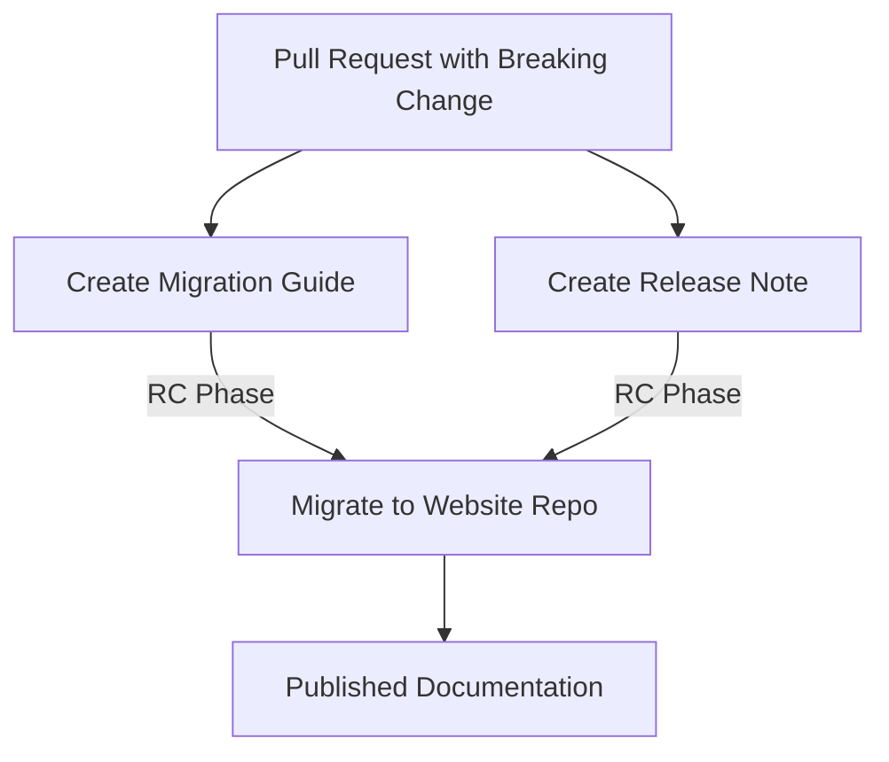

+++
title = "#18427 Establish structure and process for in-repo release notes"
date = "2025-03-20T00:00:00"
draft = false
template = "pull_request_page.html"
in_search_index = true

[taxonomies]
list_display = ["show"]

[extra]
current_language = "en"
available_languages = {"en" = { name = "English", url = "/pull_request/bevy/2025-03/pr-18427-en-20250320" }, "zh-cn" = { name = "中文", url = "/pull_request/bevy/2025-03/pr-18427-zh-cn-20250320" }}
+++

# #18427 Establish structure and process for in-repo release notes

## Basic Information
- **Title**: Establish structure and process for in-repo release notes
- **PR Link**: https://github.com/bevyengine/bevy/pull/18427
- **Author**: alice-i-cecile
- **Status**: MERGED
- **Created**: 2025-03-19T22:48:42Z
- **Merged**: Not merged
- **Merged By**: N/A

## Description Translation
# Objective

As discussed in #https://github.com/bevyengine/bevy/discussions/16431, our release process is a major bottleneck, difficult to collaborate on and a serious source of burnout (hi!). Writing all of the release notes and migration guides at the end of the cycle is miserable, and makes it harder to coalesce them across multiple PRs doing related work.

## Solution

This PR largely implements the solution designed and discussed in the [Better release notes](https://discord.com/channels/691052431525675048/1331412459432710247) working group, unofficially led by @NthTensor. The [plan](https://hackmd.io/NBKkrGbbS5CaU7PsQUFGJQ) laid out in the linked HackMD has largely been folllowed, although I've also added Migration Guides too: they suffer much the same problem.

I've also moved away from using the PR number as the title for the file: if we're hand-authoring the files we can do much better than that!

The READMEs for each folder describe the process in more detail: please read (and comment on them!).

## Questions for reviewers / fellow implementers

- I've moved away from the current "store metadata in a mega-file" approach, and moved it towards a "put the metadata in the file you're editing" design. I much prefer the locality, but it may be harder to get to play nice with our website generation. Do you want me to revert that? See [this folder](https://github.com/bevyengine/bevy-website/tree/main/release-content/0.15) for the current format.
- does the "how to write release notes / migration guides" sections make sense to you here? Normally I would toss this in the Contributor's Guide, but I do like it being right beside the spot you're making changes

## Follow-up work

- [ ] add a job which checks for the labels and blocks the PR if no file in the correct folder is merged
- [ ] add a CI job to do basic format validation on the files inside of these folders
- [ ] generate the release notes and migration guides using a modified version of [the tooling](https://github.com/bevyengine/bevy-website/tree/main/generate-release) one last time for 0.16
- [ ] remove the release notes and migration guide generating tools
- [ ] build a new pipeline to turn the copy-pasted release notes here into actual website content
- [ ] rethink how we're doing release notes to provide better punchy summaries for casual readers
- [ ] create a CI job that checks for new or edited migration guides and automatically labels the PR

## The Story of This Pull Request

### The Problem and Context
Bevy's release process faced significant challenges with documentation crunch. As the engine grew, compiling release notes and migration guides became a bottleneck requiring intense effort at the end of each cycle. This pattern led to contributor burnout and made it difficult to aggregate related changes across multiple PRs. The existing system stored documentation metadata in centralized files, creating coordination challenges and making it hard to maintain context with code changes.

### The Solution Approach
The PR introduces a decentralized documentation workflow where contributors write draft release notes and migration guides alongside their code changes. Key decisions include:
1. Creating separate directories for migration guides and release notes
2. Using per-feature Markdown files with embedded metadata
3. Providing templates and README guidance in each directory
4. Moving from PR-number-based filenames to descriptive titles

This approach leverages locality of reference - documentation lives near the code it describes, making it easier to keep in sync. The template system ensures consistency while allowing flexibility for different change types.

### The Implementation
The core changes establish two new documentation workflows:

**For Migration Guides:**
```markdown
# working-migration-guides/README.md
When we make breaking changes to Bevy, we need to communicate them... 
Migration guides should reflect the complete experience of migrating...
```

**For Release Notes:**
```markdown
# working-release-notes/README.md
Release notes should be organized by "rough feature", not "per PR"...
Images and videos are lovely... **do not put multimedia content in this folder**
```

The templates emphasize practical content requirements:
```markdown
# working-release-notes/template.md
authors = ["@FerrisTheCrab", "@BirdObsessed"]
prs = [14791, 15458]

Add release note content here. Answer:
- what has been changed or added?
- why is this a big deal for users?
```

### Technical Insights
1. **Metadata Locality**: Moving metadata into individual files (rather than centralized storage) reduces merge conflicts and keeps documentation context with its related code
2. **Progressive Enhancement**: The system allows rough drafts that can be refined later, lowering the barrier to entry for contributors
3. **Search Optimization**: Documentation guidance emphasizes search-friendly content structure, recognizing users typically navigate via Ctrl+F

### The Impact
This change shifts documentation from a batch process to a continuous integration model. Early benefits include:
- Reduced risk of missing changes during release crunch
- Better preservation of context between code and documentation
- More natural grouping of related features across PRs
- Clear ownership of documentation by feature implementers

The follow-up CI plans (validation jobs, auto-labeling) will further strengthen the process by enforcing documentation completeness as part of code review.

## Visual Representation



## Key Files Changed

1. `working-migration-guides/README.md` (+51/-0)
   - Establishes process for incremental migration guide creation
   - Key snippet:
```markdown
When writing migration guides, prefer terse, technical language...
Migration guides are not read end-to-end: instead, they are navigated via Ctrl+F
```

2. `working-release-notes/README.md` (+45/-0)
   - Defines new workflow for feature-focused release notes
   - Key decision:
```markdown
Release notes should be organized by "rough feature", not "per PR"
Bevy users don't care if the work was done in 17 PRs
```

3. `working-release-notes/template.md` (+11/-0)
   - Provides metadata structure for release notes:
```markdown
authors = ["@FerrisTheCrab"]
prs = [14791, 15458]
```

4. `working-migration-guides/template.md` (+9/-0)
   - Sets standard format for migration entries:
```markdown
prs = [14791, 15458]
Add migration guide content here... how can users migrate their existing code?
```

## Further Reading
- [Bevy Migration Guides Introduction](https://bevyengine.org/learn/migration-guides/introduction/)
- [Original Release Notes Plan (HackMD)](https://hackmd.io/NBKkrGbbS5CaU7PsQUFGJQ)
- [Rust #[deprecated] Attribute Documentation](https://doc.rust-lang.org/reference/attributes/diagnostics.html#the-deprecated-attribute)