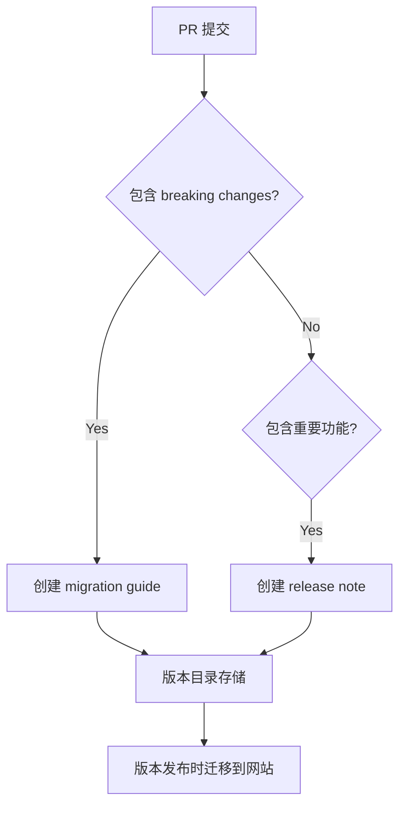

+++
title = "#18427 Establish structure and process for in-repo release notes"
date = "2025-03-20T00:00:00"
draft = false
template = "pull_request_page.html"
in_search_index = false

[extra]
current_language = "zh-cn"
available_languages = {"en" = { name = "English", url = "/pull_request/bevy/2025-03/pr-18427-en-20250320" }, "zh-cn" = { name = "中文", url = "/pull_request/bevy/2025-03/pr-18427-zh-cn-20250320" }}
+++

# #18427 Establish structure and process for in-repo release notes

## Basic Information
- **Title**: Establish structure and process for in-repo release notes
- **PR Link**: https://github.com/bevyengine/bevy/pull/18427
- **Author**: alice-i-cecile
- **Status**: MERGED
- **Created**: 2025-03-19T22:48:42Z
- **Merged**: 2025-03-21T08:15:12Z
- **Merged By**: cart

## Description Translation
# 目标

正如在 [讨论#16431](https://github.com/bevyengine/bevy/discussions/16431) 中提到的，当前的发布流程存在严重瓶颈，协作困难且容易导致维护者疲劳（尤其是集中编写发布说明和迁移指南的阶段）。

## 解决方案

本 PR 基本实现了 [Better release notes](https://discord.com/channels/691052431525675048/1331412459432710247) 工作组设计的方案，并新增了迁移指南的处理流程。主要改动包括：

1. 在仓库中创建结构化目录存放草稿文档
2. 采用 per-feature 的文档组织方式
3. 将元数据直接嵌入文档文件
4. 提供详细的贡献者指南模板

## 后续工作

- [ ] 添加检查标签的 CI 任务
- [ ] 增加基础格式验证
- [ ] 重构网站生成工具链

完整技术细节请参考新增的 README 文件。

## The Story of This Pull Request

### 问题背景与挑战
Bevy 引擎原有的发布流程在版本周期末期面临两大痛点：
1. **集中式文档编写**：所有迁移指南(migration guides)和发布说明(release notes)需在版本发布前集中编写，导致最后时刻的工作压力
2. **内容组织困难**：相关功能的修改分散在不同 PR，难以有效聚合文档内容

这种模式导致：
- 贡献者需要回溯大量历史提交来编写文档
- 文档质量难以保证
- 增加维护者的工作负担（"serious source of burnout"）

### 解决方案设计
核心思路是将文档编写工作前移到功能开发阶段，采用：

1. **分布式文档存储**
   - 每个主要版本创建独立目录（如 `working-migration-guides/0.12/`）
   - 破坏性变更的 PR 必须附带迁移指南草案
   - 新功能 PR 需要包含发布说明草案

2. **结构化元数据管理**
   将相关 PR 编号、作者等信息直接嵌入文档头部：
   ```markdown
   # Feature Name
   authors = ["@FerrisTheCrab"]
   prs = [14791, 15458]
   ```

3. **模板驱动编写**
   提供标准化模板确保内容一致性：
   ```markdown
   # Migration Guide Template
   - What changed?
   - Why change?
   - How to migrate?
   ```

### 关键技术实现
1. **目录结构重构**
   ```plaintext
   bevy/
   ├── working-migration-guides/
   │   ├── 0.12/
   │   │   └── entity_system_changes.md
   │   └── README.md
   └── working-release-notes/
       ├── 0.12/
       │   └── new_rendering.md
       └── README.md
   ```

2. **文档编写规范**
   - 迁移指南要求包含：
     - 技术术语的搜索友好描述
     - 简明的代码迁移示例
     - 破坏性变更的完整影响范围
   - 发布说明需要：
     - 功能亮点的可视化描述
     - 性能数据或对比图表
     - 使用场景说明

3. **版本兼容处理**
   ```markdown
   # working-migration-guides/README.md
   When we publish our first release candidate,
   these notes are moved to bevy-website repo
   for final editing.
   ```

### 工程决策考量
1. **元数据存储方式选择**
   - 选项1：集中式元数据文件（原有方案）
   - 选项2：分布式元数据（当前实现）
   
   选择选项2的主要优势：
   - 修改文档时元数据同步更新
   - 降低合并冲突概率
   - 更符合代码审查习惯

2. **模板复杂度平衡**
   在模板中明确要求三项核心内容：
   ```markdown
   # Release Note Template
   - What changed?
   - Why important?
   - How to use?
   ```
   既保证内容结构，又避免过度约束写作风格。

### 影响与后续计划
当前实现带来：
- 文档编写工作量分摊到日常开发
- 内容准确性和及时性提升
- 降低版本发布前的集成风险

待完成工作：
```markdown
# PR 描述中的后续计划
- [ ] 添加 CI 格式检查
- [ ] 重构网站生成工具
- [ ] 实现自动化标签管理
```

## Visual Representation



## Key Files Changed

### `working-migration-guides/README.md` (+51/-0)
1. **核心改动**
   ```markdown
   ## Where to put your migration guides
   Each major version gets own folder
   Drafts moved to website during RC phase
   ```
2. **技术规范**
   ```markdown
   Prefer terse, technical language
   Include searchable terms
   ```

### `working-release-notes/README.md` (+45/-0)
1. **内容组织原则**
   ```markdown
   Organize by feature, not PR
   Collect related PRs in metadata
   ```
2. **多媒体处理**
   ```markdown
   Do not put multimedia in repo
   Attach to PR description instead
   ```

### 模板文件对比
```markdown
# Migration Guide Template 示例
prs = [14791, 15458]
- 变更内容
- 变更原因
- 迁移步骤

# Release Note Template 示例
authors = ["@FerrisTheCrab"]
- 新增功能
- 用户价值
- 使用方式
```

## Further Reading
1. [Semantic Versioning 规范](https://semver.org/)
2. [Rust API 兼容性指南](https://rust-lang.github.io/api-guidelines/compatibility.html)
3. [Technical Writing 最佳实践](https://developers.google.com/tech-writing)