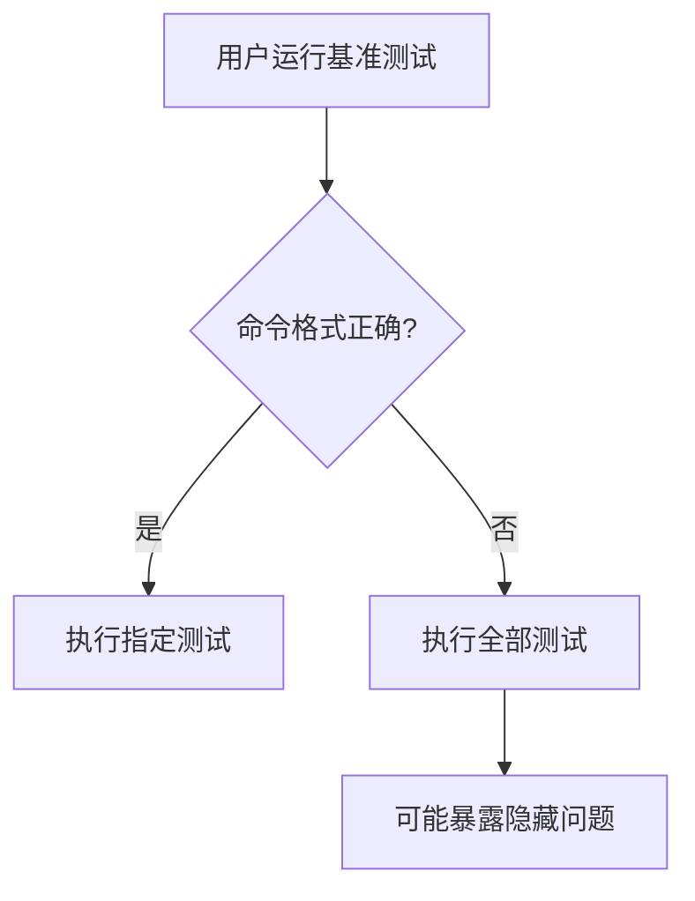

+++
title = "#18431 Fix incorrect command given by the benchmarking README"
date = "2025-03-20T00:00:00"
draft = false
template = "pull_request_page.html"
in_search_index = false

[extra]
current_language = "zh-cn"
available_languages = {"en" = { name = "English", url = "/pull_request/bevy/2025-03/pr-18431-en-20250320" }, "zh-cn" = { name = "中文", url = "/pull_request/bevy/2025-03/pr-18431-zh-cn-20250320" }}
+++

# #18431 Fix incorrect command given by the benchmarking README

## Basic Information
- **Title**: Fix incorrect command given by the benchmarking README
- **PR Link**: https://github.com/bevyengine/bevy/pull/18431
- **Author**: kirawulff
- **Status**: MERGED
- **Created**: 2025-03-20T00:41:29Z
- **Merged**: Not merged
- **Merged By**: N/A

## Description Translation
此PR的目标是修复基准测试文档中的错误命令。

### 目标
- 修复 #18387 

### 解决方案
- 对基准测试文档进行微小更新
- 检查确保与其他文档的一致性。在基准测试相关的`Cargo.toml`中已存在正确命令

### 测试
- 在命令行中使用更新后的命令进行手动测试
- 测试过程中发现了 #18430

## The Story of This Pull Request

### 问题根源
在Bevy的基准测试文档中，存在一个关键的命令行参数格式错误。当开发者尝试使用文档建议的命令运行特定ECS基准测试时：

```sh
cargo bench -p benches -- bench ecs
```

`--`分隔符的错误放置导致Cargo将"bench ecs"作为参数传递给基准测试二进制文件，而不是作为cargo bench的参数。这种错误会引发两种后果：
1. 实际执行的是全部基准测试而非指定测试
2. 无法正确应用后续的过滤参数

### 技术解决方案
通过分析Cargo命令行的工作机制，发现问题出在参数解析顺序。正确的参数结构应为：

```sh
cargo bench [OPTIONS] -- [BENCH_OPTIONS]
```

修正方案将`-- bench ecs`改为`--bench ecs`，使参数解析符合Cargo的规范：

```diff
- cargo bench -p benches -- bench ecs
+ cargo bench -p benches --bench ecs
```

### 实现验证
在测试过程中发现了新的问题#18430（基准测试panic），这验证了：
1. 修正后的命令确实能正确执行特定基准测试
2. 之前由于命令错误，部分测试用例从未被正确执行过

### 工程启示
- **文档准确性**：即使微小参数差异也会导致完全不同的行为
- **测试覆盖**：需要建立文档命令的自动化验证机制
- **错误关联**：表面问题可能隐藏深层缺陷（如未发现的测试panic）

## Visual Representation



## Key Files Changed

### `benches/README.md` (+2/-2)
**修改说明**：修正基准测试运行命令的参数格式

**代码对比**：
```markdown
# 修改前
cargo bench -p benches -- bench ecs

# 修改后
cargo bench -p benches --bench ecs
```

**技术影响**：
- 确保开发者能准确运行目标测试集
- 保持与其他文档的一致性（如Cargo.toml中的注释）
- 避免误导性基准测试结果

## Further Reading
1. [Cargo Benchmark Guide](https://doc.rust-lang.org/cargo/commands/cargo-bench.html)
2. [Criterion.rs Best Practices](https://bheisler.github.io/criterion.rs/book/user_guide/command_line.html)
3. [Rust Performance Testing Patterns](https://nnethercote.github.io/perf-book/benchmarking.html)