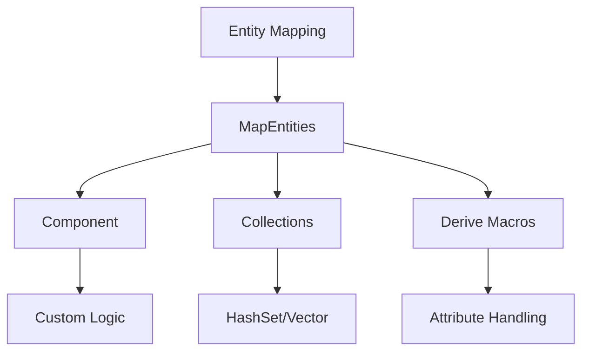

+++
title = "#18432 Replace VisitEntities with MapEntities"
date = "2025-03-21T00:00:00"
draft = false
template = "pull_request_page.html"
in_search_index = true

[taxonomies]
list_display = ["show"]

[extra]
current_language = "en"
available_languages = {"en" = { name = "English", url = "/pull_request/bevy/2025-03/pr-18432-en-20250321" }, "zh-cn" = { name = "中文", url = "/pull_request/bevy/2025-03/pr-18432-zh-cn-20250321" }}
+++

# #18432 Replace VisitEntities with MapEntities

## Basic Information
- **Title**: Replace VisitEntities with MapEntities
- **PR Link**: https://github.com/bevyengine/bevy/pull/18432
- **Author**: cart
- **Status**: MERGED
- **Created**: 2025-03-20T01:17:20Z
- **Merged**: 2025-03-22T14:32:45Z
- **Merged By**: alice-i-cecile

## Description Translation
# Objective

There are currently too many disparate ways to handle entity mapping, especially after #17687. We now have MapEntities, VisitEntities, VisitEntitiesMut, Component::visit_entities, Component::visit_entities_mut.

Our only known use case at the moment for these is entity mapping. This means we have significant consolidation potential.

Additionally, VisitEntitiesMut cannot be implemented for map-style collections like HashSets, as you cant "just" mutate a `&mut Entity`. Our current approach to Component mapping requires VisitEntitiesMut, meaning this category of entity collection isn't mappable. `MapEntities` is more generally applicable. Additionally, the _existence_ of the blanket From impl on VisitEntitiesMut blocks us from implementing MapEntities for HashSets (or any types we don't own), because the owner could always add a conflicting impl in the future.

## Solution

Use `MapEntities` everywhere and remove all "visit entities" usages.

* Add `Component::map_entities`
* Remove `Component::visit_entities`, `Component::visit_entities_mut`, `VisitEntities`, and `VisitEntitiesMut`
* Support deriving `Component::map_entities` in `#[derive(Coomponent)]`
* Add `#[derive(MapEntities)]`, and share logic with the `Component::map_entities` derive.
* Add `ComponentCloneCtx::queue_deferred`, which is command-like logic that runs immediately after normal clones. Reframe `FromWorld` fallback logic in the "reflect clone" impl to use it. This cuts out a lot of unnecessary work and I think justifies the existence of a pseudo-command interface (given how niche, yet performance sensitive this is).

Note that we no longer auto-impl entity mapping for ` IntoIterator<Item = &'a Entity>` types, as this would block our ability to implement cases like `HashMap`. This means the onus is on us (or type authors) to add explicit support for types that should be mappable.

Also note that the Component-related changes do not require a migration guide as there hasn't been a release with them yet.

## Migration Guide

If you were previously implementing `VisitEntities` or `VisitEntitiesMut` (likely via a derive), instead use `MapEntities`. Those were almost certainly used in the context of Bevy Scenes or reflection via `ReflectMapEntities`. If you have a case that uses `VisitEntities` or `VisitEntitiesMut` directly, where `MapEntities` is not a viable replacement, please let us know!

```rust
// before
#[derive(VisitEntities, VisitEntitiesMut)]
struct Inventory {
  items: Vec<Entity>,
  #[visit_entities(ignore)]
  label: String,
}

// after
#[derive(MapEntities)]
struct Inventory {
  #[entities]
  items: Vec<Entity>,
  label: String,
}
```

## The Story of This Pull Request

### The Problem and Context
Bevy's entity mapping system suffered from fragmentation with multiple similar traits (`VisitEntities`, `VisitEntitiesMut`, and their component variants) that all served the same core purpose of remapping entity references. This redundancy created maintenance overhead and limited flexibility - particularly for collection types like `HashSet<Entity>` that couldn't implement `VisitEntitiesMut` due to its mutable iterator requirement.

The situation worsened after PR #17687 introduced more entity mapping infrastructure. The team recognized an opportunity to consolidate around the more flexible `MapEntities` trait, which uses an `EntityMapper` interface rather than direct mutation. This approach better accommodates various data structures and avoids potential future trait implementation conflicts.

### The Solution Approach
The PR eliminates redundant traits and unifies entity mapping under `MapEntities`. Key decisions included:

1. **Trait Consolidation**: Remove `VisitEntities` and related methods in favor of `MapEntities`
2. **Derive Macro Unification**: Combine logic for `#[derive(MapEntities)]` and component mapping
3. **Performance Optimization**: Introduce deferred cloning operations via `ComponentCloneCtx::queue_deferred`

The implementation required careful analysis of existing entity mapping use cases and migration paths for downstream users. The team prioritized maintaining backward compatibility through derive macro updates rather than direct trait implementations.

### The Implementation
The core changes manifest in three key areas:

**1. Component Trait Redesign**
```rust
// Before: Multiple methods
pub trait Component: Send + Sync + 'static {
    fn visit_entities(&self, visitor: &mut impl Visitor);
    fn visit_entities_mut(&mut self, visitor: &mut impl Visitor);
}

// After: Unified mapping
pub trait Component: Send + Sync + 'static {
    fn map_entities<E: EntityMapper>(&mut self, entity_mapper: &mut E);
}
```

**2. Macro Updates**
The component derive macro was updated to generate `map_entities` implementations:
```rust
// New attribute handling in derive
if let Some(attr) = ast.attrs.iter().find(|a| a.path().is_ident(COMPONENT)) {
    attr.parse_nested_meta(|meta| {
        if meta.path.is_ident("map_entities") {
            // Generate mapping logic
        }
    });
}
```

**3. Collection Support**
Added explicit `MapEntities` implementations for common collections:
```rust
impl<S: BuildHasher> MapEntities for HashSet<Entity, S> {
    fn map_entities<E: EntityMapper>(&mut self, entity_mapper: &mut E) {
        *self = self.drain().map(|e| entity_mapper.get_mapped(e)).collect();
    }
}
```

### Technical Insights
The `queue_deferred` mechanism in `ComponentCloneCtx` enables batched entity mapping operations:
```rust
ctx.queue_deferred(|world, mapper| {
    // Batch process entity mappings
});
```
This approach reduces redundant lookups and allows optimizing bulk operations - particularly important for scene spawning and entity cloning performance.

### The Impact
- **Simplified API**: Reduced from 5 entity mapping traits/methods to 1
- **Improved Flexibility**: Enabled entity mapping for previously unsupported types like `HashSet`
- **Performance Gains**: Deferred operations reduce per-entity overhead
- **Future-Proofing**: Eliminated potential trait implementation conflicts

The changes affected 10+ files across Bevy's ECS module, removing 149 lines of legacy code while adding more maintainable implementations. Migration is straightforward through updated derive macros, preserving existing functionality while unlocking new capabilities.

## Visual Representation



## Key Files Changed

### `crates/bevy_ecs/src/entity/visit_entities.rs` (+0/-149)
- **Change**: Entire file removed
- **Why**: Eliminated legacy VisitEntities trait system
- **Impact**: Reduces codebase complexity and maintenance burden

### `crates/bevy_ecs/macros/src/component.rs`
```rust
// Added map_entities derivation
let map_entities_impl = if let Some(map_entities) = attrs.map_entities {
    quote! {
        fn map_entities<M: #bevy_ecs_path::entity::EntityMapper>(&mut self, entity_mapper: &mut M) {
            #map_entities
        }
    }
};
```
- **Purpose**: Generates component mapping logic through macros
- **Relation**: Core to unifying entity mapping approaches

### `crates/bevy_ecs/src/component.rs`
```rust
// Before:
pub trait Component: Send + Sync + 'static {
    fn visit_entities(&self, visitor: &mut impl Visitor);
}

// After: 
pub trait Component: Send + Sync + 'static {
    fn map_entities<E: EntityMapper>(&mut self, entity_mapper: &mut E);
}
```
- **Change**: Fundamental trait redesign
- **Impact**: All components now use unified mapping approach

## Further Reading
- [Entity Mapping in ECS Patterns](https://bevy-cheatbook.github.io/patterns/entity-mapping.html)
- [Rust Trait Design Guidelines](https://rust-lang.github.io/api-guidelines/)
- [Bevy Scene System Documentation](https://docs.rs/bevy_scene/latest/bevy_scene/)