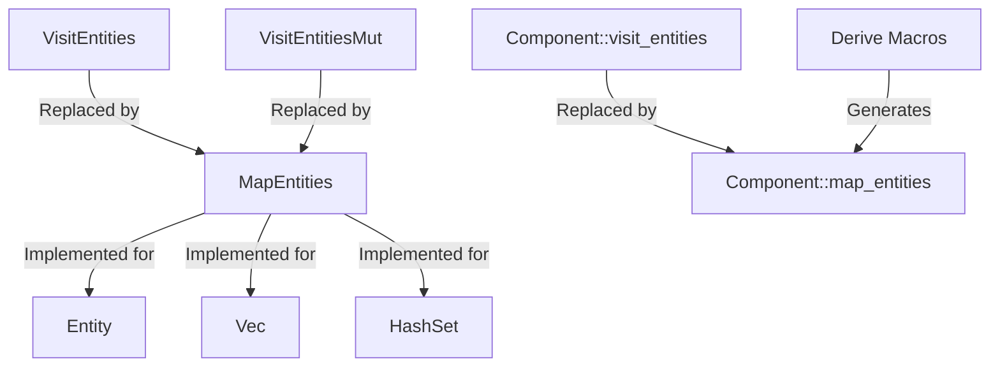

+++
title = "#18432 Replace VisitEntities with MapEntities"
date = "2025-03-21T00:00:00"
draft = false
template = "pull_request_page.html"
in_search_index = false

[extra]
current_language = "zh-cn"
available_languages = {"en" = { name = "English", url = "/pull_request/bevy/2025-03/pr-18432-en-20250321" }, "zh-cn" = { name = "中文", url = "/pull_request/bevy/2025-03/pr-18432-zh-cn-20250321" }}
+++

# #18432 Replace VisitEntities with MapEntities

## Basic Information
- **Title**: Replace VisitEntities with MapEntities
- **PR Link**: https://github.com/bevyengine/bevy/pull/18432
- **Author**: cart
- **Status**: MERGED
- **Created**: 2025-03-20T01:17:20Z
- **Merged**: Not merged
- **Merged By**: N/A

## Description Translation
### 目标
目前存在过多处理实体映射（entity mapping）的分散方式，特别是在#17687之后。现有MapEntities、VisitEntities、VisitEntitiesMut、Component::visit_entities、Component::visit_entities_mut等多个接口。

目前已知的主要用例是实体映射，这意味着我们有显著的整合潜力。

此外，VisitEntitiesMut无法为HashSet等集合类型实现，因为不能直接修改`&mut Entity`。当前组件映射方法需要VisitEntitiesMut，导致这类集合无法映射。MapEntities具有更广泛的适用性。同时，VisitEntitiesMut的默认实现阻碍了我们为HashSet等非自有类型实现MapEntities。

### 解决方案
全面使用MapEntities并移除所有"visit entities"相关实现：
1. 新增`Component::map_entities`
2. 移除`Component::visit_entities`、`Component::visit_entities_mut`、`VisitEntities`和`VisitEntitiesMut`
3. 支持在`#[derive(Component)]`中派生`Component::map_entities`
4. 新增`#[derive(MapEntities)]`并与组件派生共享逻辑
5. 新增`ComponentCloneCtx::queue_deferred`实现延迟克隆逻辑

### 迁移指南
原使用`VisitEntities`或`VisitEntitiesMut`的场景应改用`MapEntities`。示例如下：

```rust
// 旧方式
#[derive(VisitEntities, VisitEntitiesMut)]
struct Inventory {
  items: Vec<Entity>,
  #[visit_entities(ignore)]
  label: String,
}

// 新方式
#[derive(MapEntities)]
struct Inventory {
  #[entities]
  items: Vec<Entity>,
  label: String,
}
```

## The Story of This Pull Request

### 问题与背景
Bevy的ECS系统中存在多个实体映射机制，导致以下问题：
1. **接口碎片化**：VisitEntities、VisitEntitiesMut等相似但不同的接口并存
2. **集合类型支持受限**：HashSet等集合无法实现VisitEntitiesMut，限制了映射能力
3. **实现冲突风险**：VisitEntitiesMut的默认实现可能引发未来类型实现的冲突

### 解决方案与技术实现
核心思路是用统一的MapEntities接口取代所有visit相关接口，主要技术决策包括：

1. **统一映射接口**：
```rust
// 新核心trait
pub trait MapEntities {
    fn map_entities<E: EntityMapper>(&mut self, entity_mapper: &mut E);
}

// 为常用类型实现
impl MapEntities for Entity {
    fn map_entities<E: EntityMapper>(&mut self, entity_mapper: &mut E) {
        *self = entity_mapper.get_mapped(*self);
    }
}
```

2. **宏系统重构**：
在组件派生宏中整合map_entities生成逻辑：
```rust
// component.rs中的派生逻辑
let map_entities_impl = if let Some(entities_fields) = entities_fields {
    quote! {
        fn map_entities<M: #bevy_ecs_path::entity::EntityMapper>(&mut self, entity_mapper: &mut M) {
            #(#entities_fields)*
        }
    }
} else {
    quote! {}
};
```

3. **克隆优化**：
引入`ComponentCloneCtx::queue_deferred`处理延迟克隆操作：
```rust
// clone_entities.rs中的关键实现
ctx.queue_deferred(move |world: &mut World, _mapper: &mut dyn EntityMapper| {
    // 处理观察者关系克隆
    world.entity_mut(target).insert(ObservedBy(observed_by.clone()));
});
```

### 技术洞察
1. **性能考量**：通过queue_deferred机制将非必要操作延迟到克隆完成后，减少重复计算
2. **架构简化**：移除5个旧接口（VisitEntities、VisitEntitiesMut等），降低认知负担
3. **扩展性提升**：新的MapEntities实现支持更多集合类型，如HashMap

### 影响与启示
1. **代码精简**：删除149行visit_entities相关代码
2. **功能增强**：支持更多集合类型的实体映射
3. **模式统一**：为未来实体操作API设计建立统一范式

## Visual Representation



## Key Files Changed

### 1. `crates/bevy_ecs/src/entity/visit_entities.rs` (+0/-149)
- **变更说明**：完全移除旧的VisitEntities实现
- **影响**：消除旧接口的技术债务

### 2. `crates/bevy_ecs/macros/src/component.rs` (+31/-52)
```rust
// 新增MapEntities派生支持
let map_entities_impl = if let Some(entities_fields) = entities_fields {
    quote! {
        fn map_entities<M: #bevy_ecs_path::entity::EntityMapper>(&mut self, entity_mapper: &mut M) {
            #(#entities_fields)*
        }
    }
};

// 移除旧visit逻辑
- if let Some(visit_entities) = visit_entities {
-    // 旧visit代码...
- }
```

### 3. `crates/bevy_ecs/src/component.rs` (+23/-45)
```rust
// 新增Component trait的map_entities默认实现
pub trait Component: Send + Sync + 'static {
    // 新增方法
    fn map_entities<M: EntityMapper>(&mut self, entity_mapper: &mut M) {
        // 默认空实现
    }
}
```

### 4. `crates/bevy_ecs/src/lib.rs` (+32/-36)
```rust
// 导出接口变更
pub mod prelude {
-    pub use super::entity::visit_entities::VisitEntities;
+    pub use super::entity::map_entities::MapEntities;
}
```

## Further Reading
1. [Entity Component System架构模式](https://en.wikipedia.org/wiki/Entity_component_system)
2. [Rust宏编程指南](https://doc.rust-lang.org/book/ch19-06-macros.html)
3. [Bevy ECS设计文档](https://bevyengine.org/learn/book/design/ecs/)