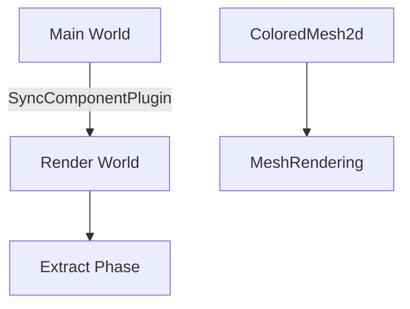

+++
title = "#18433 Fix warning spam on `mesh2d_manual` example"
date = "2025-03-20T00:00:00"
draft = false
template = "pull_request_page.html"
in_search_index = true

[taxonomies]
list_display = ["show"]

[extra]
current_language = "en"
available_languages = {"en" = { name = "English", url = "/pull_request/bevy/2025-03/pr-18433-en-20250320" }, "zh-cn" = { name = "中文", url = "/pull_request/bevy/2025-03/pr-18433-zh-cn-20250320" }}
+++

# #18433 Fix warning spam on `mesh2d_manual` example

## Basic Information
- **Title**: Fix warning spam on `mesh2d_manual` example
- **PR Link**: https://github.com/bevyengine/bevy/pull/18433
- **Author**: hukasu
- **Status**: MERGED
- **Created**: 2025-03-20T01:24:26Z
- **Merged**: Not merged
- **Merged By**: N/A

## Description Translation
# Objective

Fixes #18429 

## Solution

Add syncing to the render world for the `ColoredMesh2d` component

## Testing

Ran the example and it works as intended without the warning spam

## The Story of This Pull Request

The `mesh2d_manual` example was generating persistent warnings due to missing render world synchronization for a custom component. In Bevy's ECS architecture, components needing rendering must be synchronized between the main World and render World through explicit registration.

The root cause was identified in the `ColoredMesh2dPlugin` implementation. While the plugin established rendering pipelines and draw functions, it lacked synchronization for the `ColoredMesh2d` component. This omission caused the render system to log warnings about missing component data during extraction.

The fix involved adding component synchronization through Bevy's existing synchronization infrastructure:

```rust
// Added to ColoredMesh2dPlugin implementation
impl Plugin for ColoredMesh2dPlugin {
    fn build(&self, app: &mut App) {
        // Register sync system for ColoredMesh2d component
        app.add_plugins(SyncComponentPlugin::<ColoredMesh2d>::default());
        
        let render_app = app.sub_app_mut(RenderApp);
        render_app
            .init_resource::<SpecializedRenderPipelines<ColoredMesh2dPipeline>>()
            .add_render_command::<Transparent2d, DrawColoredMesh2d>();
    }
}
```

This change leverages Bevy's `SyncComponentPlugin` to automatically copy `ColoredMesh2d` components from the main World to the render World. The synchronization ensures the render system can access required component data during the extraction phase, eliminating the warning spam.

The implementation demonstrates proper use of Bevy's component synchronization pattern. By using the existing `SyncComponentPlugin`, the solution maintains consistency with Bevy's ECS rendering architecture while adding minimal overhead. This approach avoids manual system writing and ensures compatibility with Bevy's built-in optimization strategies for component synchronization.

## Visual Representation



## Key Files Changed

### `examples/2d/mesh2d_manual.rs` (+15/-4)
**Purpose**: Fix component synchronization in 2D manual mesh example

Key modification in plugin registration:
```rust
// Before:
impl Plugin for ColoredMesh2dPlugin {
    fn build(&self, app: &mut App) {
        let render_app = app.sub_app_mut(RenderApp);
        render_app
            .init_resource::<SpecializedRenderPipelines<ColoredMesh2dPipeline>>()
            .add_render_command::<Transparent2d, DrawColoredMesh2d>();
    }
}

// After:
impl Plugin for ColoredMesh2dPlugin {
    fn build(&self, app: &mut App) {
        // Added component synchronization
        app.add_plugins(SyncComponentPlugin::<ColoredMesh2d>::default());
        
        let render_app = app.sub_app_mut(RenderApp);
        render_app
            .init_resource::<SpecializedRenderPipelines<ColoredMesh2dPipeline>>()
            .add_render_command::<Transparent2d, DrawColoredMesh2d>();
    }
}
```

This change adds the critical component synchronization while maintaining existing rendering setup. The `SyncComponentPlugin` registration ensures the `ColoredMesh2d` component data becomes available in the render world.

## Further Reading

- Bevy ECS System Scheduling: https://bevyengine.org/learn/book/getting-started/ecs/
- Component Synchronization: https://bevyengine.org/learn/book/getting-started/ecs/#system-sets
- Render World Architecture: https://bevyengine.org/learn/book/getting-started/rendering/#render-world