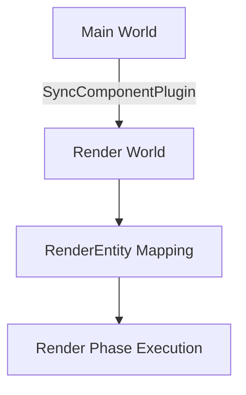

+++
title = "#18433 Fix warning spam on `mesh2d_manual` example"
date = "2025-03-20T00:00:00"
draft = false
template = "pull_request_page.html"
in_search_index = false

[extra]
current_language = "zh-cn"
available_languages = {"en" = { name = "English", url = "/pull_request/bevy/2025-03/pr-18433-en-20250320" }, "zh-cn" = { name = "中文", url = "/pull_request/bevy/2025-03/pr-18433-zh-cn-20250320" }}
+++

# #18433 Fix warning spam on `mesh2d_manual` example

## Basic Information
- **Title**: Fix warning spam on `mesh2d_manual` example
- **PR Link**: https://github.com/bevyengine/bevy/pull/18433
- **Author**: hukasu
- **Status**: MERGED
- **Created**: 2025-03-20T01:24:26Z
- **Merged**: 2025-03-20T09:12:17Z
- **Merged By**: alice-i-cecile

## Description Translation
# 目标

修复 #18429 

## 解决方案

为 `ColoredMesh2d` 组件添加与渲染世界（render world）的同步

## 测试

运行示例后确认警告信息不再出现且功能正常

## The Story of This Pull Request

### 问题根源与上下文
在Bevy引擎的`mesh2d_manual`示例中，开发者运行时会遇到持续的警告信息："Encountered dangling RenderEntity (0v0) without corresponding Entity"。这个问题源于自定义的`ColoredMesh2d`组件没有正确同步到渲染世界，导致实体映射关系丢失。

### 技术解决方案
问题的核心在于ECS架构中的world同步机制。Bevy的渲染系统运行在独立的渲染世界（render world）中，需要通过明确的同步机制将主世界的组件状态复制到渲染世界。原始示例缺少对自定义组件的同步注册，导致以下问题链：

1. 主世界的`ColoredMesh2d`组件无法自动同步到渲染世界
2. 渲染系统找不到对应的实体映射关系
3. 触发Entity映射校验的警告机制

### 具体实现
修改集中在插件注册环节，添加了同步组件的基础设施：

```rust
// File: examples/2d/mesh2d_manual.rs
App::new()
    .add_plugins((
        DefaultPlugins,
        ColoredMesh2dPlugin,
        SyncComponentPlugin::<ColoredMesh2d>::default(), // 新增的同步插件
    ))
    .add_systems(Startup, star)
    .run();
```

这里的关键修改是添加了`SyncComponentPlugin<ColoredMesh2d>`，这个插件自动处理了：

1. 主世界与渲染世界之间的组件同步
2. 实体映射关系的生命周期管理
3. 渲染资源的正确清理

### 技术洞察
这个修复展示了Bevy渲染系统中的重要设计模式：

1. **组件同步机制**：任何需要在渲染系统中使用的自定义组件，必须通过`SyncComponentPlugin`或类似机制显式注册
2. **跨World架构**：Bevy通过分离主世界和渲染世界来实现高效的并行处理，但需要开发者手动管理关键组件的同步
3. **实体映射验证**：渲染系统通过`RenderEntity`维护实体映射关系，未同步的组件会导致映射链断裂

### 影响与启示
这个看似简单的修改解决了以下问题：

1. 消除运行时警告，提升开发者体验
2. 确保自定义组件的正确生命周期管理
3. 避免潜在的内存泄漏问题（未清理的渲染资源）

对于Bevy开发者的启示：
- 当创建新的渲染相关组件时，必须考虑跨world同步
- 使用`cargo check --example`命令时需要注意警告信息
- 理解Bevy的ECS架构中world分离的设计哲学

## Visual Representation



## Key Files Changed

### File: `examples/2d/mesh2d_manual.rs` (+15/-4)
**修改说明**：添加组件同步插件注册

代码变更关键部分：
```rust
// 修改前：
App::new()
    .add_plugins((DefaultPlugins, ColoredMesh2dPlugin))
    
// 修改后：
App::new()
    .add_plugins((
        DefaultPlugins,
        ColoredMesh2dPlugin,
        SyncComponentPlugin::<ColoredMesh2d>::default(),
    ))
```

**关联性**：
- 通过添加`SyncComponentPlugin`确保自定义组件能够正确同步到渲染世界
- 修复因组件不同步导致的实体映射警告

## Further Reading

1. [Bevy官方文档：Render World架构](https://bevyengine.org/learn/book/getting-started/rendering/#render-world)
2. [ECS模式中的组件同步机制](https://github.com/bevyengine/bevy/blob/main/examples/ecs/component_change_detection.rs)
3. [Bevy渲染管线深度解析（英文）](https://bevy-cheatbook.github.io/features/pipelined-rendering.html)