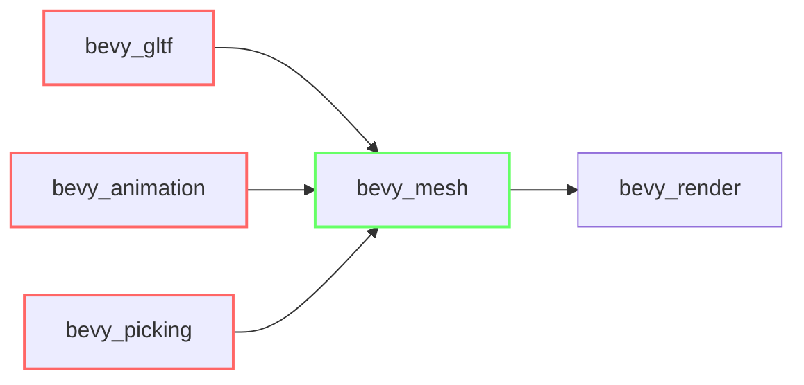

+++
title = "#18437 Reduce dependencies on `bevy_render` by preferring `bevy_mesh` imports"
date = "2025-03-25T00:00:00"
draft = false
template = "pull_request_page.html"
in_search_index = true

[taxonomies]
list_display = ["show"]

[extra]
current_language = "en"
available_languages = {"en" = { name = "English", url = "/pull_request/bevy/2025-03/pr-18437-en-20250325" }, "zh-cn" = { name = "中文", url = "/pull_request/bevy/2025-03/pr-18437-zh-cn-20250325" }}
labels = ["A-Rendering", "C-Dependencies"]
+++

# #18437 Reduce dependencies on `bevy_render` by preferring `bevy_mesh` imports

## Basic Information
- **Title**: Reduce dependencies on `bevy_render` by preferring `bevy_mesh` imports
- **PR Link**: https://github.com/bevyengine/bevy/pull/18437
- **Author**: greeble-dev
- **Status**: MERGED
- **Labels**: `A-Rendering`, `C-Dependencies`, `S-Ready-For-Final-Review`
- **Created**: 2025-03-20T11:39:47Z
- **Merged**: Not merged
- **Merged By**: N/A

## Description Translation
**Objective**

Reduce dependencies on `bevy_render` by preferring `bevy_mesh` imports over `bevy_render` re-exports. 

```diff
- use bevy_render::mesh::Mesh;
+ use bevy_mesh::Mesh;
```

This is intended to help with #18423 (render crate restructure). Affects `bevy_gltf`, `bevy_animation` and `bevy_picking`.

**But Why?**

As part of #18423, I'm assuming there'll be a push to make crates less dependent on the big render crates. This PR seemed like a small and safe step along that path - it only changes imports and makes the `bevy_mesh` crate dependency explicit in `Cargo.toml`. Any remaining dependencies on `bevy_render` are true dependencies.

**Testing**

```
cargo run --example testbed_3d
cargo run --example mesh_picking
```

## The Story of This Pull Request

The PR addresses technical debt in Bevy's dependency graph by decoupling non-rendering crates from the render subsystem. While working on render crate restructure (#18423), the author identified an opportunity to reduce artificial dependencies created through re-exports.

The core issue stemmed from crates importing `Mesh` and related types through `bevy_render`'s re-exports instead of directly from `bevy_mesh`. This created unnecessary dependency links and violated the principle of depending only on what you actually use. For example:

```rust
// Before: Indirect dependency through render crate
use bevy_render::mesh::Mesh;

// After: Direct dependency on mesh crate 
use bevy_mesh::Mesh;
```

The implementation required systematic changes across multiple crates:
1. Updated `Cargo.toml` files to explicitly add `bevy_mesh` dependencies
2. Modified import statements in source files to reference `bevy_mesh` directly
3. Verified through testing that no functionality broke from these changes

Key technical considerations included:
- Maintaining compatibility with existing APIs that might expect `bevy_render` types
- Ensuring all necessary mesh-related features remained accessible
- Avoiding circular dependencies between crates

The changes improve build times by reducing unnecessary compilation of render-related code in crates that only need mesh functionality. This also makes dependency relationships more explicit and easier to analyze for future refactoring.

## Visual Representation



## Key Files Changed

### File: `crates/bevy_animation/Cargo.toml`
```toml
# Added explicit bevy_mesh dependency
[dependencies]
bevy_mesh = { path = "../bevy_mesh", version = "0.16.0-dev" }
```

### File: `crates/bevy_gltf/src/loader/mod.rs`
```rust
// Before:
use bevy_render::mesh::{Mesh, MeshVertexAttribute};

// After: 
use bevy_mesh::{Mesh, MeshVertexAttribute};
```

### File: `crates/bevy_gltf/src/vertex_attributes.rs`
```rust
// Before:
use bevy_render::mesh::VertexAttributeValues;

// After:
use bevy_mesh::VertexAttributeValues;
```

### File: `crates/bevy_gltf/src/label.rs`
```rust
// Before:
use bevy_render::render_resource::Face;

// After:
use bevy_mesh::skinning::SkinnedMeshInverseBindposes;
```

## Further Reading
- [Rust API Guidelines: Re-exports](https://rust-lang.github.io/api-guidelines/necessities.html#crate-reexports-are-minimal-and-clear-c-reexport)
- [Cargo Documentation: Dependency Features](https://doc.rust-lang.org/cargo/reference/features.html)
- [Bevy Engine: ECS Overview](https://bevyengine.org/learn/book/getting-started/ecs/)