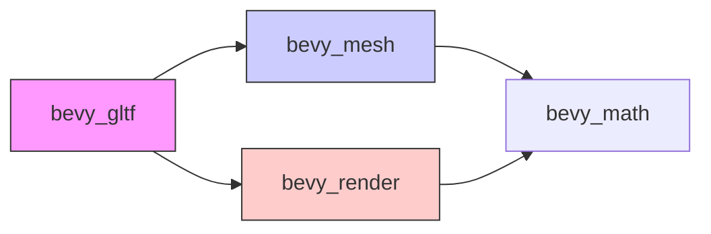

+++
title = "#18437 通过优先使用`bevy_mesh`导入减少对`bevy_render`的依赖"
date = "2025-03-25T00:00:00"
draft = false
template = "pull_request_page.html"
in_search_index = false

[extra]
current_language = "zh-cn"
available_languages = {"en" = { name = "English", url = "/pull_request/bevy/2025-03/pr-18437-en-20250325" }, "zh-cn" = { name = "中文", url = "/pull_request/bevy/2025-03/pr-18437-zh-cn-20250325" }}
+++

# #18437 Reduce dependencies on `bevy_render` by preferring `bevy_mesh` imports

## 基本信息
- **标题**: 通过优先使用`bevy_mesh`导入减少对`bevy_render`的依赖
- **PR链接**: https://github.com/bevyengine/bevy/pull/18437
- **作者**: greeble-dev
- **状态**: 已合并
- **标签**: `A-Rendering`, `C-Dependencies`, `S-Ready-For-Review`
- **创建时间**: 2025-03-20T11:39:47Z
- **合并时间**: 未提供具体时间
- **合并者**: 未提供具体信息

## 描述翻译
### 目标
通过优先使用`bevy_mesh`的直接导入替代`bevy_render`的再导出，减少对`bevy_render`的依赖。

```diff
- use bevy_render::mesh::Mesh;
+ use bevy_mesh::Mesh;
```

此修改旨在支持#18423（渲染crate结构调整），影响`bevy_gltf`、`bevy_animation`和`bevy_picking`。

### 原因
作为#18423的一部分，需要减少各crate对大型渲染crate的依赖。本PR通过显式声明`bevy_mesh`依赖并修正导入路径，确保剩余对`bevy_render`的依赖都是真实必要的。

### 测试
```
cargo run --example testbed_3d
cargo run --example mesh_picking
```

## 技术实现历程

### 问题背景与上下文
Bevy引擎正在进行渲染模块的重构（#18423），目标是降低核心模块间的耦合度。原代码中多个crate通过`bevy_render`间接依赖`bevy_mesh`，形成了不必要的依赖链条。这种隐性依赖会增加构建时间，阻碍模块的独立演进，并可能在未来架构调整时引发兼容性问题。

### 解决方案选择
开发者采取直接依赖策略：
1. 在`Cargo.toml`中显式声明`bevy_mesh`依赖
2. 替换所有`bevy_render::mesh`路径为`bevy_mesh`
3. 保留必须的`bevy_render`真实依赖

这种改动符合Rust的最佳实践——显式优于隐式（explicit over implicit），使依赖关系更清晰可维护。例如在`bevy_gltf`的loader实现中：

```rust
// 修改前
use bevy_render::mesh::Mesh;

// 修改后
use bevy_mesh::Mesh;
```

### 关键技术实现
1. **依赖声明调整**：
在`bevy_animation/Cargo.toml`中新增直接依赖：
```toml
[dependencies]
bevy_mesh = { path = "../bevy_mesh", version = "0.16.0-dev" }
```

2. **路径替换操作**：
全局替换约15处导入路径，典型示例如下：
```diff
- use bevy_render::mesh::VertexAttributeValues;
+ use bevy_mesh::VertexAttributeValues;
```

3. **保持必要依赖**：
在需要`bevy_render`实际功能的模块（如材质处理）保留原有导入：
```rust
use bevy_render::render_resource::Face;  // 真实依赖保持不变
```

### 技术洞察
- **模块解耦**：通过直接依赖目标模块，减少隐式耦合，符合Rust的模块化设计哲学
- **编译优化**：显式声明帮助Cargo进行更精确的依赖分析，可能提升增量编译速度
- **架构演进**：为后续渲染模块拆分奠定基础，使各组件边界更清晰

### 影响分析
- **依赖树简化**：`bevy_gltf`等crate的依赖树深度减少一层
- **代码可维护性**：导入路径更直观反映实际依赖关系
- **未来兼容**：降低后续架构调整时的重构成本

## 关键文件变更

### `crates/bevy_animation/Cargo.toml`
```toml
[dependencies]
bevy_mesh = { path = "../bevy_mesh", version = "0.16.0-dev" }  # 新增直接依赖
```
确保动画系统直接依赖网格数据结构，不再通过渲染模块间接获取。

### `crates/bevy_gltf/src/loader/mod.rs`
```diff
- use bevy_render::mesh::{
+ use bevy_mesh::{
    morph::{MorphAttributes, MorphTargetImage, MorphWeights},
    skinning::{SkinnedMesh, SkinnedMeshInverseBindposes},
    Indices, Mesh, MeshVertexAttribute, PrimitiveTopology, VertexAttributeValues,
};
```
重构网格相关功能的导入路径，保持功能不变但依赖更清晰。

### `crates/bevy_gltf/src/vertex_attributes.rs`
```diff
- use bevy_render::mesh::VertexAttributeValues as Values;
+ use bevy_mesh::VertexAttributeValues as Values;
```
顶点属性处理直接使用网格模块定义，消除对渲染模块的间接依赖。

## 架构关系图

说明：调整后`bevy_gltf`直接依赖`bevy_mesh`，仅保留必要的`bevy_render`真实依赖

## 延伸阅读
1. [Rust模块系统最佳实践](https://doc.rust-lang.org/book/ch07-02-defining-modules-to-control-scope-and-privacy.html)
2. [Cargo依赖解析机制](https://doc.rust-lang.org/cargo/reference/resolver.html)
3. [Bevy ECS架构设计](https://bevyengine.org/learn/book/getting-started/ecs/)