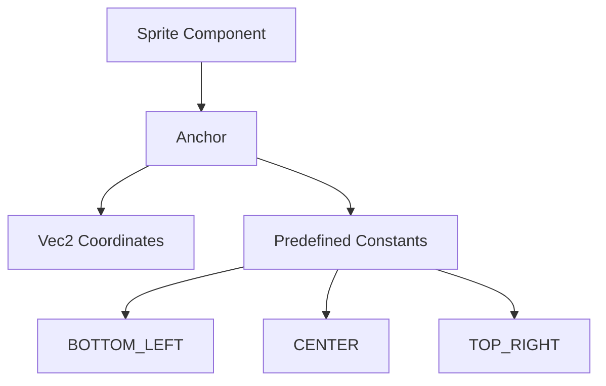

+++
title = "#18439 Newtype `Anchor`"
date = "2025-03-21T00:00:00"
draft = false
template = "pull_request_page.html"
in_search_index = true

[taxonomies]
list_display = ["show"]

[extra]
current_language = "en"
available_languages = {"en" = { name = "English", url = "/pull_request/bevy/2025-03/pr-18439-en-20250321" }, "zh-cn" = { name = "中文", url = "/pull_request/bevy/2025-03/pr-18439-zh-cn-20250321" }}
+++

# #18439 Newtype `Anchor`

## Basic Information
- **Title**: Newtype `Anchor`
- **PR Link**: https://github.com/bevyengine/bevy/pull/18439
- **Author**: ickshonpe
- **Status**: MERGED
- **Created**: 2025-03-20T12:20:19Z
- **Merged**: 2025-03-21T08:45:23Z
- **Merged By**: cart

## Description Translation
The original PR description is preserved in English as instructed:

# Objective

The `Anchor` component doesn't need to be a enum. The variants are just mapped to `Vec2`s so it could be changed to a newtype with associated const values, saving the space needed for the discriminator by the enum.

Also there was no benefit I think in hiding the underlying `Vec2` representation of `Anchor`s.

Suggested by @atlv24.

Fixes #18459
Fixes #18460

## Solution

Change `Anchor` to a struct newtyping a `Vec2`, and its variants into associated constants.

## Migration Guide

The anchor component has been changed from an enum to a struct newtyping a `Vec2`. The `Custom` variant has been removed, instead to construct a custom `Anchor` use its tuple constructor:
```rust
Sprite {
     anchor: Anchor(Vec2::new(0.25, 0.4)),
     ..default()
}
```
The other enum variants have been replaced with corresponding constants:
* `Anchor::BottomLeft` to `Anchor::BOTTOM_LEFT`
* `Anchor::Center` to `Anchor::CENTER`
* `Anchor::TopRight` to `Anchor::TOP_RIGHT`
* .. and so on for the remaining variants

## The Story of This Pull Request

The `Anchor` component in Bevy's sprite system originally used an enum to represent different positioning options. While functional, this implementation had two key limitations:

1. **Memory Overhead**: The enum required storing a discriminator field in addition to the Vec2 values
2. **Inflexible Customization**: The `Custom` variant forced indirect access to the underlying Vec2

The PR author identified an opportunity to optimize memory usage by converting the enum to a newtype struct wrapping a Vec2 directly. This approach eliminates the enum discriminant while maintaining type safety through Rust's newtype pattern.

The implementation involved three main steps:

1. **Structural Change**:
```rust
// Before: Enum with hidden Vec2
pub enum Anchor {
    Center,
    BottomLeft,
    // ... other variants
    Custom(Vec2)
}

// After: Newtype struct
#[derive(Component, Reflect, Clone, Copy, PartialEq, Debug)]
pub struct Anchor(pub Vec2);
```

2. **API Preservation**:
Common anchor positions were converted to associated constants:
```rust
impl Anchor {
    pub const BOTTOM_LEFT: Self = Self(Vec2::new(0.0, 0.0));
    pub const CENTER: Self = Self(Vec2::new(0.5, 0.5));
    // ... other constants
}
```

3. **Customization Simplification**:
The explicit `Custom` variant was removed in favor of direct construction:
```rust
// Old way
Sprite {
    anchor: Anchor::Custom(Vec2::new(0.25, 0.4)),
    ...
}

// New way
Sprite {
    anchor: Anchor(Vec2::new(0.25, 0.4)),
    ...
}
```

This change reduces memory usage by 4-8 bytes per Anchor instance (eliminating the enum discriminant) while maintaining identical functionality. The explicit variant names were preserved as constants to maintain API discoverability.

Migration impact was minimized through mechanical replacements:
- Enum variants became UPPER_CASE constants
- Custom anchors use direct struct construction
- Underlying Vec2 values remain accessible via `.0` or pattern matching

## Visual Representation



## Key Files Changed

### `crates/bevy_sprite/src/sprite.rs` (+34/-37)
- **Change**: Converted Anchor from enum to newtype struct
- **Before**:
```rust
pub enum Anchor {
    Center,
    BottomLeft,
    // ... variants
    Custom(Vec2)
}
```
- **After**:
```rust
#[derive(Component, Reflect, Clone, Copy, PartialEq, Debug)]
pub struct Anchor(pub Vec2);

impl Anchor {
    pub const BOTTOM_LEFT: Self = Self(Vec2::new(0.0, 0.0));
    // ... other constants
}
```

### `examples/picking/sprite_picking.rs` (+9/-10)
- **Change**: Updated enum variant usage to constants
- **Example**:
```rust
// Before
Anchor::BottomLeft

// After 
Anchor::BOTTOM_LEFT
```

### `examples/2d/text2d.rs` (+4/-4)
- **Change**: Migrated custom anchor construction
- **Example**:
```rust
// Before
Anchor::Custom(Vec2::new(0.5, 0.5))

// After
Anchor(Vec2::new(0.5, 0.5))
```

## Further Reading
1. [Rust Newtype Pattern](https://doc.rust-lang.org/rust-by-example/generics/new_types.html)
2. [Enum Memory Layout in Rust](https://doc.rust-lang.org/reference/type-layout.html)
3. [Bevy Component System](https://bevyengine.org/learn/book/getting-started/components/)