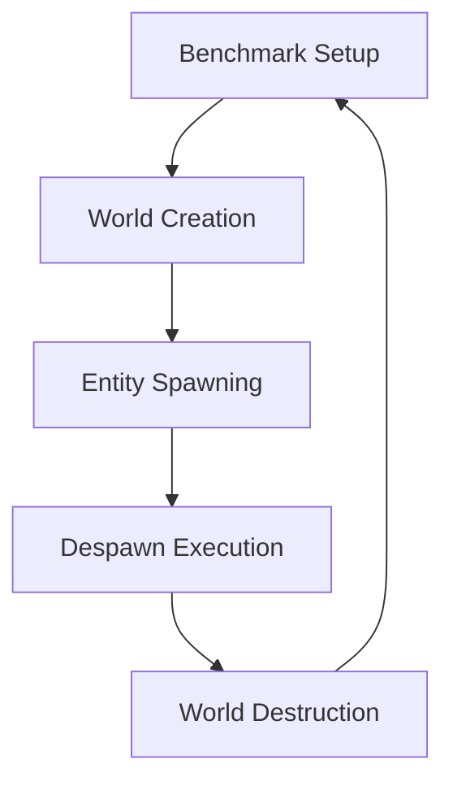

+++
title = "#18448 Fix double-despawning in `despawn_world` and `despawn_world_recursive` benchmarks"
date = "2025-03-22T00:00:00"
draft = false
template = "pull_request_page.html"
in_search_index = true

[taxonomies]
list_display = ["show"]

[extra]
current_language = "en"
available_languages = {"zh-cn" = { name = "中文", url = "/pull_request/bevy/2025-03/pr-18448-zh-cn-20250322" }, "en" = { name = "English", url = "/pull_request/bevy/2025-03/pr-18448-en-20250322" }}
+++

# #18448 Fix double-despawning in `despawn_world` and `despawn_world_recursive` benchmarks

## Basic Information
- **Title**: Fix double-despawning in `despawn_world` and `despawn_world_recursive` benchmarks
- **PR Link**: https://github.com/bevyengine/bevy/pull/18448
- **Author**: kirawulff
- **Status**: MERGED
- **Created**: 2025-03-20T21:26:13Z
- **Merged**: Not merged
- **Merged By**: N/A

## Description Translation
# Objective

- Fixes #18430


## Solution

- Moves world creation into per-iteration setup for both `despawn_world` and `despawn_world_recursive`, meaning the world's entities don't aren't despawned multiple times
- Doesn't affect despawn APIs

## Testing

- Tested manually by running `cargo bench -p benches --bench ecs -- despawn_world`

## The Story of This Pull Request

The PR addresses a benchmarking inaccuracy in Bevy's ECS despawn operations. The core issue stemmed from entity IDs being reused across benchmark iterations, leading to double-despawning attempts that skewed performance measurements.

### The Problem and Context
In the original benchmarks:
1. `despawn_world` measured basic entity despawns
2. `despawn_world_recursive` tested hierarchical despawns
Both suffered from world state reuse between iterations. The setup created entities once per batch group, causing subsequent iterations to operate on already-despawned entities. This violated benchmark integrity by:
- Measuring no-op operations on non-existent entities
- Introducing potential errors from invalid entity IDs
- Failing to isolate per-iteration costs

### The Solution Approach
The fix restructures benchmark initialization to ensure fresh world state per iteration:
1. **World lifecycle isolation**: Move world creation inside the benchmark's setup closure
2. **Entity freshness guarantee**: Generate new entities for every measurement cycle
3. **Consistent test surface**: Maintain identical entity composition across runs

### The Implementation
Key changes appear in both benchmark files:

**`despawn.rs` (Basic Despawns)**
```rust
bencher.iter_batched_ref(
    || { // Setup closure now creates fresh world/entities per batch
        let mut world = World::default();
        // Spawn entities...
        (world, ents)
    },
    |(world, ents)| { // Tested operation remains unchanged
        ents.iter().for_each(|e| world.despawn(*e));
    },
    BatchSize::SmallInput,
);
```

**`despawn_recursive.rs` (Hierarchical Despawns)**
```rust
bencher.iter_batched_ref(
    || {
        let mut world = World::default();
        // Spawn parent-child hierarchies...
        (world, parent_ents)
    },
    |(world, parent_ents)| {
        parent_ents.iter().for_each(|e| world.despawn(*e));
    },
    BatchSize::SmallInput,
);
```

The pattern ensures:
- Clean world state per batch group
- Valid entity references for each despawn operation
- Consistent measurement of despawn costs without side effects

### Technical Insights
The solution leverages Criterion.rs's batching capabilities effectively:
- `iter_batched_ref` optimizes setup costs while maintaining state isolation
- `BatchSize::SmallInput` balances setup overhead with measurement accuracy
- Entity ID management remains internal to each benchmark iteration

For recursive despawns, child entity handling becomes crucial:
```rust
.with_children(|parent| {
    parent.spawn((A(Mat4::default()), B(Vec4::default())));
})
```
The fix maintains proper parent-child relationships while preventing cross-iteration contamination.

### The Impact
- **Accurate benchmarking**: Measures true despawn costs without artifacts
- **Error prevention**: Eliminates invalid entity references
- **Consistent baselines**: Enables reliable performance comparisons
- **Pattern validation**: Confirms recursive despawn behavior in hierarchies

Engineers can now trust these benchmarks to reflect actual ECS performance characteristics during optimization work.

## Visual Representation



## Key Files Changed

### `benches/bevy_ecs/world/despawn.rs`
- **Change**: Encapsulated world/entity creation within setup closure
- **Impact**: Prevents entity ID reuse across iterations
- **Code Flow**:
```rust
// Before: Potential external world reference
// After: Fresh world per batch
|| {
    let mut world = World::default();
    // ... entity spawning ...
    (world, ents)
}
```

### `benches/bevy_ecs/world/despawn_recursive.rs`
- **Change**: Isolated hierarchy creation in setup
- **Impact**: Ensures clean parent-child relationships per test
- **Hierarchy Handling**:
```rust
// Maintains valid parent-child links per iteration
world.spawn((A(Mat4::default()), B(Vec4::default())))
    .with_children(|parent| {
        parent.spawn((A(Mat4::default()), B(Vec4::default())));
    });
```

## Further Reading
- [Criterion.rs Benchmarking Guide](https://bheisler.github.io/criterion.rs/book/)
- [Bevy ECS World Management](https://bevyengine.org/learn/book/ECS/world/)
- [Entity Component System Pattern](https://en.wikipedia.org/wiki/Entity_component_system)