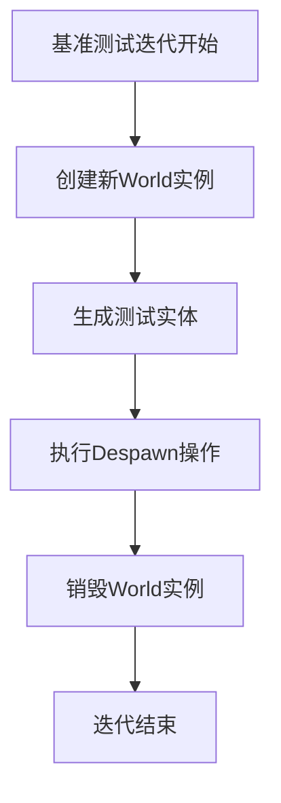

+++
title = "#18448 Fix double-despawning in `despawn_world` and `despawn_world_recursive` benchmarks"
date = "2025-03-22T00:00:00"
draft = false
template = "pull_request_page.html"
in_search_index = false

[extra]
current_language = "zh-cn"
available_languages = {"en" = { name = "English", url = "/pull_request/bevy/2025-03/pr-18448-en-20250322" }, "zh-cn" = { name = "中文", url = "/pull_request/bevy/2025-03/pr-18448-zh-cn-20250322" }}
+++

# #18448 Fix double-despawning in `despawn_world` and `despawn_world_recursive` benchmarks

## Basic Information
- **Title**: Fix double-despawning in `despawn_world` and `despawn_world_recursive` benchmarks
- **PR Link**: https://github.com/bevyengine/bevy/pull/18448
- **Author**: kirawulff
- **Status**: MERGED
- **Created**: 2025-03-20T21:26:13Z
- **Merged**: Not merged
- **Merged By**: N/A

## Description Translation
# 目标

- 修复 #18430

## 解决方案

- 将 world 的创建移动到每个迭代的 setup 阶段，避免实体被多次删除
- 不影响 despawn API

## 测试

- 通过手动运行 `cargo bench -p benches --bench ecs -- despawn_world` 测试


## The Story of This Pull Request

### 问题根源与基准测试缺陷
在原始的基准测试实现中，存在一个关键的结构性问题：当使用`iter_batched_ref`进行性能测试时，world实例的创建位置错误导致了实体被多次删除。具体来说，`World`的初始化被放置在基准测试的全局setup阶段，而每次迭代重复使用同一个world实例。这造成了两个问题：

1. 首次迭代后所有实体已被删除（despawn）
2. 后续迭代尝试删除已不存在的实体，导致无效操作

这种设计使得基准测试实际上测量的是重复删除已删除实体的性能，而非真实场景下的despawn操作。

### 重构基准测试生命周期
核心修改体现在将world创建逻辑移动到`iter_batched_ref`的闭包中：

```rust
bencher.iter_batched_ref(
    || {  // 每次迭代的setup闭包
        let mut world = World::default();
        // 实体生成逻辑
        (world, ents)
    },
    |(world, ents)| {  // 被测代码
        ents.iter().for_each(|e| world.despawn(*e));
    },
    BatchSize::SmallInput
);
```

这种重构保证了：
- 每次迭代使用全新的world实例
- 实体生成和删除操作完全隔离
- 避免跨迭代的状态污染

### 层次结构处理的变化
在`despawn_recursive.rs`中，处理父子实体关系时进行了类似的重构：

```rust
let parent_ents = (0..entity_count)
    .map(|_| {
        world.spawn(...)
            .with_children(|parent| {  // 创建子实体
                parent.spawn(...);
            })
            .id()
    })
    .collect::<Vec<_>>();
```

修改后每次迭代都会：
1. 创建全新的父实体及其子实体
2. 通过`despawn`父实体触发递归删除
3. 确保下次迭代从干净状态开始

### 性能测试有效性保障
调整后的结构更符合实际使用场景，因为：
- 模拟了真实场景中创建-删除的生命周期
- 避免内存分配器缓存带来的干扰
- 提供更准确的每操作耗时测量（而非重复操作的异常值）

## Visual Representation



## Key Files Changed

### `benches/bevy_ecs/world/despawn.rs`
**修改要点**：
1. 将world创建逻辑移动到迭代闭包内部
2. 确保每次迭代使用独立实体集合

核心代码变化：
```rust
// 修改前：world在外部创建
let mut world = World::default();
// ...生成实体...
bencher.iter_batched_ref(|| (world, ents), ...)

// 修改后：world在闭包内创建
bencher.iter_batched_ref(
    || {
        let mut world = World::default();
        // ...生成实体...
        (world, ents)
    },
    ...
)
```

### `benches/bevy_ecs/world/despawn_recursive.rs`
**修改要点**：
1. 重构父子实体生成逻辑
2. 确保递归删除测试的独立性

结构变化示例：
```rust
// 修改前：父实体在外部生成
let parent_ents = (0..entity_count).map(|_| world.spawn(...)).collect();

// 修改后：在闭包内完整创建层次结构
|| {
    let mut world = World::default();
    let parent_ents = (0..entity_count)
        .map(|_| {
            world.spawn(...)
                .with_children(...)
                .id()
        })
        .collect();
    (world, parent_ents)
}
```

## Further Reading

1. [Criterion.rs基准测试框架文档](https://docs.rs/criterion/latest/criterion/) - 理解`iter_batched_ref`的工作原理
2. [Bevy ECS实体生命周期管理](https://bevyengine.org/learn/book/ecs/entity/) - 掌握实体创建/删除机制
3. [系统级基准测试设计模式](https://www.researchgate.net/publication/228588682_System_benchmarking_how_to_choose_representative_workloads) - 学习基准测试设计最佳实践