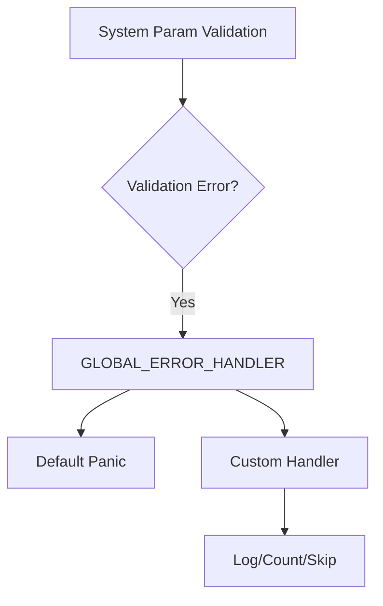

+++
title = "#18454 Make system param validation rely on the unified ECS error handling via the GLOBAL_ERROR_HANDLER"
date = "2025-03-24T00:00:00"
draft = false
template = "pull_request_page.html"
in_search_index = true

[taxonomies]
list_display = ["show"]

[extra]
current_language = "en"
available_languages = {"en" = { name = "English", url = "/pull_request/bevy/2025-03/pr-18454-en-20250324" }}
labels = ["`C-Bug`", "`A-ECS`", "`C-Code-Quality`", "`C-Usability`", "`S-Ready-For-Final-Review`", "`X-Contentious`"]
+++

# #18454 Make system param validation rely on the unified ECS error handling via the GLOBAL_ERROR_HANDLER

## Basic Information
- **Title**: Make system param validation rely on the unified ECS error handling via the GLOBAL_ERROR_HANDLER
- **PR Link**: https://github.com/bevyengine/bevy/pull/18454
- **Author**: alice-i-cecile
- **Status**: MERGED
- **Labels**: `C-Bug`, `A-ECS`, `C-Code-Quality`, `C-Usability`, `S-Ready-For-Final-Review`, `X-Contentious`
- **Created**: 2025-03-20T22:51:13Z

## Description Translation
# Objective

There are two related problems here:

1. Users should be able to change the fallback behavior of *all* ECS-based errors in their application by setting the `GLOBAL_ERROR_HANDLER`. See #18351 for earlier work in this vein.
2. The existing solution (#15500) for customizing this behavior is high on boilerplate, not global and adds a great deal of complexity.

The consensus is that the default behavior when a parameter fails validation should be set based on the kind of system parameter in question: `Single` / `Populated` should silently skip the system, but `Res` should panic. Setting this behavior at the system level is a bandaid that makes getting to that ideal behavior more painful, and can mask real failures (if a resource is missing but you've ignored a system to make the Single stop panicking you're going to have a bad day).

## Solution

I've removed the existing `ParamWarnPolicy`-based configuration, and wired up the `GLOBAL_ERROR_HANDLER`/`default_error_handler` to the various schedule executors to properly plumb through errors .

Additionally, I've done a small cleanup pass on the corresponding example.

## Testing

I've run the `fallible_params` example, with both the default and a custom global error handler. The former panics (as expected), and the latter spams the error console with warnings 🥲 

## Questions for reviewers

1. Currently, failed system param validation will result in endless console spam. Do you want me to implement a solution for warn_once-style debouncing somehow?
2. Currently, the error reporting for failed system param validation is very limited: all we get is that a system param failed validation and the name of the system. Do you want me to implement improved error reporting by bubbling up errors in this PR?
3. There is broad consensus that the default behavior for failed system param validation should be set on a per-system param basis. Would you like me to implement that in this PR?

My gut instinct is that we absolutely want to solve 2 and 3, but it will be much easier to do that work (and review it) if we split the PRs apart.

## Migration Guide

`ParamWarnPolicy` and the `WithParamWarnPolicy` have been removed completely. Failures during system param validation are now handled via the `GLOBAL_ERROR_HANDLER`: please see the `bevy_ecs::error` module docs for more information.

## The Story of This Pull Request

### The Problem and Context
The ECS system parameter validation previously used a fragmented error handling approach through `ParamWarnPolicy`. This system-specific configuration required boilerplate code and made global error handling customization difficult. Developers needed per-system configuration when a unified approach would be more maintainable and user-friendly. The existing implementation also risked masking critical errors by allowing systems to silently skip validation failures.

### The Solution Approach
The PR eliminates the `ParamWarnPolicy` infrastructure and centralizes error handling through the existing `GLOBAL_ERROR_HANDLER` mechanism. This aligns system parameter validation with other ECS error handling patterns, providing a single configuration point for error behavior. The implementation required modifying schedule executors to propagate errors through the unified handler while maintaining backward compatibility through default panic behavior.

### Key Implementation Details
1. **Executor Modifications**: All executor implementations (single/multi-threaded, simple) were updated to accept an error handler parameter:
```rust
// In multi_threaded.rs
fn run(
    &mut self,
    schedule: &mut SystemSchedule,
    world: &mut World,
    skip_systems: Option<&FixedBitSet>,
    error_handler: fn(BevyError, ErrorContext),
) {
    // ...
    error_handler(error, ErrorContext::Observer { name, last_run });
}
```

2. **Policy Removal**: Over 100 lines of `ParamWarnPolicy`-related code were removed from `function_system.rs` and `system_param.rs`, eliminating complex policy management:
```rust
// Before in system_param.rs
pub struct WithParamWarnPolicy<T, P> {
    inner: T,
    policy: P,
}

// After: Entire struct and related logic removed
```

3. **Error Context Enrichment**: The `ErrorContext` enum was expanded to handle observer failures, providing better diagnostics:
```rust
pub enum ErrorContext {
    Observer {
        name: Cow<'static, str>,
        last_run: Tick,
    },
    // Other variants...
}
```

### Technical Insights
The implementation leverages Rust's type system to ensure error handler compatibility across executors. By using a function pointer (`fn(BevyError, ErrorContext)`) instead of trait objects, the solution achieves zero-cost abstraction. The `OnceLock` synchronization primitive from `bevy_platform_support` ensures thread-safe initialization of the global handler without runtime overhead after setup.

### Impact and Trade-offs
- **Positive**: Reduces code complexity by ~150 LOC, eliminates per-system configuration
- **Negative**: Temporarily reduces error granularity until per-parameter policies are implemented
- **Migration**: Straightforward removal of `ParamWarnPolicy` references, but requires understanding new global handler setup

## Visual Representation



## Key Files Changed

### `crates/bevy_ecs/src/schedule/executor/multi_threaded.rs` (+21/-2)
Added error handler parameter to executor run methods:
```rust
fn run(
    &mut self,
    schedule: &mut SystemSchedule,
    world: &mut World,
    skip_systems: Option<&FixedBitSet>,
    error_handler: fn(BevyError, ErrorContext), // New parameter
) {
    // Error handling now uses error_handler
    error_handler(error, context);
}
```

### `crates/bevy_ecs/src/system/system_param.rs` (+20/-26)
Removed policy management infrastructure:
```rust
// Before:
impl<T: SystemParam, P: ParamWarnPolicy> SystemParam for WithParamWarnPolicy<T, P> {}

// After:
// Entire WithParamWarnPolicy implementation removed
```

### `examples/ecs/fallible_params.rs` (+17/-17)
Updated example to use global handler:
```rust
// Before:
app.add_systems(
    Update,
    needy_system.with_param_warn_policy(WarnPolicy::Warning),
);

// After:
app.set_global_error_handler(Box::new(my_error_handler));
```

## Further Reading
1. [Bevy ECS Error Handling RFC](https://github.com/bevyengine/rfcs/pull/45)
2. [OnceLock Documentation](https://doc.rust-lang.org/std/sync/struct.OnceLock.html)
3. [System Parameter Validation Deep Dive](https://bevyengine.org/learn/errors/system-param-validation/)