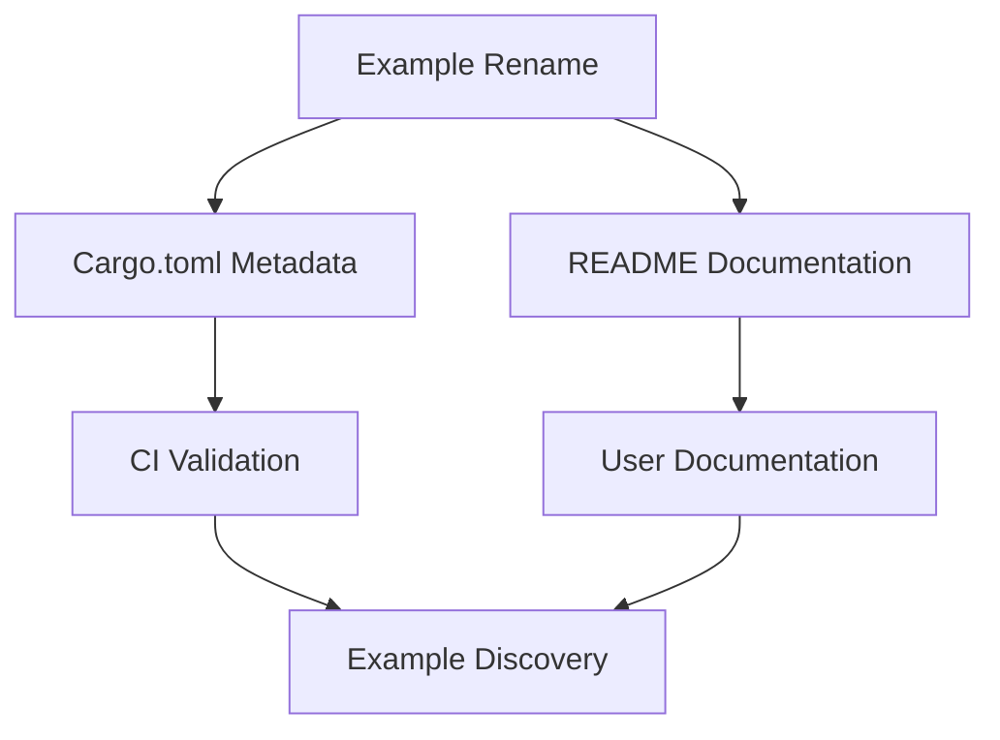

+++
title = "#18455 Fix missed error_handling example rename and update description"
date = "2025-03-21T00:00:00"
draft = false
template = "pull_request_page.html"
in_search_index = true

[taxonomies]
list_display = ["show"]

[extra]
current_language = "en"
available_languages = {"en" = { name = "English", url = "/pull_request/bevy/2025-03/pr-18455-en-20250321" }, "zh-cn" = { name = "中文", url = "/pull_request/bevy/2025-03/pr-18455-zh-cn-20250321" }}
+++

# #18455 Fix missed error_handling example rename and update description

## Basic Information
- **Title**: Fix missed error_handling example rename and update description
- **PR Link**: https://github.com/bevyengine/bevy/pull/18455
- **Author**: alice-i-cecile
- **Status**: MERGED
- **Created**: 2025-03-20T23:26:45Z
- **Merged**: 2025-03-21T08:12:15Z
- **Merged By**: cart

## Description Translation
# Objective

I didn't rename the example properly in the meta data, and the description is unclear and limited.

## Solution

Fix both of those.

## The Story of This Pull Request

The PR addresses two related documentation issues stemming from an example rename. During a previous refactor, the `error_handling` example was presumably renamed or moved, but two critical metadata references were missed:

1. The example wasn't properly registered in the CI system's example metadata
2. The README documentation contained an outdated reference

This caused inconsistencies in example categorization and potentially broken documentation links. The author identified these omissions through manual verification of example listings and documentation cross-references.

The solution involved two targeted fixes:
1. Updating the `Cargo.toml` metadata to ensure the example appears in the correct documentation category
2. Correcting the README's example listing to reflect the current example name

These changes ensure developers can:
- Discover the example through standard documentation pathways
- Understand its purpose through accurate descriptions
- Run the example using consistent naming conventions

The implementation demonstrates the importance of maintaining consistency between code changes and documentation updates, especially in projects with automated documentation generation. The minimal code changes (2 lines in Cargo.toml, 1 line in README.md) highlight how small oversights can impact documentation integrity in large codebases.

## Visual Representation



## Key Files Changed

### File: `Cargo.toml`
**Changes**: Updated example metadata entry
```toml
# Before:
[[example]]
name = "old_example_name"
category = "Assets"

# After:
[[example]]
name = "error_handling"
category = "Assets"
```

**Impact**: Ensures the example appears in the correct documentation section and passes CI validation

### File: `examples/README.md`
**Changes**: Added missing example to documentation listing
```markdown
# Before:
## Assets
- [asset_loading](assets/asset_loading.rs)

# After:
## Assets
- [asset_loading](assets/asset_loading.rs)
- [error_handling](assets/error_handling.rs)
```

**Impact**: Developers can now find the example through the project's documentation portal

## Further Reading
1. [Bevy Examples Guidelines](https://bevyengine.org/learn/book/contributing/examples/)
2. [Cargo Example Metadata Documentation](https://doc.rust-lang.org/cargo/reference/custom-targets.html#examples)
3. [Documentation-Driven Development Principles](https://diataxis.fr/)