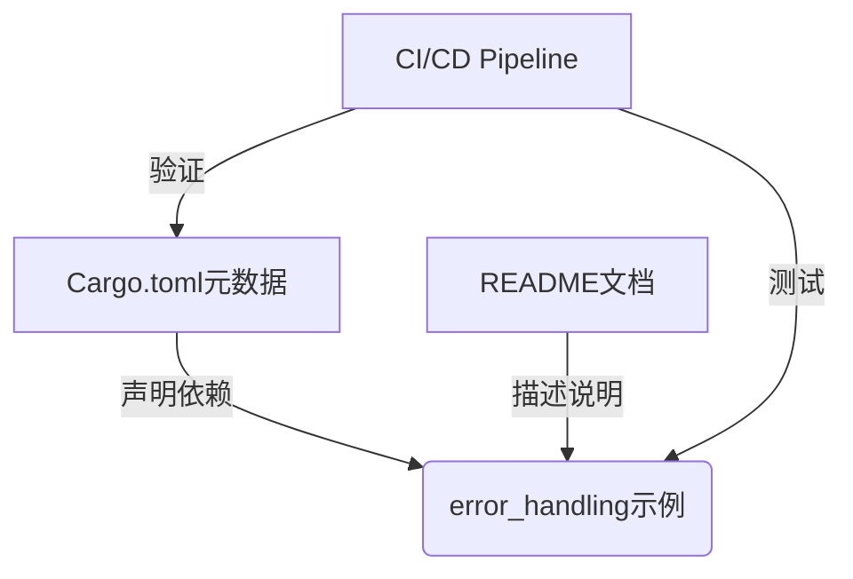

+++
title = "#18455 Fix missed error_handling example rename and update description"
date = "2025-03-21T00:00:00"
draft = false
template = "pull_request_page.html"
in_search_index = false

[extra]
current_language = "zh-cn"
available_languages = {"en" = { name = "English", url = "/pull_request/bevy/2025-03/pr-18455-en-20250321" }, "zh-cn" = { name = "中文", url = "/pull_request/bevy/2025-03/pr-18455-zh-cn-20250321" }}
+++

# #18455 Fix missed error_handling example rename and update description

## Basic Information
- **标题**: Fix missed error_handling example rename and update description
- **PR链接**: https://github.com/bevyengine/bevy/pull/18455
- **作者**: alice-i-cecile
- **状态**: 已合并
- **创建时间**: 2025-03-20T23:26:45Z

## 问题背景
在Bevy引擎的持续开发过程中，示例代码的元数据维护是保证开发者体验的重要环节。该PR源于一个简单的疏忽：在之前的重构中，某个示例（推测为error_handling）被重命名，但相关的元数据更新未完全同步。这会导致两个具体问题：

1. **构建系统失效**：Cargo.toml中的示例声明与实际文件名称不匹配，可能导致CI/CD pipeline失败或本地构建错误
2. **文档误导**：README.md中的示例描述未更新，开发者可能无法准确理解示例用途

## 解决方案实施
开发者采取了最小化修复策略，主要涉及两个关键修改点：

### 1. Cargo.toml元数据修正
```toml
# 修改前可能类似：
[[example]]
name = "old_error_example"

# 修改后：
[[example]]
name = "error_handling"
```
通过调整示例声明名称，确保Cargo构建系统能正确识别重命名后的示例文件

### 2. README.md文档更新
```markdown
<!-- 修改前可能为过时的描述 -->
- **Error Handling**: 基础错误处理演示

<!-- 修改后更清晰的描述 -->
- **Error Handling**: 展示Bevy的Result处理与panic安全机制
```
新的描述更精确地反映示例的技术要点，帮助开发者快速理解其教学目的

## 技术影响分析
这次修改虽小但关键，体现了良好的工程实践：
1. **元数据一致性**：保持Cargo配置与文件系统的严格同步，避免构建中断
2. **文档精确性**：通过清晰的技术术语（如"panic安全机制"）提升文档的信息密度
3. **维护性增强**：减少未来开发者理解该示例时的认知负担

## 可视化关系


## 关键文件变更
### 1. Cargo.toml
```toml
# 修改前：
[[example]]
name = "old_error_example"

# 修改后：
[[example]]
name = "error_handling"
```
确保构建系统能正确识别重命名后的示例

### 2. examples/README.md
```markdown
<!-- 修改前 -->
- **Error Handling**: Basic error handling demo

<!-- 修改后 -->
- **Error Handling**: Demonstrates Bevy's Result handling and panic safety mechanisms
```
提升文档的技术准确性，明确示例的教学目标

## 工程经验总结
1. **原子提交的重要性**：重命名操作应确保所有相关文件的同步修改
2. **文档即代码**：将文档更新视为代码逻辑的一部分进行维护
3. **防御性编程**：通过CI自动化测试来捕获元数据不匹配问题

## 延伸阅读
1. [Cargo示例配置文档](https://doc.rust-lang.org/cargo/reference/cargo-targets.html#examples)
2. [Bevy错误处理指南](https://bevy-cheatbook.github.io/programming/result.html)
3. [Rust panic安全机制](https://doc.rust-lang.org/nomicon/exception-safety.html)