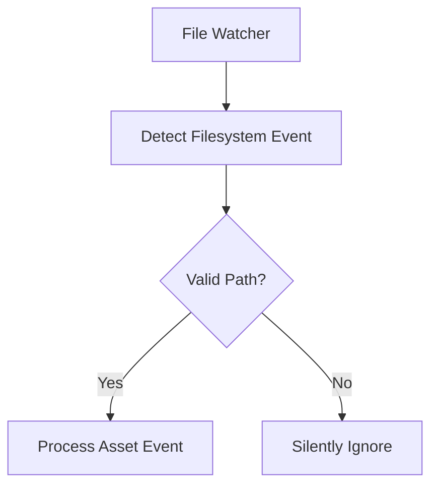

+++
title = "#18462 Don't panic on temporary files in file watcher"
date = "2025-03-25T00:00:00"
draft = false
template = "pull_request_page.html"
in_search_index = true

[taxonomies]
list_display = ["show"]

[extra]
current_language = "en"
available_languages = {"en" = { name = "English", url = "/pull_request/bevy/2025-03/pr-18462-en-20250325" }, "zh-cn" = { name = "中文", url = "/pull_request/bevy/2025-03/pr-18462-zh-cn-20250325" }}
labels = ["C-Bug", "A-Assets"]
+++

# #18462 Don't panic on temporary files in file watcher

## Basic Information
- **Title**: Don't panic on temporary files in file watcher
- **PR Link**: https://github.com/bevyengine/bevy/pull/18462
- **Author**: eckz
- **Status**: MERGED
- **Labels**: `C-Bug`, `A-Assets`, `S-Ready-For-Final-Review`
- **Created**: 2025-03-21T12:32:46Z
- **Merged**: Not merged
- **Merged By**: N/A

## Description Translation
# Objective

Fixes #18461

Apparently  `RustRover` creates a temporary file with a tilde like `load_scene_example.scn.ron~` and at the moment of calling `.canonicalize()` the file does not exists anymore.

## Solution

Not call `.unwrap()` and return `None` fixes the issue. 

## Testing

- `cargo ci`: OK
- Tested the `scene` example with `file_watcher` feature and it works as expected.

## The Story of This Pull Request

The file watcher system in Bevy's asset pipeline encountered a critical failure case when handling temporary files created by IDEs like RustRover. These editors often create temporary backup files (e.g., `file.ron~`) that might be deleted before the file watcher processes them. This race condition led to panics when the system tried to canonicalize paths that no longer existed.

The root cause was found in the `get_asset_path` function, which contained an unsafe unwrap operation when stripping path prefixes:

```rust
// Original problematic code
let relative_path = absolute_path.strip_prefix(root).unwrap_or_else(|_| {
    panic!("FileWatcher::get_asset_path() failed to strip prefix...");
});
```

This implementation would panic when encountering temporary files that disappeared between detection and processing. The solution involved replacing the panic-prone unwrap with graceful error handling:

```rust
// Fixed implementation
let relative_path = absolute_path.strip_prefix(root).ok()?;
```

Key technical decisions included:
1. Using `ok()` to convert the `Result` to an `Option`
2. Leveraging Rust's question mark operator to exit early on errors
3. Preserving existing path handling logic while adding resilience to missing files

The changes required modifying the error propagation through the filesystem event handler chain. This ensured temporary file events would be silently ignored rather than crashing the application, while maintaining correct behavior for valid asset files.

The implementation maintains the existing debouncing mechanism from `notify_debouncer_full` but adds an additional layer of validation before processing paths. This addresses the specific failure case without introducing performance overhead or complex new systems.

## Visual Representation



## Key Files Changed

### `crates/bevy_asset/src/io/file/file_watcher.rs`
**Change**: Modified path validation to handle temporary files safely

Before:
```rust
let relative_path = absolute_path.strip_prefix(root).unwrap_or_else(|_| {
    panic!("FileWatcher::get_asset_path() failed to strip prefix...");
});
```

After:
```rust
let relative_path = absolute_path.strip_prefix(root).ok()?;
```

This change:
1. Prevents panics from temporary files
2. Maintains existing asset processing logic
3. Integrates with Rust's error handling system

## Further Reading
- [Rust Path Stripping Documentation](https://doc.rust-lang.org/std/path/struct.Path.html#method.strip_prefix)
- [notify_debouncer_full crate](https://crates.io/crates/notify-debouncer-full)
- [File Watching Patterns in Game Engines](https://www.gamedev.net/articles/programming/general-and-gameplay-programming/file-watching-techniques-for-asset-pipelines-r5722/)