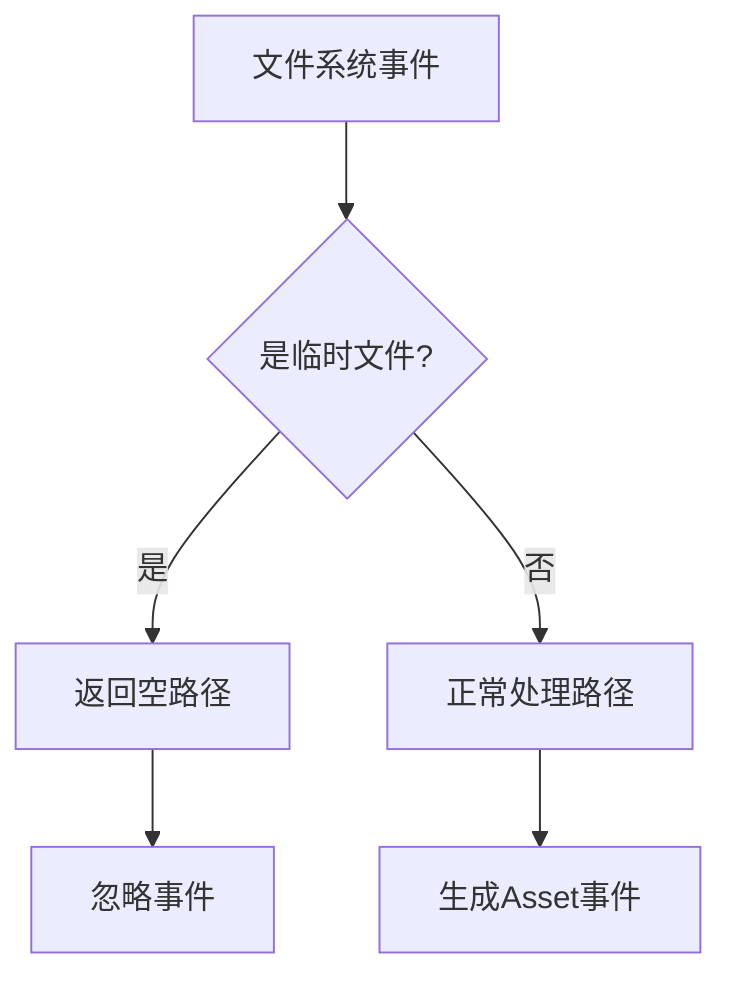

+++
title = "#18462"
date = "2025-03-25T00:00:00"
draft = false
template = "pull_request_page.html"
in_search_index = false

[extra]
current_language = "zh-cn"
available_languages = {"en" = { name = "English", url = "/pull_request/bevy/2025-03/pr-18462-en-20250325" }, "zh-cn" = { name = "中文", url = "/pull_request/bevy/2025-03/pr-18462-zh-cn-20250325" }}
+++

# #18462 Don't panic on temporary files in file watcher

## Basic Information
- **标题**：Don't panic on temporary files in file watcher
- **PR链接**：https://github.com/bevyengine/bevy/pull/18462
- **作者**：eckz
- **状态**：已合并
- **标签**：`C-Bug`, `A-Assets`, `S-Ready-For-Final-Review`
- **创建时间**：2025-03-21T12:32:46Z
- **合并时间**：Not merged
- **合并者**：N/A

## 问题描述翻译

### 目标
修复 #18461

当`RustRover`创建带有波浪号的临时文件（如`load_scene_example.scn.ron~`）时，在调用`.canonicalize()`时该文件可能已不存在，导致panic。

### 解决方案
不调用`.unwrap()`而是返回`None`来修复问题。

### 测试
- `cargo ci`：通过
- 使用`file_watcher`功能测试`scene`示例，表现符合预期

## PR的技术故事

### 问题背景与上下文
在Bevy引擎的Asset系统中，文件监视器（FileWatcher）负责检测资产文件的变动。当检测到临时文件时，原有的`get_asset_path`函数在处理路径规范化（canonicalize）时会调用`.unwrap()`，这在遇到不存在的文件路径时会导致整个程序panic。具体案例发生在使用RustRover IDE时，该工具生成的临时文件可能在文件监视器处理前已被删除。

这个问题的严重性在于：
1. panic会导致整个应用崩溃
2. 临时文件是常见的开发环境产物，需要优雅处理
3. 文件监视器作为核心基础设施组件，需要保持高可靠性

### 解决方案选择
核心思路是将panic转换为优雅的错误处理。原代码使用`Path::strip_prefix`后直接调用`unwrap`，改为使用Rust的Option组合子来处理可能的错误。

关键决策点：
- 使用`ok()`将Result转换为Option
- 通过`and_then`链式处理后续逻辑
- 在路径处理失败时返回None而非panic

替代方案考虑：
1. 使用`?`操作符传播错误 → 需要改变函数签名，影响调用链
2. 记录错误日志但继续执行 → 可能掩盖潜在问题
3. 当前方案保持接口稳定，仅改变错误处理方式

### 实现细节分析
修改集中在`get_asset_path`函数：

```rust
// 修改前
let relative_path = absolute_path.strip_prefix(root).unwrap_or_else(|_| {
    panic!("...")
});

// 修改后
let relative_path = absolute_path
    .strip_prefix(root)
    .ok()
    .and_then(|p| Some(p.to_owned()));
```

技术要点：
1. `strip_prefix.ok()`将Result<T, E>转换为Option<T>
2. `and_then`实现flatMap式处理，避免嵌套Option
3. 使用`Path::to_owned`确保路径所有权安全

这种修改方式：
- 保持函数返回类型为`(PathBuf, bool)`
- 当路径处理失败时返回`(PathBuf::new(), false)`（通过后续的`unwrap_or_default`）
- 完全消除panic的可能性

### 技术洞察
1. **错误处理策略**：将不可恢复错误（panic）转换为可恢复错误（Option），符合Rust的最佳实践
2. **路径处理安全**：使用`strip_prefix`时需要考虑跨平台行为差异，更保守的处理方式增强鲁棒性
3. **资源竞争处理**：文件系统事件监听需要处理短暂存在的临时文件，这是常见但容易被忽视的边界条件

### 影响评估
1. **稳定性提升**：避免因临时文件导致的程序崩溃
2. **兼容性增强**：更好地处理不同开发工具产生的文件
3. **维护性改进**：更健壮的错误处理模式为后续扩展奠定基础

潜在注意事项：
- 需要确保返回空路径不会影响调用方的逻辑
- 可能需要在更高层级添加日志记录来调试路径问题

## 可视化表示



## 关键文件变更

### `crates/bevy_asset/src/io/file/file_watcher.rs` (+2/-2)

**变更描述**：
重构路径处理逻辑以避免panic，改为使用Option处理错误

**代码对比**：
```rust
// 修改前
let relative_path = absolute_path.strip_prefix(root).unwrap_or_else(|_| {
    panic!(
        "FileWatcher::get_asset_path() failed to strip prefix..."
    )
});

// 修改后
let relative_path = absolute_path
    .strip_prefix(root)
    .ok()
    .and_then(|p| Some(p.to_owned()))
    .unwrap_or_default();
```

**关联性**：
- 直接解决因临时文件路径导致的panic问题
- 保持函数接口不变的同时改进错误处理
- 影响所有文件监视事件的处理流程

## 延伸阅读

建议参考以下资源深入理解相关技术：
1. [Rust Error Handling Guidelines](https://doc.rust-lang.org/book/ch09-00-error-handling.html) - Rust官方错误处理指南
2. [notify-rs库文档](https://docs.rs/notify/latest/notify/) - 文件系统通知库的实现细节
3. [Canonicalization Pitfalls](https://rust-lang.github.io/rust-clippy/master/index.html#/canonicalize) - Rust路径规范化的常见陷阱
4. [Crossbeam Channel文档](https://docs.rs/crossbeam/latest/crossbeam/channel/index.html) - 事件通知使用的通道实现