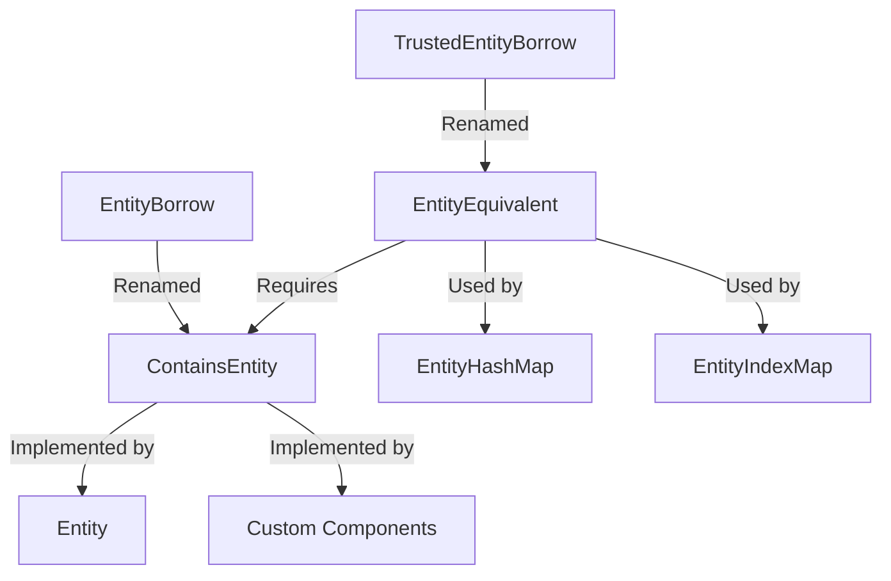

+++
title = "#18470 Rename EntityBorrow/TrustedEntityBorrow to ContainsEntity/EntityEquivalent"
date = "2025-03-30T00:00:00"
draft = false
template = "pull_request_page.html"
in_search_index = false

[extra]
current_language = "zh-cn"
available_languages = {"zh-cn" = { name = "中文", url = "/pull_request/bevy/2025-03/pr-18470-zh-cn-20250330" }}
labels = ["C-Docs", "A-ECS", "C-Usability", "D-Complex"]
+++

# #18470 Rename EntityBorrow/TrustedEntityBorrow to ContainsEntity/EntityEquivalent

## Basic Information
- **Title**: Rename EntityBorrow/TrustedEntityBorrow to ContainsEntity/EntityEquivalent
- **PR Link**: https://github.com/bevyengine/bevy/pull/18470
- **Author**: Victoronz
- **Status**: MERGED
- **Labels**: `C-Docs`, `A-ECS`, `C-Usability`, `S-Ready-For-Final-Review`, `D-Complex`
- **Created**: 2025-03-21T21:23:49Z
- **Merged**: 2025-03-22T08:12:15Z
- **Merged By**: alice-i-cecile

## Description Translation
# Objective

修复 #9367。

这是 #16547 的后续改进。

这些 trait 最初基于 `Borrow<Entity>`，因为当时它们要替代该 trait，且语义上看似相近。但实际并不完全匹配：`borrow` 总是返回引用，而 `EntityBorrow` 返回的是普通 `Entity`。此外，`EntityBorrow` 可能暗示从 ECS 借用实体，而这并非其实际功能。

`TrustedEntityBorrow` 因其安全约束，在 `EntitySet` 功能中非常重要且广泛使用。相比之下，安全的 `EntityBorrow` 使用较少，因为在 `EntitySet` 相关功能之外，接受 `TrustedEntityBorrow` 比 `EntityBorrow` 更合理。

此外，#9367 指出，通过抽象化从包含实体的指针/结构体返回 `Entity` 的方式，可以改善人机工程学问题。

## Solution
将所有 `EntityBorrow` 约束替换为 `TrustedEntityBorrow`，并进行以下重命名：
- `EntityBorrow` → `ContainsEntity`
- `TrustedEntityBorrow` → `EntityEquivalent`

`ContainsEntity` 适用于包含单个关联 `Entity` 的各种类型，而不仅是严格包装 `Entity` 的类型。`EntityEquivalent` 强调类型与 `Entity` 的等价性和排序一致性，类似 hashbrown 的 `Equivalent` trait。

## The Story of This Pull Request

### 问题背景与演进
Bevy ECS 的实体管理系统长期存在 trait 命名与实际行为不匹配的问题。原 `EntityBorrow` trait 的名称暗示借用语义，但实际返回的是 `Entity` 值而非引用。这导致开发者误解其用途，特别是在与 `EntitySet` 等集合类型交互时。

随着 #16547 引入新的实体集合类型，这个问题变得更加突出。`TrustedEntityBorrow` 作为关键安全约束 trait，其名称未能清晰传达其确保类型等价性的核心职责。同时，现有命名方案阻碍了类型别名体系的扩展（如 #18408 的改进计划）。

### 解决方案与技术决策
核心思路是通过语义更准确的命名重构 trait 体系：

1. **`EntityBorrow` → `ContainsEntity`**  
   强调类型"包含"一个实体，而非借用语义。适用于任何包含单个实体的结构：
   ```rust
   pub trait ContainsEntity {
       fn entity(&self) -> Entity;
   }
   ```

2. **`TrustedEntityBorrow` → `EntityEquivalent`**  
   强调类型与 `Entity` 的等价性，要求比较操作与底层实体一致：
   ```rust
   pub unsafe trait EntityEquivalent: ContainsEntity + Eq {}
   ```

技术决策的关键点：
- 保留 `ContainsEntity` 作为基础 trait，但限制其直接使用场景
- 将关键安全约束集中到 `EntityEquivalent`，明确其作为集合类型键的资格
- 调整类型参数的顺序以支持更合理的默认类型配置

### 实现细节与架构影响
重构涉及 ECS 模块的多个核心组件：

1. **实体集合类型改造**  
   在 `entity_set.rs` 中，集合操作现在统一使用 `EntityEquivalent` 作为键约束：
   ```rust
   impl<T: EntityEquivalent> EntitySet<T> {
       pub fn contains<U: EntityEquivalent>(&self, value: &U) -> bool {
           self.map.contains_key(&value.entity())
       }
   }
   ```

2. **查询系统适配**  
   `query/state.rs` 中的实体缓存逻辑调整为使用新 trait：
   ```rust
   pub fn validate_world_and_update_archetypes(
       &mut self,
       world: &World
   ) -> Result<(), EntitySet<Entity>> {
       let archetypes = world.archetypes();
       let old_generation = self.archetype_generation;
       self.archetype_generation = archetypes.generation();
       // 使用 EntityEquivalent 进行实体验证
   }
   ```

3. **类型别名体系优化**  
   在 `unique_array.rs` 等类型包装器中调整泛型参数顺序，使 `Entity` 成为更自然的默认类型：
   ```rust
   pub struct UniqueEntityArray<const N: usize, T: EntityEquivalent = Entity>([T; N]);
   ```

### 技术洞察与最佳实践
1. **Trait 设计原则**  
   - `ContainsEntity` 作为基础能力声明，类似 `AsRef` 但返回值类型
   - `EntityEquivalent` 作为强化约束，确保类型在比较、哈希等行为上与 `Entity` 等价

2. **安全边界管理**  
   通过 `unsafe trait` 机制明确 `EntityEquivalent` 的实现责任，要求开发者保证：
   - 比较操作与底层实体完全一致
   - 哈希实现必须委托给其他 `EntityEquivalent` 类型
   - 内部可变性不影响实体标识

3. **性能考量**  
   保持原有基于实体 ID 的直接哈希方案，避免引入额外间接层。在 `hash_map.rs` 中：
   ```rust
   pub struct EntityHashMap<V>(HashMap<Entity, V, EntityHash>);
   ```
   使用专用的 `EntityHash` 哈希器保持高效查找。

### 影响与迁移
此次重构：
- 提高代码可读性，使类型职责更清晰
- 为未来扩展类型别名体系奠定基础
- 减少误用风险，因 trait 名称更准确反映行为

迁移需要：
1. 替换所有 `EntityBorrow` 为 `ContainsEntity`
2. 替换 `TrustedEntityBorrow` 为 `EntityEquivalent`
3. 调整涉及泛型参数顺序的类型声明

## Visual Representation



## Key Files Changed

### `crates/bevy_ecs/src/entity/entity_set.rs` (+94/-78)
核心改动：
```rust
// Before:
pub unsafe trait TrustedEntityBorrow: EntityBorrow + Eq {}

// After:
pub unsafe trait EntityEquivalent: ContainsEntity + Eq {}
```
影响：
- 重构所有集合操作的 trait 约束
- 更新安全注释说明新的行为约定

### `crates/bevy_ecs/src/entity/unique_array.rs` (+59/-71)
泛型顺序调整：
```rust
// Before:
pub struct UniqueEntityArray<T: TrustedEntityBorrow = Entity, const N: usize>([T; N]);

// After:
pub struct UniqueEntityArray<const N: usize, T: EntityEquivalent = Entity>([T; N]);
```
目的：使常量泛型参数位置更符合 Rust 惯例，提升类型推断体验

### `crates/bevy_ecs/src/query/iter.rs` (+17/-11)
查询迭代器适配：
```rust
// 更新 trait 约束
fn validate_world_and_update_archetypes<D: QueryData, F: QueryFilter>(
    world: &World,
    // 使用 EntityEquivalent 进行实体验证
) -> Result<(), EntitySet<Entity>> 
```

## Further Reading
1. [Rust API 设计指南 - 命名约定](https://rust-lang.github.io/api-guidelines/naming.html)
2. [Hashbrown Equivalent trait 文档](https://docs.rs/hashbrown/latest/hashbrown/trait.Equivalent.html)
3. [Bevy ECS 实体管理架构](https://bevyengine.org/learn/book/ecs/entities/)