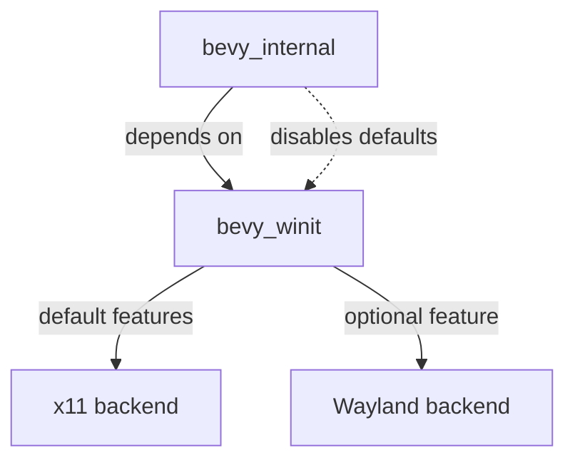

+++
title = "#18475 enable x11 by default in bevy_winit"
date = "2025-03-24T00:00:00"
draft = false
template = "pull_request_page.html"
in_search_index = true

[taxonomies]
list_display = ["show"]

[extra]
current_language = "en"
available_languages = {"zh-cn" = { name = "中文", url = "/pull_request/bevy/2025-03/pr-18475-zh-cn-20250324-1" }, "en" = { name = "English", url = "/pull_request/bevy/2025-03/pr-18475-en-20250324-1" }}
labels = ["A-Windowing", "O-Linux"]
+++

# #18475 enable x11 by default in bevy_winit

## Basic Information
- **Title**: enable x11 by default in bevy_winit
- **PR Link**: https://github.com/bevyengine/bevy/pull/18475
- **Author**: mockersf
- **Status**: MERGED
- **Labels**: `A-Windowing`, `O-Linux`, `S-Ready-For-Final-Review`
- **Created**: 2025-03-22T08:57:06Z
- **Merged**: Not merged
- **Merged By**: N/A

## Description Translation
# Objective

- building bevy_winit on linux fails with
```
error: The platform you're compiling for is not supported by winit
  --> /home/runner/.cargo/registry/src/index.crates.io-1949cf8c6b5b557f/winit-0.30.9/src/platform_impl/mod.rs:78:1
   |
78 | compile_error!("The platform you're compiling for is not supported by winit");
   | ^^^^^^^^^^^^^^^^^^^^^^^^^^^^^^^^^^^^^^^^^^^^^^^^^^^^^^^^^^^^^^^^^^^^^^^^^^^^^
```
- this blocks publishing Bevy from linux during the verification step

## Solution

- Enable `x11` by default when building bevy_winit, and disable default features of bevy_winit in bevy_internal
- This doesn't change anything when depending on Bevy


## The Story of This Pull Request

The problem emerged during Linux-based CI/CD pipelines where building `bevy_winit` would fail due to missing platform support in the winit dependency. This failure blocked the publishing process for Bevy, as crate verification requires successful standalone builds of all components.

The root cause was winit's requirement for explicit platform backend selection on Linux. Without either x11 or Wayland features enabled, winit throws a compile error. The existing configuration didn't specify a default backend for Linux, causing builds to fail when `bevy_winit` was compiled directly during verification.

The solution involved two coordinated changes to Cargo.toml files:
1. **Default Feature Configuration**: Set x11 as the default feature in `bevy_winit` to ensure Linux builds work out-of-the-box
2. **Dependency Management**: Modify `bevy_internal` to explicitly disable default features when depending on `bevy_winit`, preserving existing behavior for downstream consumers

In `bevy_winit/Cargo.toml`, the features section was updated to establish x11 as the default backend:
```toml
[features]
default = ["x11"]  # Added to ensure Linux compatibility
```

Simultaneously, `bevy_internal/Cargo.toml` was adjusted to prevent feature inheritance:
```toml
bevy_winit = { path = "../bevy_winit", version = "0.16.0-dev", default-features = false }
```

This dual approach solves the immediate build failure while maintaining architectural consistency. When building `bevy_winit` directly (as during publishing verification), x11 support is automatically included. When used as a dependency through `bevy_internal`, feature selection remains explicit and controlled through Bevy's main feature flags.

The implementation demonstrates effective use of Cargo's feature system to manage platform-specific dependencies. By making x11 the default but allowing override through feature selection, the changes balance convention with flexibility. This pattern follows Rust ecosystem best practices for handling platform-specific functionality while maintaining cross-platform compatibility.

## Visual Representation



## Key Files Changed

### `crates/bevy_winit/Cargo.toml`
```toml
# Before:
[features]
default = []

# After:
[features]
default = ["x11"]
```
- Establishes x11 as the default windowing backend for Linux
- Ensures standalone builds work without explicit feature selection

### `crates/bevy_internal/Cargo.toml`
```toml
# Dependency declaration before:
bevy_winit = { path = "../bevy_winit", version = "0.16.0-dev" }

# After:
bevy_winit = { path = "../bevy_winit", version = "0.16.0-dev", default-features = false }
```
- Prevents automatic inheritance of x11 feature
- Maintains existing behavior for Bevy users
- Allows feature selection through Bevy's top-level features

## Further Reading
- [Cargo Features Documentation](https://doc.rust-lang.org/cargo/reference/features.html)
- [Winit Platform Backend Selection](https://docs.rs/winit/latest/winit/#platform-specific-usage)
- [Bevy Feature Management Guide](https://bevyengine.org/learn/book/getting-started/features/)