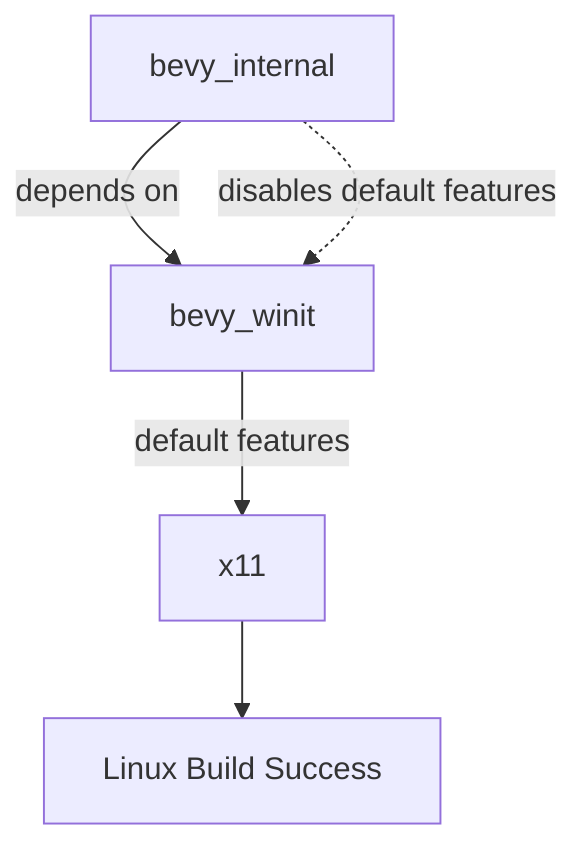

+++
title = "#18475 enable x11 by default in bevy_winit"
date = "2025-03-24T00:00:00"
draft = false
template = "pull_request_page.html"
in_search_index = true

[taxonomies]
list_display = ["show"]

[extra]
current_language = "en"
available_languages = {"zh-cn" = { name = "中文", url = "/pull_request/bevy/2025-03/pr-18475-zh-cn-20250324-1" }, "en" = { name = "English", url = "/pull_request/bevy/2025-03/pr-18475-en-20250324-1" }}
labels = ["A-Windowing", "O-Linux"]
+++

# #18475 enable x11 by default in bevy_winit

## Basic Information
- **Title**: enable x11 by default in bevy_winit
- **PR Link**: https://github.com/bevyengine/bevy/pull/18475
- **Author**: mockersf
- **Status**: MERGED
- **Labels**: `A-Windowing`, `O-Linux`, `S-Ready-For-Final-Review`
- **Created**: 2025-03-22T08:57:06Z
- **Merged**: Not merged
- **Merged By**: N/A

## Description Translation
# Objective

- building bevy_winit on linux fails with
```
error: The platform you're compiling for is not supported by winit
  --> /home/runner/.cargo/registry/src/index.crates.io-1949cf8c6b5b557f/winit-0.30.9/src/platform_impl/mod.rs:78:1
   |
78 | compile_error!("The platform you're compiling for is not supported by winit");
   | ^^^^^^^^^^^^^^^^^^^^^^^^^^^^^^^^^^^^^^^^^^^^^^^^^^^^^^^^^^^^^^^^^^^^^^^^^^^^^
```
- this blocks publishing Bevy from linux during the verification step

## Solution

- Enable `x11` by default when building bevy_winit, and disable default features of bevy_winit in bevy_internal
- This doesn't change anything when depending on Bevy

## The Story of This Pull Request

The problem emerged during Linux-based build verification for Bevy publication. When attempting to build `bevy_winit` on Linux, the compilation would fail due to winit's platform requirements not being met. The root cause was that `bevy_winit` wasn't configuring its windowing backend features appropriately for Linux environments.

Winit requires explicit selection of either X11 or Wayland backend on Linux. The error occurred because neither backend was enabled by default, resulting in a platform support compile error. This became a critical blocker for Linux-based CI/CD pipelines handling Bevy publication.

The solution involved two coordinated changes to Cargo.toml manifests. First, `bevy_winit` was modified to include X11 support by default through its feature flags. This ensures that standalone builds of `bevy_winit` (like those during publication verification) would automatically include necessary Linux windowing support. However, to prevent unintended feature propagation in the main Bevy engine, the parent `bevy_internal` crate was updated to explicitly disable `bevy_winit`'s default features while maintaining existing functionality.

Key implementation details:

1. **bevy_winit Feature Defaults**
```toml
# Before:
[features]
default = []

# After:
[features]
default = ["x11"]
```
This change ensures X11 support activates automatically when using `bevy_winit` directly.

2. **bevy_internal Dependency Adjustment**
```toml
# Before:
bevy_winit = { path = "../bevy_winit", version = "0.16.0-dev" }

# After:
bevy_winit = { path = "../bevy_winit", version = "0.16.0-dev", default-features = false }
```
This prevents default feature inheritance in the main engine while allowing downstream users to get sensible defaults.

The technical rationale balances two requirements:
- Publication workflows needing valid standalone `bevy_winit` builds
- Main Bevy users expecting controlled feature activation through `bevy_internal`

By decoupling the default features between the crate and its usage in the engine, the solution maintains backward compatibility while fixing the build pipeline. X11 was chosen as the default Linux backend due to its broader compatibility compared to Wayland, though users can still opt into Wayland explicitly if needed.

The impact is immediate and localized:
- Linux build verification now succeeds
- Existing Bevy users see no behavior changes
- Crate consumers get sensible Linux defaults without extra configuration

This demonstrates effective use of Cargo's feature management system to solve platform-specific build issues while maintaining ecosystem compatibility. The pattern of adjusting default features at different dependency levels could serve as a reference for similar cross-crate configuration challenges.

## Visual Representation



## Key Files Changed

1. **crates/bevy_winit/Cargo.toml**
```toml
# Before:
[features]
default = []

# After:
[features]
default = ["x11"]
```
This change ensures X11 backend activation by default for standalone builds.

2. **crates/bevy_internal/Cargo.toml**
```toml
# Dependency line before:
bevy_winit = { path = "../bevy_winit", version = "0.16.0-dev" }

# Dependency line after:
bevy_winit = { path = "../bevy_winit", version = "0.16.0-dev", default-features = false }
```
This prevents default feature inheritance in the main Bevy engine while allowing manual feature selection.

## Further Reading

1. [Cargo Features Documentation](https://doc.rust-lang.org/cargo/reference/features.html) - Official guide to Rust's feature system
2. [Winit Platform Requirements](https://github.com/rust-windowing/winit#platform-specific-notes) - Details on windowing backend requirements
3. [Bevy Feature Management Guide](https://bevyengine.org/learn/book/getting-started/features/) - How Bevy handles feature flags
4. [Rust Dependency Specification](https://doc.rust-lang.org/cargo/reference/specifying-dependencies.html) - Understanding dependency declarations in Cargo.toml